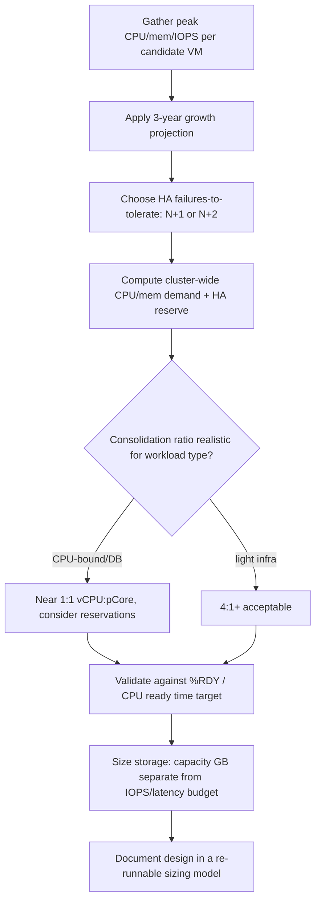

# VMware Virtual Estate Capacity Planning, Sizing and Management

**Level:** Expert
**Tree:** [Design, Migration & Operations](../README.md)
**Branch:** [Capacity, Storage & Network Design](README.md)
**Forest:** [Virtualization](../../../README.md)

## Explanation

## Sizing from workload evidence, not vendor rules of thumb

Capacity design for a virtual estate starts with measured workload demand, not a generic 'assume 4 vCPU per host' rule. The inputs that matter: peak (not average) CPU/memory/IOPS/throughput per candidate VM, growth projections over the design horizon (typically 3 years), and the target N+1 or N+2 failure-to-tolerate posture, since that directly sets how much headroom must sit idle across the cluster at all times.

**CPU sizing** works in vCPU:pCore consolidation ratios, but the ratio is workload-dependent - light infrastructure VMs tolerate 4:1 or higher, while latency-sensitive or CPU-bound workloads (databases, real-time processing) need closer to 1:1 and often benefit from CPU reservations or even exclusive affinity. Oversubscription without headroom produces CPU **ready time** (%RDY in ESXi, measurable per-vCPU) - the silent killer of perceived performance that a raw CPU-utilization graph never reveals, because a busy but not-yet-saturated host can still show moderate utilization while VMs queue for scheduling.

**Memory sizing** must account for the hypervisor's own overhead per VM (vCPU count and configured RAM both add per-VM overhead), and for HA admission control reserving enough capacity across the cluster to absorb the configured number of host failures without breaching a memory or CPU threshold - a cluster sized to exactly 100% utilization has, by definition, no room for a single host failure to succeed.

**Storage sizing** must separate capacity (GB free) from performance (IOPS/latency headroom); a datastore can have abundant free space and still be the bottleneck if aggregate IOPS demand exceeds what the backing array or vSAN disk group can sustain at the required latency. The professional deliverable is a sizing model as a live spreadsheet or tool output (not a one-time slide) that a customer can re-run as workload counts change, explicitly showing the N+1/N+2 headroom consumed by the design.

## Architecture and flow



## Commands

### Command 1

Show per-vCPU CPU ready time live on an ESXi host - the key oversubscription signal

```text
esxtop then press c, look at %RDY column
```

### Command 2

PowerCLI: pull CPU ready time statistics for all VMs for offline analysis

```text
Get-Stat -Entity (Get-VM) -Stat cpu.ready.summation -Realtime
```

### Command 3

Show per-device latency and IOPS stats to validate storage headroom against sizing assumptions

```text
esxcli storage core device stats get -d <naa.id>
```

### Command 4

PowerCLI: report the configured HA admission control failover level per cluster

```text
Get-Cluster | Get-View | Select Name, @{N='FailoverLevel';E={$_.Configuration.DasConfig.AdmissionControlPolicy.FailoverLevel}}
```

### Command 5

Inventory current consolidation ratio (VMs per host, cores, memory) as a sizing baseline

```text
Get-VMHost | Select Name, NumCpu, MemoryTotalGB, @{N='VMs';E={($_ | Get-VM).Count}}
```

## Automation scripts

### capacity-report.ps1

```powershell
# Capacity and CPU-ready summary per cluster for a sizing review.
param([string]$vCenter)
Connect-VIServer -Server $vCenter | Out-Null
foreach ($cl in Get-Cluster) {
  $hosts = $cl | Get-VMHost
  $vms = $cl | Get-VM
  $totalPCores = ($hosts | Measure-Object -Property NumCpu -Sum).Sum
  $totalVCPUs = ($vms | Measure-Object -Property NumCpu -Sum).Sum
  $ratio = if ($totalPCores -gt 0) { [math]::Round($totalVCPUs / $totalPCores, 2) } else { 0 }
  Write-Host "Cluster: $($cl.Name)"
  Write-Host "  Hosts: $($hosts.Count), pCores: $totalPCores, vCPUs: $totalVCPUs, ratio: $ratio`:1"
  $readyStats = Get-Stat -Entity $vms -Stat cpu.ready.summation -Realtime -MaxSamples 1 -ErrorAction SilentlyContinue
  if ($readyStats) {
    $avgReady = ($readyStats | Measure-Object -Property Value -Average).Average
    Write-Host "  Avg CPU ready (ms, sampled): $([math]::Round($avgReady,1))"
  }
}
Disconnect-VIServer -Confirm:$false
```

## Lab

**Objective:** Build a sizing model for a proposed 20-VM workload set against a target N+1 cluster, then validate the design by loading a test cluster and measuring actual CPU ready time against the planned consolidation ratio.

### Steps

1. Collect (or simulate with stress-ng in test VMs) peak CPU/memory numbers for 5 representative workload profiles (web, DB, batch, infra, cache).
2. Build a spreadsheet computing total vCPU/memory demand, apply a 3-year 20% annual growth factor, and size a cluster with N+1 HA admission control.
3. Stand up the sized cluster (or a scaled-down proportional lab version) and deploy VMs matching the workload profiles at the planned consolidation ratio.
4. Generate synthetic load (stress-ng) on the CPU-bound profiles simultaneously and capture esxtop %RDY during the peak.
5. Compare measured CPU ready time against the design's assumed headroom and adjust the model if ready time exceeds an acceptable threshold (commonly under 5% per vCPU).

### Validation

The sizing spreadsheet explicitly shows HA reserve capacity separate from usable workload capacity.,Measured %RDY during peak synthetic load stays within the design's target threshold.,A single host taken offline (simulated maintenance mode) does not breach cluster resource thresholds, confirming N+1 headroom is real, not theoretical.,The model can be re-run with a changed VM count and produce an updated host count recommendation without a redesign from scratch.

## Operational automation

### Automating capacity management

- **vROps/Aria Operations**: continuously trend CPU ready, memory contention, and datastore latency against the original sizing assumptions, alerting when actual consumption trends toward exhausting the planned growth horizon early.
- **PowerCLI reporting**: schedule capacity-report.ps1 style scripts to run weekly and feed a capacity dashboard, so a design's assumptions are checked against reality continuously rather than only at the next refresh cycle.
- **Right-sizing feedback loop**: use guest-level utilization data (not just allocated vCPU/RAM) to identify over-provisioned VMs and reclaim capacity, feeding reclaimed headroom back into the sizing model instead of buying more hardware prematurely.

## Troubleshooting

### Scenario 1: Cluster shows moderate average CPU utilization but users report sluggish VMs

**Likely cause:** CPU ready time (contention/scheduling delay) is high despite host utilization looking moderate - classic oversubscription symptom invisible to a plain utilization graph

**Resolution:** Check esxtop %RDY per VM; reduce vCPU counts on over-provisioned VMs, or reduce consolidation ratio / add hosts for CPU-bound workloads

### Scenario 2: HA fails to power on VMs after a host failure though the cluster had free capacity

**Likely cause:** Admission control's configured failover level did not actually reserve enough capacity, or reservations on some VMs consumed more than the visible free capacity suggested

**Resolution:** Recalculate admission control based on the largest host's actual capacity and audit VM-level CPU/memory reservations that reduce effective slot availability

### Scenario 3: Datastore has ample free space but VMs on it show high storage latency

**Likely cause:** Aggregate IOPS demand from co-located VMs exceeds the array/vSAN disk group's sustainable IOPS at acceptable latency - a performance, not capacity, ceiling

**Resolution:** Check esxcli storage core device stats for device latency and rebalance VMs across datastores/disk groups by IOPS demand, not just by GB free

### Scenario 4: A sizing model built a year ago already looks undersized

**Likely cause:** Actual VM growth or per-VM resource growth outpaced the projected growth rate used in the original model

**Resolution:** Re-run the model with actual historical growth trend data instead of the original assumption, and shorten the review cadence for volatile workload categories

## Interview questions

### 1. Why is CPU ready time a better oversubscription signal than raw CPU utilization?

Utilization only shows how busy the physical cores are; ready time shows how long a vCPU sat runnable but unscheduled because the hypervisor could not give it a physical core in time. A host can show 60% utilization and still have VMs suffering high ready time if scheduling contention is high relative to core count and consolidation ratio - utilization alone would hide the problem entirely.

### 2. How does HA admission control interact with capacity sizing?

Admission control reserves enough cluster-wide capacity, based on the configured failover level (N+1/N+2) and a chosen policy (slot-based, percentage-based, or dedicated failover hosts), to guarantee that VMs can restart elsewhere after the tolerated number of host failures. A cluster sized to 100% steady-state utilization has effectively promised HA headroom it does not actually have; sizing must subtract that reserve before quoting usable capacity to workload owners.

### 3. Why must storage sizing separate capacity from performance?

Free gigabytes and available IOPS/latency headroom are independent constraints - a datastore can be nearly empty by capacity yet already IOPS-saturated by a handful of high-demand VMs, or nearly full by capacity yet performance-idle for a set of cold archival VMs. Sizing that tracks only GB free will confidently place a workload that then causes a latency incident.

### 4. How do you set a realistic vCPU:pCore consolidation ratio for a mixed workload cluster?

Segment by workload class first - light infrastructure VMs can run at high ratios (4:1 or more) because their peaks rarely coincide, while CPU-bound or latency-sensitive workloads (databases, real-time systems) need near 1:1 or explicit reservations because contention directly degrades their SLA. A single blended ratio across a mixed cluster either wastes capacity on the light VMs or starves the sensitive ones.

## Certification alignment

- VCP-DCV - Plan and design vSphere cluster capacity and resource management
- VCP-DCV - Configure and manage HA admission control policies
- VCDX - Capacity and resource management design decisions and justification

## References

- VMware vSphere Resource Management Guide - CPU/memory scheduling and HA admission control
- VMware Docs: Measuring and understanding CPU ready time (%RDY)
- VMware vSAN Design and Sizing Guide - capacity vs performance sizing

## Suggested video search

VMware vSphere capacity planning sizing CPU ready time HA admission control

---

> Validate commands, versions, permissions, licensing, and rollback procedures in an isolated lab before production use.
