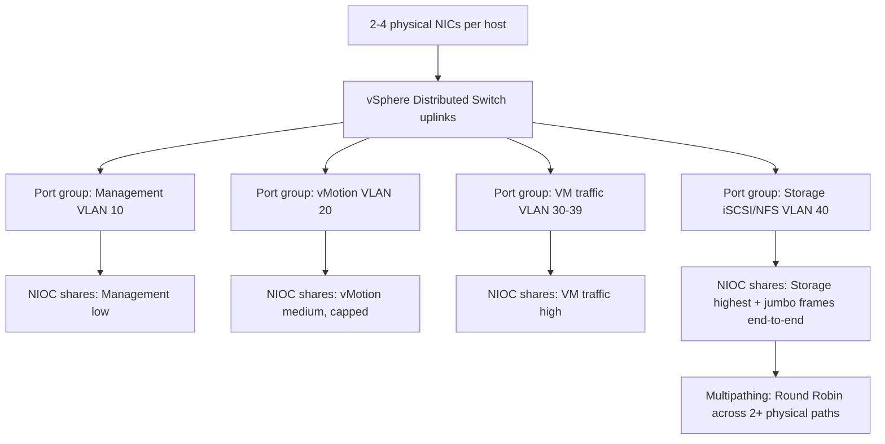

# Virtual Networking Design: Distributed Switches and Storage Fabrics

**Level:** Expert
**Tree:** [Design, Migration & Operations](../README.md)
**Branch:** [Capacity, Storage & Network Design](README.md)
**Forest:** [Virtualization](../../../README.md)

## Explanation

## Designing the fabric, not just plugging in cables

A virtual networking design has to solve two coupled problems: how VM and infrastructure traffic is logically separated and prioritized, and how that logical design maps onto physical NIC and switch redundancy. The **vSphere Distributed Switch (vDS)** is the enterprise building block over per-host standard switches because it centralizes configuration (port groups, NIOC shares, LACP) across every host in the cluster from one place - a standard switch requires manually replicating every change per host, which is where configuration drift and outage-causing typos come from at scale.

**Traffic separation** follows a consistent pattern regardless of vendor: management, vMotion, VM traffic, and storage (iSCSI/NFS) each get their own VLAN and, ideally, distinct physical uplinks or NIOC-guaranteed bandwidth shares so a vMotion storm or a backup job cannot starve production VM traffic or - critically - storage traffic, since storage latency spikes translate directly into guest-visible application stalls. **Network I/O Control (NIOC)** on vDS assigns shares (relative priority under contention) and optional hard limits per traffic type, the mechanism that actually enforces this separation on shared 10/25GbE uplinks rather than dedicating physical NICs per traffic type as in older 1GbE designs.

For storage fabrics specifically, iSCSI needs a genuinely separate, non-routed network with jumbo frames enabled consistently end-to-end (switch, vmkernel port, and array - a single link with default MTU breaks the whole path silently), and multipathing (Round Robin PSP for most modern arrays) across at least two physically distinct paths. vSAN adds its own strict requirements: a dedicated (or NIOC-guaranteed) vSAN VMkernel network, multicast historically then unicast in modern versions for cluster directory services, and a latency budget the design must respect since vSAN is fundamentally a distributed storage system riding the network.

The deliverable of a proper design is a documented physical-to-logical mapping: which physical NICs, which vDS uplinks, which port groups, which VLANs, and which NIOC shares - reviewable before a single cable is run.

## Architecture and flow



## Commands

### Command 1

PowerCLI: inventory all port groups and their VLAN tagging on a distributed switch

```text
Get-VDSwitch | Get-VDPortgroup | Select Name, VlanConfiguration
```

### Command 2

PowerCLI: list physical NIC uplinks currently attached to a distributed switch

```text
Get-VDSwitch <vds> | Get-NetworkAdapter
```

### Command 3

Show negotiated speed/duplex on a specific physical NIC for validation against design

```text
esxcli network nic get -n vmnic2
```

### Command 4

Show VMkernel interfaces and their MTU - verify jumbo frames configured where required

```text
esxcli network ip interface list
```

### Command 5

Show multipathing policy (e.g. Round Robin) and active paths per storage device

```text
esxcli storage nmp device list
```

### Command 6

Test jumbo-frame end-to-end path (no fragmentation) on the storage VMkernel interface

```text
vmkping -d -s 8972 -I vmk1 10.20.40.5
```

## Automation scripts

### validate-network-design.ps1

```powershell
# Validate NIOC shares, MTU consistency, and multipathing against the intended design.
param([string]$vCenter)
Connect-VIServer -Server $vCenter | Out-Null
$vds = Get-VDSwitch
foreach ($sw in $vds) {
  Write-Host "== $($sw.Name) =="
  Get-VDPortgroup -VDSwitch $sw | Select-Object Name, VlanConfiguration | Format-Table
}
Write-Host "== VMkernel MTU (expect 9000 on storage/vMotion) =="
Get-VMHost | Get-VMHostNetworkAdapter -VMKernel | Select-Object VMHost, DeviceName, PortGroupName, Mtu
Write-Host "== Multipathing policy per storage device =="
Get-VMHost | Get-ScsiLun -LunType disk | Select-Object VMHost, CanonicalName, MultipathPolicy
Disconnect-VIServer -Confirm:$false
```

## Lab

**Objective:** Build a vDS with separated management, vMotion, VM, and storage port groups, apply NIOC shares, enable jumbo frames end-to-end on the storage path, and prove isolation under simulated contention.

### Steps

1. Create a vDS with at least 2 uplinks per host and 4 port groups (management, vMotion, VM traffic, storage) each with a distinct VLAN.
2. Enable NIOC and set shares: storage highest, VM traffic high, vMotion medium with a hard limit, management low.
3. Enable jumbo frames (MTU 9000) on the storage VMkernel port, the physical switch ports, and the storage array/target; validate with vmkping -d -s 8972.
4. Configure Round Robin multipathing on the iSCSI/NFS datastore and confirm at least two active paths.
5. Generate a large vMotion (or several concurrent) alongside sustained storage I/O and confirm storage latency stays within the design budget thanks to NIOC shares.

### Validation

validate-network-design.ps1 shows all four port groups with correct, distinct VLANs.,vmkping -d -s 8972 succeeds without fragmentation across the entire storage path.,esxcli storage nmp device list shows Round Robin with multiple active paths.,Storage-bound VM latency does not spike materially during concurrent vMotion activity, evidencing NIOC isolation.

## Operational automation

### Automating network design deployment

- **Host profiles / vDS backup-restore**: capture the validated vDS configuration as a host profile or exported vDS configuration so new hosts join the cluster with the identical, reviewed network design applied automatically - no manual per-host port group creation.
- **Infrastructure as code**: manage vDS, port groups, and NIOC policy declaratively via the Terraform vSphere provider or PowerCLI scripts stored in git, so a network design change is a reviewed diff rather than a click-through change.
- **Continuous validation**: schedule validate-network-design.ps1 to run after every host addition or vDS change and diff the output against the documented design baseline, catching drift before it causes an incident.

## Troubleshooting

### Scenario 1: iSCSI storage performance degrades intermittently under load though the network shows no errors

**Likely cause:** Jumbo frames configured on the VMkernel port and array but not consistently on an intermediate physical switch, causing silent fragmentation or a fallback path

**Resolution:** Test the full path with vmkping -d -s 8972 from every host to the array target and correct any switch or VMkernel MTU mismatch found

### Scenario 2: vMotion traffic causes visible latency spikes on production VM traffic

**Likely cause:** No NIOC shares/limits configured, so vMotion can consume the full uplink bandwidth on a shared 10/25GbE NIC during a large migration

**Resolution:** Configure NIOC shares favoring VM/storage traffic and apply a hard bandwidth limit to the vMotion traffic class

### Scenario 3: Only one storage path shows as active though two were cabled and configured

**Likely cause:** Multipathing policy defaulted to Most Recently Used (MRU) or Fixed instead of Round Robin, or one path failed silently at the switch/zoning layer

**Resolution:** Set the correct PSP (Round Robin for most modern arrays) with esxcli storage nmp and verify SAN zoning/switch config for the inactive path

### Scenario 4: New host added to the cluster does not match the network design of existing hosts

**Likely cause:** Port groups and NIOC settings were configured manually on original hosts and never captured as a host profile or automated template

**Resolution:** Capture the validated configuration as a host profile (or codified Terraform/PowerCLI) and apply it to every new host instead of manual replication

## Interview questions

### 1. Why choose a Distributed Switch over per-host Standard Switches at scale?

vDS centralizes port group, VLAN, and NIOC configuration across every host in the cluster from a single control point, eliminating the manual per-host replication that causes configuration drift and outage-causing typos as cluster size grows. It also enables cluster-wide features like NIOC and consistent LACP configuration that standard switches cannot coordinate.

### 2. What problem does Network I/O Control actually solve?

On shared 10/25GbE uplinks carrying multiple traffic types (management, vMotion, VM, storage), NIOC guarantees relative bandwidth shares (and optional hard limits) per traffic class under contention, preventing one traffic type - most dangerously vMotion or backup traffic - from starving latency-sensitive storage or production VM traffic during a burst.

### 3. Why is jumbo-frame consistency described as an end-to-end requirement rather than a per-device setting?

MTU must match at every hop - VMkernel port, physical switch ports, and the storage array/target - because a single mismatched hop causes silent fragmentation or a protocol fallback that degrades performance without an obvious error, rather than an outright failure that would be easy to spot. vmkping -d -s tests the whole path specifically to catch this.

### 4. How would you design storage networking differently for iSCSI/NFS versus vSAN?

iSCSI/NFS needs a dedicated non-routed network with multipathing (Round Robin) across at least two physical paths to an external array. vSAN instead needs a dedicated or NIOC-guaranteed VMkernel network specifically for vSAN's own inter-host traffic (data replication and, in older versions, multicast directory services), with a tight latency budget respected in the design since vSAN's storage layer is itself distributed across the same hosts running the workloads.

## Certification alignment

- VCP-DCV - Configure and manage vSphere Distributed Switches and Network I/O Control
- VCP-DCV - Configure storage multipathing and jumbo frames
- VCDX - Network design decisions, NIOC policy justification, and vSAN network requirements

## References

- VMware vSphere Networking Guide - Distributed Switches and NIOC
- VMware vSAN Network Design Guide
- VMware Docs: Multipathing and Path Selection Policies (PSP)

## Suggested video search

vSphere Distributed Switch NIOC storage networking design deep dive

---

> Validate commands, versions, permissions, licensing, and rollback procedures in an isolated lab before production use.
