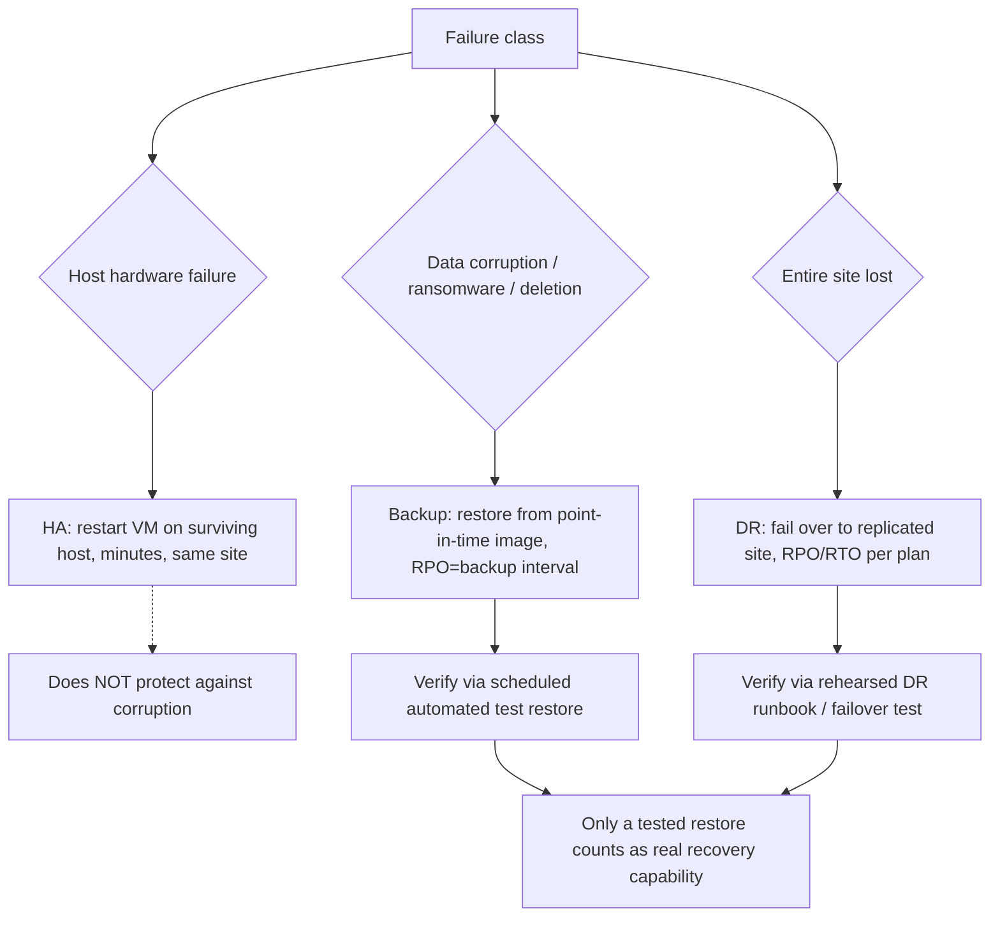

# Backup, HA and Disaster Recovery for Virtual Estates

**Level:** Expert
**Tree:** [Design, Migration & Operations](../README.md)
**Branch:** [Migration & Business Continuity](README.md)
**Forest:** [Virtualization](../../../README.md)

## Explanation

## Layering protection: HA, backup, and DR are not the same thing

A common design mistake is treating high availability, backup, and disaster recovery as interchangeable - they protect against entirely different failure classes and none substitutes for another. **HA** (vSphere HA, Proxmox HA, Hyper-V clustering) protects against a host failure by restarting the VM elsewhere within the same site in minutes - it does nothing for data corruption, accidental deletion, or ransomware, because it faithfully restarts the same (now-corrupted) disk state. **Backup** (image-level, application-consistent via VSS/quiesced snapshots) protects against corruption and deletion by keeping point-in-time recoverable copies, typically with a Recovery Point Objective (RPO) measured in hours. **DR** protects against losing the entire site, replicating VMs or their backups to a geographically separate location with an explicit RPO (data loss tolerance) and RTO (time-to-recover) the business has actually agreed to, not just what the tooling happens to default to.

The design discipline is to map each protection layer to the failure classes it actually covers and size RPO/RTO per workload tier rather than applying one policy fleet-wide - a stateless web tier may need only redeployment (no backup at all), while a financial database needs application-consistent backups plus synchronous or near-synchronous replication to a DR site. Backup **verification** is non-negotiable and routinely skipped: an unverified backup is a hypothesis, not a recovery capability - the only proof a backup works is a successful, timed test restore, ideally automated and run on a schedule against a subset of critical VMs.

For DR specifically, the runbook itself must be rehearsed on a schedule (tabletop at minimum, full failover test ideally annually), because DR plans rot as infrastructure, IPs, and dependencies change quietly between real invocations - the worst time to discover a stale runbook is during an actual disaster.

## Architecture and flow



## Commands

### Command 1

Confirm VMware Tools/quiescing capability is present, required for application-consistent snapshots

```text
govc vm.info -json vm1 | jq '.VirtualMachines[0].Config.Tools'
```

### Command 2

Create a quiesced, memory-included snapshot as part of a manual backup validation

```text
vim-cmd vmsvc/snapshot.create <vmid> backup-test true true
```

### Command 3

Trigger a Proxmox Backup Server backup job for a specific VM outside its schedule for testing

```text
pbs-client backup create --repository main --backup-id vm-101 --backup-type vm
```

### Command 4

Run PBS's built-in verify job against a specific backup snapshot to detect corruption

```text
pbs-client snapshot verify main:vm/101/2026-07-20T02:00:00Z
```

### Command 5

PowerCLI: review DRS recommendations as part of confirming HA/DRS is actively balancing after a simulated failure

```text
Get-DrsRecommendation -Cluster (Get-Cluster)
```

## Automation scripts

### backup-restore-test.sh

```bash
#!/usr/bin/env bash
# Automated scheduled restore test - the only real proof a backup works.
set -euo pipefail
VMID="${1:?usage: backup-restore-test.sh <vmid> <pbs-snapshot>}"
SNAP="${2:?usage: backup-restore-test.sh <vmid> <pbs-snapshot>}"
TESTVMID=$((VMID + 9000))
echo "== Restoring $SNAP to test VMID $TESTVMID (isolated network) =="
qmrestore "$SNAP" "$TESTVMID" --storage local-lvm
qm set "$TESTVMID" --net0 virtio,bridge=vmbr_isolated
qm start "$TESTVMID"
sleep 45
STATUS=$(qm status "$TESTVMID" | awk '{print $2}')
if [ "$STATUS" = "running" ]; then
  echo "PASS: restored VM $TESTVMID is running"
else
  echo "FAIL: restored VM $TESTVMID did not reach running state" >&2
  exit 1
fi
qm stop "$TESTVMID"; qm destroy "$TESTVMID"
echo "Test restore complete and cleaned up."
```

## Lab

**Objective:** Design and implement per-tier RPO/RTO protection (HA for a web tier, application-consistent backup plus scheduled verified restore for a database tier), then rehearse a simulated site-loss DR failover for the database tier.

### Steps

1. Classify two workload tiers: a stateless web tier (HA only, no backup needed) and a database tier (HA plus nightly application-consistent backup).
2. Configure HA for both tiers and confirm a host failure restarts VMs in both tiers correctly.
3. Configure a nightly backup job for the database tier VM using quiesced/application-consistent snapshots, and confirm a completed job in the backup tool.
4. Run backup-restore-test.sh (or the equivalent for your backup platform) against last night's backup into an isolated network and confirm the restored VM boots and the database engine starts cleanly.
5. Simulate a DR failover: replicate (or restore from an offsite copy of) the database tier VM to a separate cluster/site, document the actual time taken, and compare against a stated RTO target.

### Validation

Web tier VM restarts via HA after a simulated host failure with no manual backup restore involved.,The nightly database backup job completes and its scheduled test restore reports PASS.,The restored test VM's database engine starts and responds to a basic query, proving application consistency, not just disk-level integrity.,The DR failover rehearsal's measured time is recorded and compared explicitly against the target RTO, with any gap documented for remediation.

## Operational automation

### Automating protection verification

- **Scheduled restore tests**: run backup-restore-test.sh (or platform equivalent) automatically after every backup job against a rotating sample of critical VMs, alerting on any restore failure the same day it happens rather than discovering it during a real incident.
- **DR runbook drift detection**: version the DR runbook in git alongside infrastructure-as-code, and require a runbook update as part of any change (new subnet, renamed host, changed dependency) via the same pull-request review that changes the infrastructure.
- **RPO/RTO reporting**: build a dashboard cross-referencing each workload tier's actual measured backup completion time and last successful verified restore against its documented RPO/RTO target, flagging any tier silently drifting out of compliance.

## Troubleshooting

### Scenario 1: HA restarted a VM after a host failure but the application data is corrupted

**Likely cause:** HA restored availability, not data integrity - it faithfully restarted the VM's last-known disk state, which was already corrupted before the host failure

**Resolution:** This is expected HA behavior, not a bug; recovery requires restoring from a verified point-in-time backup, which is why HA and backup are separate, non-substitutable layers

### Scenario 2: Backup jobs report success every night but a real restore fails

**Likely cause:** Backups were never actually test-restored - job 'success' only confirms the backup software wrote data, not that the data is restorable or application-consistent

**Resolution:** Implement scheduled automated restore testing (as in backup-restore-test.sh) rather than trusting job-completion status alone

### Scenario 3: DR failover test takes far longer than the documented RTO

**Likely cause:** The runbook is stale - it references decommissioned hosts, old IP ranges, or manual steps nobody has practiced since the plan was written

**Resolution:** Rehearse the DR runbook on a real schedule (not only during actual disasters), update it as part of every infrastructure change, and time each rehearsal against the stated RTO

### Scenario 4: Application-consistent (quiesced) snapshot fails or times out for a specific VM

**Likely cause:** Guest tools/agent (VMware Tools, guest agent) are outdated, not running, or the application's VSS writer is unhealthy

**Resolution:** Confirm guest tools are current and running, check the guest's VSS writer status (vssadmin list writers on Windows) and repair or restart the failing writer before the next backup window

## Interview questions

### 1. Why can HA never substitute for backup, no matter how fast it restarts a VM?

HA's entire mechanism is restarting the VM from its existing disk state on a surviving host - it has no concept of point-in-time recovery. If the disk state is corrupted, deleted, or encrypted by ransomware before the host failure, HA faithfully restarts exactly that broken state elsewhere, often within minutes, which is precisely why backup (a separate, independent point-in-time copy) is the only real protection against data-level failure classes.

### 2. How do you decide RPO and RTO targets per workload tier instead of one blanket policy?

RPO/RTO should reflect the actual business cost of data loss and downtime for that specific workload - a stateless, quickly-redeployable web tier may tolerate total loss with zero RPO/RTO commitment, while a financial transaction database may require near-zero RPO via synchronous replication and an RTO measured in minutes. A single fleet-wide policy either over-protects cheap workloads (wasting cost) or under-protects critical ones (real business risk).

### 3. What makes a backup 'verified' rather than merely 'completed'?

A completed job only confirms the backup software finished writing data somewhere; verification requires an actual restore - ideally automated and scheduled - that boots the recovered VM and confirms the application layer (not just the disk) comes up cleanly, since an unbootable or inconsistent backup that reports 'success' is a false sense of security.

### 4. Why does a DR runbook need to be rehearsed rather than just written and filed?

Infrastructure changes continuously - IP ranges, hostnames, dependency order, credentials - and a DR runbook not exercised against real infrastructure silently rots, so the one time it matters most (an actual site loss) is exactly when a stale step is discovered. Scheduled rehearsal (tabletop or full failover test) catches drift while the stakes are low.

## Certification alignment

- VCP-DCV - Configure vSphere HA, backup integration, and business continuity concepts
- VCDX - Availability design: RPO/RTO justification and protection-layer mapping
- NCP - Data protection, replication and disaster recovery objectives

## References

- VMware vSphere Availability Guide - HA, backup integration concepts
- Proxmox Backup Server Documentation - verification and restore testing
- SNIA / DRI International - RPO/RTO definitions and DR planning frameworks

## Suggested video search

vSphere HA vs backup vs disaster recovery RPO RTO design deep dive

---

> Validate commands, versions, permissions, licensing, and rollback procedures in an isolated lab before production use.
