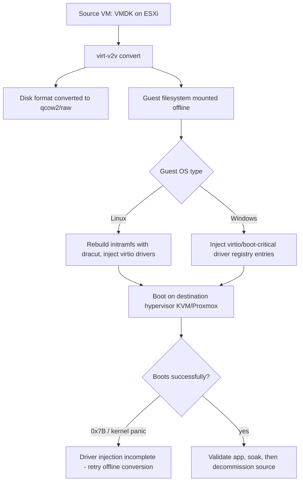

# Virtual Machine Workload Migration: V2V, P2V Rehost and Cross-Platform Conversion

**Level:** Advanced
**Tree:** [Design, Migration & Operations](../README.md)
**Branch:** [Migration & Business Continuity](README.md)
**Forest:** [Virtualization](../../../README.md)

## Explanation

## Moving workloads without moving problems with them

Virtual-to-virtual (V2V) migration - converting a VM from one hypervisor's disk/device model to another's, or between clouds - looks like a copy operation but is really a driver and boot-chain surgery problem. The source VM's disk image was built expecting a specific virtual SCSI/NIC controller and, on Windows, specific boot-critical drivers loaded via the registry; simply copying the disk to a new hypervisor without addressing this produces the classic 0x7B (INACCESSIBLE_BOOT_DEVICE) blue screen on first boot, because the new hypervisor's virtual storage controller has no driver loaded at boot time.

The correct sequence for any cross-platform migration: convert the disk format (qemu-img convert for VMDK/VHD/QCOW2 interconversion, or a purpose-built tool), inject or pre-stage the target platform's drivers into the guest OS before or during the first boot on the new platform (virt-v2v does this automatically for many Linux/Windows guests by mounting the guest filesystem offline and installing the correct drivers/initramfs), and only then boot on the destination. Linux guests generally migrate more forgivingly because dracut can rebuild an initramfs with the needed drivers post-conversion, while Windows requires the correct boot-critical driver registry entries (or Windows' own hardware-abstraction migration tooling) staged before the first boot on new hardware.

For VMware-to-KVM/Proxmox specifically, virt-v2v is the Red Hat-maintained purpose-built tool exactly because it automates this driver-injection step rather than leaving it to a raw disk copy. At scale, migration waves should batch by application tier (never migrate a database's app-tier and DB-tier hosts in different weeks without a plan for the version-skew window), and every migration needs a tested and rehearsed rollback (retain the source VM powered off, not deleted, until the destination is validated in production for an agreed soak period).

## Architecture and flow



## Commands

### Command 1

Convert a VM directly from a mounted VMware datastore to a local KVM-ready image

```text
virt-v2v -i vmx /vmfs/volumes/datastore1/vm1/vm1.vmx -o local -os /var/lib/libvirt/images
```

### Command 2

Convert a VM by connecting directly to vCenter, avoiding a manual datastore export step

```text
virt-v2v -ic 'vpx://administrator@vcenter.local/DC1/esxi1?no_verify=1' -ip password.txt vm1 -o local -os /var/lib/libvirt/images
```

### Command 3

Convert only the disk format without driver injection - Linux guests with virtio already present can sometimes skip virt-v2v

```text
qemu-img convert -f vmdk -O qcow2 source.vmdk dest.qcow2
```

### Command 4

Verify the converted image's format and virtual size before first boot

```text
qemu-img info dest.qcow2
```

### Command 5

Offline-inject a missing virtio driver into a converted disk image before boot if virt-v2v could not do it automatically

```text
virt-customize -a dest.qcow2 --run-command 'dracut -f --add-drivers virtio_scsi'
```

## Automation scripts

### migrate-wave.sh

```bash
#!/usr/bin/env bash
# Convert and stage a wave of VMs from vCenter to a KVM/Proxmox destination via virt-v2v.
set -euo pipefail
VCENTER="vpx://administrator@vcenter.local/DC1/esxi1?no_verify=1"
CREDFILE="/root/.vcenter-pass"
DESTDIR="/var/lib/libvirt/images"
WAVE_FILE="${1:?usage: migrate-wave.sh <wave-vm-list.txt>}"
while read -r VM; do
  [ -z "$VM" ] && continue
  echo "== Converting $VM =="
  if virt-v2v -ic "$VCENTER" -ip "$CREDFILE" "$VM" -o local -os "$DESTDIR" \
     > "/var/log/v2v-${VM}.log" 2>&1; then
    echo "OK: $VM converted, image in $DESTDIR"
  else
    echo "FAILED: $VM - see /var/log/v2v-${VM}.log" >&2
  fi
done < "$WAVE_FILE"
echo "Wave complete. Review logs before booting any destination VM in production."
```

## Lab

**Objective:** Migrate a Linux VM and a Windows VM from a source hypervisor (or exported VMDK) to KVM using virt-v2v, and prove both boot cleanly with correct drivers without manual registry or initramfs surgery.

### Steps

1. Export or expose a Linux VM's VMDK/VMX and a Windows VM's VMDK/VMX from a source ESXi/vCenter (or use a nested ESXi lab).
2. Run virt-v2v against the Linux VM targeting local KVM output; boot it and confirm it reaches multi-user.target without a manual dracut step.
3. Run virt-v2v against the Windows VM; boot it and confirm it reaches the desktop without a 0x7B blue screen.
4. Deliberately skip virt-v2v for a second Linux VM copy (use only qemu-img convert) and observe the boot failure or missing-driver behavior to see the contrast.
5. Repair the skipped VM using virt-customize to inject the missing virtio driver and confirm it now boots correctly.

### Validation

Both virt-v2v-converted VMs boot on KVM without manual intervention.,The VM converted with only qemu-img convert (no virt-v2v) either fails to boot or is missing expected virtio devices, demonstrating why driver injection matters.,After virt-customize repair, the previously-broken VM boots correctly.,Application-level services on both migrated VMs start and respond as they did on the source platform.

## Operational automation

### Automating migration waves

- **Batch conversion**: drive virt-v2v from a CSV/inventory list per wave (as in migrate-wave.sh), logging every conversion individually so a partial-wave failure does not block the rest of the batch.
- **Pipeline validation**: after each conversion, automatically boot the destination VM headless in a validation network segment and run a smoke-test script (service health checks) before promoting it to the production migration wave.
- **Rollback discipline**: keep source VMs powered off (never deleted) for an agreed soak period after cutover, tracked in the migration tooling/inventory so rollback is a power-on away, not a restore-from-backup exercise.

## Troubleshooting

### Scenario 1: Windows VM blue-screens with 0x7B (INACCESSIBLE_BOOT_DEVICE) after migration

**Likely cause:** The destination hypervisor's virtual storage controller driver was never injected/loaded for first boot - a plain disk copy without virt-v2v or equivalent driver staging

**Resolution:** Re-run the conversion through virt-v2v (which stages the correct boot-critical drivers) rather than a raw disk copy, or use the platform vendor's supported migration tool

### Scenario 2: Migrated Linux VM boots to an emergency shell citing a missing root device

**Likely cause:** The initramfs was built for the source hypervisor's virtio/SCSI driver set and was not rebuilt for the destination's device model

**Resolution:** Boot a rescue environment, chroot, and run dracut -f --add-drivers to rebuild initramfs with the destination's required drivers, or re-run virt-v2v which automates this

### Scenario 3: virt-v2v conversion fails partway with a permission or connectivity error to vCenter

**Likely cause:** The read-only or migration service account lacks a required vCenter privilege (datastore browse, VM export), or network access to the ESXi host's NFC port is blocked

**Resolution:** Grant the account the documented virt-v2v/vCenter export privileges and confirm firewall access to the ESXi host's NFC (902/tcp) in addition to vCenter's API port

### Scenario 4: Migrated VM boots and runs but network adapter is missing or renamed

**Likely cause:** The destination hypervisor presents a different virtual NIC model, and the guest OS created a new interface rather than reusing the old configuration bound to the old MAC/driver

**Resolution:** Reassign the network configuration to the newly enumerated interface name/MAC post-migration, or pre-stage predictable interface naming rules before cutover

## Interview questions

### 1. Why is a V2V migration fundamentally a driver problem, not a copy problem?

The guest OS boot chain is built expecting the exact virtual storage/NIC controller present at install time; changing hypervisors changes that controller, and without the new driver staged before first boot, the kernel or Windows boot loader cannot find its root device at all - producing a boot failure that looks unrelated to 'the data' which copied over perfectly intact.

### 2. What does virt-v2v actually do that a raw qemu-img convert does not?

qemu-img convert only translates the disk container format (VMDK to qcow2, for example) - the bytes on disk are unchanged otherwise. virt-v2v additionally mounts the guest filesystem offline and performs OS-aware surgery: injecting or enabling the destination platform's drivers, rebuilding the Linux initramfs, or adjusting the Windows driver registry, so the guest actually boots on the new platform.

### 3. Why keep the source VM powered off rather than deleting it immediately after cutover?

It is the fastest possible rollback path - powering the original back on - if a problem surfaces in production after cutover that was not caught during validation. Deleting immediately trades a near-zero-cost safety net for a small amount of storage reclaimed, a poor trade during any migration with real business risk.

### 4. How do you scope a migration wave to avoid a version-skew outage?

Group VMs by application tier and dependency, migrating a complete dependency chain (app tier plus its database, plus anything version-coupled) within one wave rather than splitting tightly coupled tiers across separate migration windows, which risks the app tier and DB tier running incompatible versions or facing unexpected latency during the gap.

## Certification alignment

- VCP-DCV - VM migration and conversion fundamentals
- Red Hat Certified Specialist in Virtualization - virt-v2v workload migration objectives
- NCP - Cross-platform migration and workload conversion concepts

## References

- Red Hat Documentation: Using virt-v2v to convert virtual machines from other hypervisors
- libguestfs.org: virt-v2v and virt-customize documentation
- VMware Docs: VM Import/Export and cross-platform migration considerations

## Suggested video search

virt-v2v VMware to KVM Proxmox migration driver injection tutorial

---

> Validate commands, versions, permissions, licensing, and rollback procedures in an isolated lab before production use.
