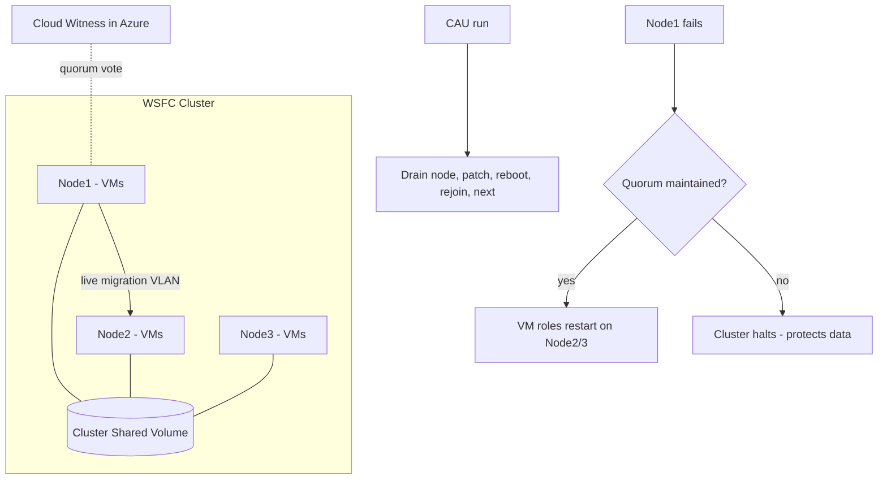

# Hyper-V: Failover Clustering and Live Migration

**Level:** Advanced
**Tree:** [Hyper-V & KVM](../README.md)
**Branch:** [Microsoft Hyper-V](README.md)
**Forest:** [Virtualization](../../../README.md)

## Explanation

## Windows-native virtualization HA

Hyper-V's enterprise availability story is **Windows Server Failover Clustering (WSFC)**: up to 64 hosts share storage (SAN LUNs as **Cluster Shared Volumes**, or SMB3 shares on a Scale-Out File Server, or Storage Spaces Direct pooling local disks), and VMs become clustered roles that restart on surviving nodes when a host fails. CSV is the key enabler - a clustered NTFS/ReFS volume all nodes mount simultaneously, so any node can run any VM without drive-letter ownership games; one node coordinates metadata while data I/O flows direct from each node to storage.

**Quorum** design prevents split-brain: each node votes, plus a witness (file share, disk, or - best practice - cloud witness in Azure) providing the tie-breaking vote; dynamic quorum adjusts votes as nodes leave gracefully, letting a cluster survive sequential shutdowns down to one node. Skipping witness configuration is the most common self-inflicted outage in small clusters.

**Live migration** moves running VMs between nodes: memory pre-copy over a dedicated migration network (compressed by default; SMB Direct/RDMA for the fastest transfers), then a brief switchover. **Storage Live Migration** relocates VHDX files with the VM running, and **Shared-Nothing Live Migration** moves VM plus storage between standalone hosts with only Kerberos constrained delegation configured. Practical settings that matter: enable processor compatibility mode for mixed CPU generations (the EVC analogue, per-VM), cap simultaneous migrations to protect the network, and prefer Kerberos over CredSSP so migrations can be initiated remotely without an interactive session on the source host.

Patching at scale uses **Cluster-Aware Updating (CAU)**: it drains each node (live-migrating VMs off), patches, reboots, rejoins, and moves to the next - a rolling update of the whole cluster with no VM downtime, schedulable and scriptable.

## Architecture and flow



## Commands

### Command 1

Run cluster validation - required evidence before support will engage

```text
Test-Cluster -Node hv1,hv2,hv3
```

### Command 2

Form the failover cluster

```text
New-Cluster -Name HVC01 -Node hv1,hv2,hv3 -StaticAddress 10.10.40.10
```

### Command 3

Configure an Azure cloud witness for quorum

```text
Set-ClusterQuorum -CloudWitness -AccountName acmewitness -AccessKey $key
```

### Command 4

Convert clustered storage into a CSV all nodes can use

```text
Add-ClusterSharedVolume -Name 'Cluster Disk 1'
```

### Command 5

Live-migrate a clustered VM to another node

```text
Move-ClusterVirtualMachineRole -Name SQL-VM01 -Node hv2 -MigrationType Live
```

### Command 6

Drain a node (live-migrating its VMs away) for maintenance

```text
Suspend-ClusterNode -Name hv1 -Drain
```

### Command 7

Generate the cluster debug log for the last 30 minutes

```text
Get-ClusterLog -Destination C:\Temp -TimeSpan 30
```

## Automation scripts

### New-HVClusterBaseline.ps1

```powershell
# Baseline a new Hyper-V cluster: validation, quorum, CSV, migration settings.
param(
    [Parameter(Mandatory)][string[]]$Nodes,
    [Parameter(Mandatory)][string]$ClusterName,
    [Parameter(Mandatory)][string]$ClusterIP
)
$ErrorActionPreference = 'Stop'
Write-Host "== Validation =="
$report = Test-Cluster -Node $Nodes
Write-Host "Validation report: $($report.FullName)"

Write-Host "== Create cluster =="
New-Cluster -Name $ClusterName -Node $Nodes -StaticAddress $ClusterIP | Out-Null

Write-Host "== Migration hardening on each node =="
foreach ($n in $Nodes) {
    Invoke-Command -ComputerName $n -ScriptBlock {
        Enable-VMMigration
        Set-VMHost -VirtualMachineMigrationAuthenticationType Kerberos
        Set-VMHost -MaximumVirtualMachineMigrations 2 -MaximumStorageMigrations 2
        Set-VMHost -VirtualMachineMigrationPerformanceOption Compression
    }
}
Write-Host "== Result =="
Get-Cluster -Name $ClusterName | Format-List Name,DynamicQuorum
Get-ClusterNode -Cluster $ClusterName | Format-Table Name,State
Write-Warning "Remember: Set-ClusterQuorum -CloudWitness and configure Kerberos constrained delegation for remote-initiated migrations."
```

## Lab

**Objective:** Build a 2-node Hyper-V cluster with a witness, prove live migration under load, unplanned failover, and a rolling CAU-style patch drain.

### Steps

1. Prepare two Hyper-V hosts (nested is fine) joined to AD with a shared iSCSI target or S2D.
2. Run Test-Cluster, fix every error, then New-Cluster and add a file-share or cloud witness.
3. Convert the shared disk to CSV and create a clustered VM on it.
4. Live-migrate the VM under a memory-churn workload; record ping loss (expect 0-1).
5. Hard power-off the node owning the VM; time the automatic restart on the survivor.
6. Drain one node with Suspend-ClusterNode, simulate patching with a reboot, resume, repeat on the other.

### Validation

Cluster validation report has no failures (warnings understood and documented).,Get-ClusterQuorum shows the witness configured and dynamic quorum on.,Live migration completes with at most one dropped ping.,After node kill, the VM is running on the surviving node within the expected restart window.,Both drains complete with zero VM downtime.

## Operational automation

### Automating Hyper-V clusters

- **PowerShell everywhere**: the FailoverClusters and Hyper-V modules cover the entire lifecycle; wrap standards (migration auth, limits, networks) in a baseline script or DSC configuration applied to every new node.
- **Cluster-Aware Updating**: configure CAU in self-updating mode on a monthly schedule with pre/post scripts (health checks, monitoring silence windows) - the cluster patches itself node by node.
- **SCVMM / Azure Arc**: at fleet scale, System Center VMM adds templates, logical networks and bare-metal provisioning; Azure Arc-enabled infrastructure brings Azure-side inventory, updates and monitoring to on-prem Hyper-V."

## Troubleshooting

### Scenario 1: Live migration fails with 0x8009030E (no credentials available)

**Likely cause:** Using Kerberos authentication without constrained delegation configured, and initiating remotely (double-hop)

**Resolution:** Configure Kerberos constrained delegation for cifs and Microsoft Virtual System Migration Service on each host's AD object, or initiate from the source host console

### Scenario 2: CSV enters Redirected Access mode and VM I/O slows

**Likely cause:** A node lost direct storage connectivity, so I/O detours through the coordinator node over the cluster network

**Resolution:** Fix the failing path (iSCSI/FC/MPIO) on the affected node; confirm with Get-ClusterSharedVolumeState; check for backup software that forces redirected mode

### Scenario 3: Cluster loses quorum when one of two nodes reboots

**Likely cause:** No witness configured - two votes, one lost, no majority

**Resolution:** Add a cloud or file-share witness immediately; with dynamic quorum and a witness, a 2-node cluster survives single-node loss cleanly

## Interview questions

### 1. Explain CSV and why it beats one-LUN-per-VM designs.

Cluster Shared Volumes let every node mount the same NTFS/ReFS volume concurrently - any node runs any VM with no disk ownership failover, so live migration needs no storage handoff and VM density per LUN is an operational choice, not a constraint. Metadata operations coordinate through one node, but data I/O flows directly; failover shrinks from minutes of LUN re-arbitration to seconds.

### 2. How does dynamic quorum change failure math?

The cluster recalculates votes as nodes leave gracefully: a 5-node cluster shutting down sequentially can remain quorate down to a single node ('last man standing'). It protects against sequential planned loss, not simultaneous failures - a 50/50 partition still needs the witness vote, which is why a witness is mandatory even with dynamic quorum.

### 3. Which live migration authentication and performance options do you standardize and why?

Kerberos with constrained delegation - CredSSP requires logging into the source host per migration and is the classic 'works from console, fails remotely' trap. Performance: compression as default (CPU is cheaper than migration-network bandwidth); SMB Direct where RDMA NICs exist. Cap concurrent migrations to protect the wire, and use a dedicated migration VLAN.

### 4. A 2-node cluster is a common SMB request. What do you insist on?

A witness (cloud witness preferred - no third site needed), redundant independent cluster networks, validated MPIO to shared storage or S2D with the right resiliency, and honest capacity planning: one node must run everything. Then test unplanned failover before go-live, not during the first real outage.

## Certification alignment

- Microsoft AZ-800/AZ-801 - Implement and manage Hyper-V and failover clustering
- Microsoft AZ-801 - Implement Cluster-Aware Updating and cluster quorum
- Legacy 70-740 objectives - Hyper-V, CSV, live migration fundamentals

## References

- Microsoft Learn: Failover Clustering in Windows Server documentation
- Microsoft Learn: Hyper-V Live Migration overview and configuration
- Microsoft Learn: Cluster-Aware Updating documentation

## Suggested video search

Hyper-V failover cluster CSV quorum live migration Cluster-Aware Updating

---

> Validate commands, versions, permissions, licensing, and rollback procedures in an isolated lab before production use.
