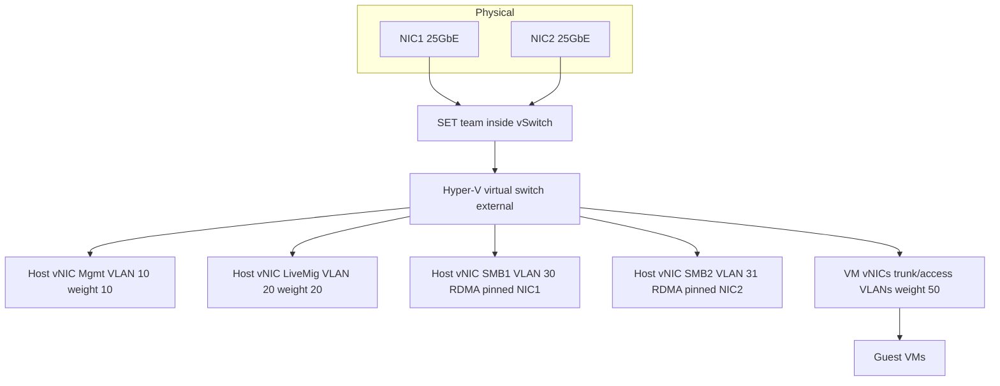

# Hyper-V: Virtual Switches, VLANs and Converged Networking

**Level:** Advanced
**Tree:** [Hyper-V & KVM](../README.md)
**Branch:** [Microsoft Hyper-V](README.md)
**Forest:** [Virtualization](../../../README.md)

## Explanation

## Software networking under Windows VMs

The **Hyper-V virtual switch** is a layer-2 software switch with three flavors: **External** (bound to a physical NIC/team - VM traffic reaches the LAN), **Internal** (host-plus-VMs only), and **Private** (VMs only - useful for isolated lab and cluster heartbeat segments). Per-vNIC features make it enterprise-grade: VLAN tagging in access or trunk mode, bandwidth weights/caps, DHCP guard and router guard (block rogue infrastructure services from guests), port mirroring, and MAC spoofing control (off by default; deliberately enabled for nested virtualization and some NLB scenarios).

The modern design pattern is **converged networking**: instead of dedicating physical NIC pairs per traffic class (management, live migration, cluster, storage, VM), team two or more high-bandwidth NICs and run everything as host vNICs on one virtual switch, separated by VLANs and governed by bandwidth policy. **SET (Switch Embedded Teaming)** is the current teaming method - built into the vSwitch (LBFO teams are deprecated for this role), supporting up to eight uplinks, Hyper-V port or dynamic load balancing, and it is required for RDMA-capable host vNICs (SMB Direct for S2D/CSV traffic). A typical S2D node: 2x25GbE in SET, host vNICs for Management, LM, and two SMB vNICs pinned each to a physical uplink with RDMA enabled, plus VM networks trunked on top - QoS weights guaranteeing storage and migration traffic under contention.

Guest-facing performance features round it out: VMQ spreads inbound VM traffic across host cores (verify it is working, not just enabled - broken VMQ on some NICs historically throttled throughput); SR-IOV bypasses the vSwitch entirely for latency-critical guests at the cost of most switch features; vRSS scales receive processing inside guests. The operational rule of thumb: converge for flexibility, then use QoS weights - not hard caps - so idle bandwidth is never wasted.

## Architecture and flow



## Commands

### Command 1

Create a SET-teamed external switch with no default host vNIC

```text
New-VMSwitch -Name ConvergedSw -NetAdapterName 'NIC1','NIC2' -EnableEmbeddedTeaming $true -AllowManagementOS $false
```

### Command 2

Add a host vNIC for management on VLAN 10

```text
Add-VMNetworkAdapter -ManagementOS -Name 'Mgmt' -SwitchName ConvergedSw; Set-VMNetworkAdapterVlan -ManagementOS -VMNetworkAdapterName 'Mgmt' -Access -VlanId 10
```

### Command 3

Guarantee storage vNIC bandwidth share under contention

```text
Set-VMNetworkAdapter -ManagementOS -Name 'SMB1' -MinimumBandwidthWeight 40
```

### Command 4

Enable RDMA on the SMB host vNICs for SMB Direct

```text
Enable-NetAdapterRdma -Name 'vEthernet (SMB1)','vEthernet (SMB2)'
```

### Command 5

Pin an SMB vNIC to a specific physical uplink for deterministic paths

```text
Set-VMNetworkAdapterTeamMapping -ManagementOS -VMNetworkAdapterName 'SMB1' -PhysicalNetAdapterName 'NIC1'
```

### Command 6

Trunk a range of VLANs to a network-appliance guest

```text
Set-VMNetworkAdapterVlan -VMName app01 -Trunk -AllowedVlanIdList 100-110 -NativeVlanId 0
```

### Command 7

Verify VMQ distribution across host cores

```text
Get-NetAdapterVmq | Where-Object Enabled | Format-Table Name,BaseProcessorNumber,MaxProcessors
```

## Automation scripts

### New-ConvergedNetwork.ps1

```powershell
# Build a converged SET switch with QoS-weighted host vNICs.
param(
    [string[]]$Uplinks = @('NIC1','NIC2'),
    [string]$SwitchName = 'ConvergedSw'
)
$ErrorActionPreference = 'Stop'
if (Get-VMSwitch -Name $SwitchName -ErrorAction SilentlyContinue) {
    throw "Switch $SwitchName already exists - aborting to avoid disruption."
}
New-VMSwitch -Name $SwitchName -NetAdapterName $Uplinks     -EnableEmbeddedTeaming $true -AllowManagementOS $false     -MinimumBandwidthMode Weight | Out-Null

$vnics = @(
    @{ Name='Mgmt'; Vlan=10; Weight=10 },
    @{ Name='LiveMig'; Vlan=20; Weight=20 },
    @{ Name='SMB1'; Vlan=30; Weight=20 },
    @{ Name='SMB2'; Vlan=31; Weight=20 }
)
foreach ($v in $vnics) {
    Add-VMNetworkAdapter -ManagementOS -Name $v.Name -SwitchName $SwitchName
    Set-VMNetworkAdapterVlan -ManagementOS -VMNetworkAdapterName $v.Name -Access -VlanId $v.Vlan
    Set-VMNetworkAdapter -ManagementOS -Name $v.Name -MinimumBandwidthWeight $v.Weight
}
Set-VMNetworkAdapterTeamMapping -ManagementOS -VMNetworkAdapterName 'SMB1' -PhysicalNetAdapterName $Uplinks[0]
Set-VMNetworkAdapterTeamMapping -ManagementOS -VMNetworkAdapterName 'SMB2' -PhysicalNetAdapterName $Uplinks[1]
Get-VMNetworkAdapter -ManagementOS | Format-Table Name,SwitchName
Write-Host "Converged switch ready. Configure IPs on the vEthernet adapters and enable RDMA on SMB vNICs."
```

## Lab

**Objective:** Build a converged network on a Hyper-V host: SET team, VLAN-separated host vNICs with QoS weights, and prove isolation plus guaranteed bandwidth under contention.

### Steps

1. On a host with two NICs (nested lab: two synthetic NICs), create the SET switch with the provisioning script.
2. Assign IPs to Mgmt/LiveMig/SMB vNICs on their VLANs; confirm the physical switchports trunk those VLANs.
3. Create two guest VMs on different access VLANs and prove they cannot reach each other but reach their gateways.
4. Enable DHCP guard on guest vNICs; run a rogue DHCP server in a guest and prove no leases escape.
5. Saturate the team from a VM (iperf3) while running a live migration; show LM still achieves its weighted share.
6. Fail one uplink and confirm all vNICs keep connectivity via the surviving SET member.

### Validation

Get-VMSwitch shows embedded teaming with both uplinks; Get-VMNetworkAdapterVlan lists correct VLANs.,Inter-VLAN guest traffic fails without a router; intra-VLAN works.,Rogue DHCP offers are blocked with DHCP guard enabled (packet capture shows drops).,During contention, live migration throughput reflects its bandwidth weight rather than starving.,Uplink failure causes no vNIC outage beyond momentary reconvergence.

## Operational automation

### Automating Hyper-V networking

- **Idempotent baselines**: the provisioning script pattern (check, create, verify) in PowerShell or DSC ensures every host is born with identical switch, VLAN and QoS configuration - configuration drift on networking is an outage generator.
- **SCVMM logical networks**: at scale, define logical networks, port profiles and classifications once in VMM; hosts inherit converged config on add, and VM networks bind to policy, not per-host settings.
- **Validation in pipelines**: scheduled Pester tests assert switch type, SET membership, VLAN maps, RDMA state and VMQ health across the fleet, failing loudly on drift.

## Troubleshooting

### Scenario 1: VM on a tagged VLAN has no connectivity

**Likely cause:** Physical switchport not trunking that VLAN, or vNIC left in access mode with the wrong ID

**Resolution:** Verify Set-VMNetworkAdapterVlan output and the switchport trunk allowed list end-to-end; remember host vNIC VLANs are set with -ManagementOS, guest vNICs per VM

### Scenario 2: Poor VM network throughput on a 10GbE host

**Likely cause:** VMQ broken or all queues landing on core 0 (infamous with certain NIC drivers), or bandwidth caps set instead of weights

**Resolution:** Update NIC drivers/firmware, verify Get-NetAdapterVmq spreads processors, prefer MinimumBandwidthWeight over hard caps, test with VMQ disabled to isolate

### Scenario 3: SMB Direct not engaging on converged vNICs

**Likely cause:** RDMA not enabled on the host vNICs, SET load-balancing misconfig, or DCB/PFC missing for RoCE

**Resolution:** Enable-NetAdapterRdma on vEthernet adapters, verify Get-SmbClientNetworkInterface shows RDMA capable true, configure DCB with PFC on the fabric for RoCE, or use iWARP to avoid fabric dependencies

## Interview questions

### 1. Why has SET replaced LBFO teaming for Hyper-V?

LBFO is a general OS teaming layer the vSwitch sits on; SET builds teaming into the vSwitch itself, which is required for RDMA on host vNICs, integrates with packet processing (VMQ/vRSS) more cleanly, and is where Microsoft develops (LBFO binding to the vSwitch is deprecated). SET trades away some LBFO modes (no LACP) for that integration - switch-independent design is the norm.

### 2. Sell converged networking to a team used to six dedicated NICs.

Fewer, faster pipes with policy instead of physical separation: two 25GbE in SET replace six 1/10GbE, QoS weights guarantee each class its share only when contended (idle bandwidth stays usable), VLANs preserve isolation, and adding a traffic class is a vNIC, not a cabling project. Failure domains improve too - every class survives an uplink loss instead of losing 'its' NIC.

### 3. When is SR-IOV worth losing the vSwitch features?

Latency/jitter-critical or packet-rate-extreme guests - NFV appliances, market data, some SQL AG replicas - where bypassing the software switch measurably matters. You give up ACLs, QoS, port mirroring and (historically) constrained mobility, so scope it to the specific vNICs that need it and document the exception.

### 4. What do DHCP guard and router guard protect against?

Guests impersonating infrastructure: DHCP guard drops DHCP server offers originating from a guest vNIC, router guard drops router advertisements/redirects. They neutralize a compromised or misconfigured VM poisoning address assignment or hijacking traffic on the segment - cheap hardening that should default-on for all guest-facing templates.

## Certification alignment

- Microsoft AZ-800 - Configure Hyper-V virtual switches and VM networking
- Microsoft AZ-801 - Networking for failover clusters and S2D (RDMA, SET)
- Legacy 70-740/70-741 objectives - Hyper-V networking features and QoS

## References

- Microsoft Learn: Hyper-V virtual switch and Switch Embedded Teaming documentation
- Microsoft Learn: Host network requirements for Azure Local / S2D
- Microsoft Learn: Remote Direct Memory Access (RDMA) and SMB Direct

## Suggested video search

Hyper-V converged networking SET switch embedded teaming VLAN QoS RDMA

---

> Validate commands, versions, permissions, licensing, and rollback procedures in an isolated lab before production use.
