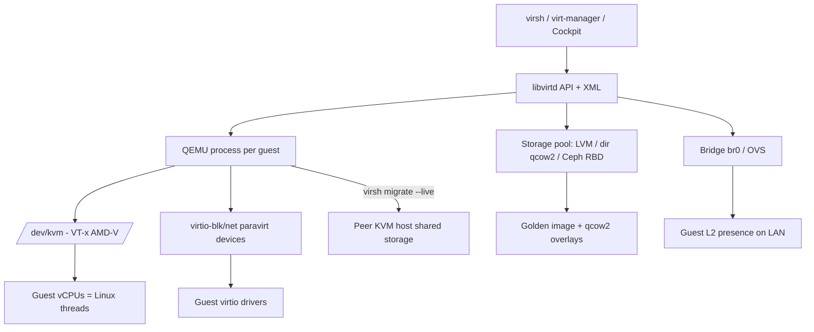

# KVM: libvirt, QEMU and virsh Administration

**Level:** Advanced
**Tree:** [Hyper-V & KVM](../README.md)
**Branch:** [KVM & Proxmox](README.md)
**Forest:** [Virtualization](../../../README.md)

## Explanation

## The Linux kernel as hypervisor

**KVM** is a kernel module that turns Linux into a type-1 hypervisor by exposing hardware virtualization extensions (Intel VT-x/AMD-V) through /dev/kvm; each guest vCPU is simply a Linux thread the scheduler manages. **QEMU** provides the machine model around it - emulated chipset, disks, NICs - executing guest code at native speed via KVM and only emulating devices. **Virtio** paravirtualized devices (disk, net, memory balloon, RNG) replace slow emulated hardware with ring-buffer interfaces the guest driver understands, and are the single biggest performance lever: a guest on IDE+e1000 emulation versus virtio-blk/virtio-net can differ by an order of magnitude. **libvirt** sits on top as the management layer: a daemon and stable XML/API abstraction over domains (VMs), storage pools/volumes and virtual networks, consumed by virsh (CLI), virt-manager (GUI), Cockpit, and higher platforms (OpenStack Nova, oVirt, and - conceptually - Proxmox's own stack).

Working fluency means: define guests with virt-install or XML; virsh edit to change hardware (persistent) versus virsh setmem/setvcpus for live adjustments; storage pools (directory, LVM, NFS, Ceph RBD) with qcow2 volumes for thin provisioning, snapshots and backing chains - golden image plus per-VM overlay is the classic lab and VDI pattern (qemu-img create -b). Networking defaults to the NAT bridge virbr0; production guests ride a Linux bridge or Open vSwitch on the host for direct L2 presence. Live migration moves running guests between hosts sharing storage (virsh migrate --live) with the same pre-copy mechanics as commercial hypervisors.

Two operational disciplines: always install guest agents (qemu-guest-agent enables clean shutdown, freeze for consistent snapshots, IP reporting), and treat host CPU model policy deliberately - host-passthrough for performance within identical fleets, named CPU models for migration compatibility across mixed hardware, exactly the EVC trade-off in open form.

## Architecture and flow



## Commands

### Command 1

Create and kickstart-install a guest headless on a bridge

```text
virt-install --name rhel9-01 --memory 4096 --vcpus 2 --disk pool=default,size=40,format=qcow2 --os-variant rhel9.4 --network bridge=br0 --location /iso/rhel9.iso --graphics none --extra-args 'console=ttyS0'
```

### Command 2

Inventory guests and show one guest's resources and state

```text
virsh list --all && virsh dominfo rhel9-01
```

### Command 3

Create a thin overlay disk backed by a golden image

```text
qemu-img create -f qcow2 -b /var/lib/libvirt/images/golden-rhel9.qcow2 -F qcow2 /var/lib/libvirt/images/vm07.qcow2
```

### Command 4

Take a disk-only external snapshot before risky changes

```text
virsh snapshot-create-as rhel9-01 pre-patch --disk-only --atomic
```

### Command 5

Live-migrate a guest to a peer host over SSH transport

```text
virsh migrate --live --persistent --verbose rhel9-01 qemu+ssh://kvm2.acme.com/system
```

### Command 6

Get guest IPs via qemu-guest-agent (works without DHCP lease inspection)

```text
virsh domifaddr rhel9-01 --source agent
```

### Command 7

Display the full qcow2 backing chain and virtual/actual sizes

```text
qemu-img info --backing-chain /var/lib/libvirt/images/vm07.qcow2
```

## Automation scripts

### clone-from-golden.sh

```bash
#!/usr/bin/env bash
# Clone a VM from a golden qcow2 with cloud-init NoCloud seed.
set -euo pipefail
NAME="$1"; IP="$2"
BASE="/var/lib/libvirt/images/golden-rhel9.qcow2"
DISK="/var/lib/libvirt/images/${NAME}.qcow2"
SEED="/var/lib/libvirt/images/${NAME}-seed.iso"
[ -e "$DISK" ] && { echo "ERROR: $DISK exists" >&2; exit 1; }
qemu-img create -f qcow2 -b "$BASE" -F qcow2 "$DISK" 60G
TMP=$(mktemp -d)
cat > "${TMP}/meta-data" <<EOF
instance-id: ${NAME}
local-hostname: ${NAME}
EOF
cat > "${TMP}/user-data" <<EOF
#cloud-config
users:
  - name: admin
    ssh_authorized_keys:
      - ssh-ed25519 AAAA_REPLACE_WITH_KEY admin@acme
    sudo: ALL=(ALL) NOPASSWD:ALL
write_files:
  - path: /etc/issue.d/build.issue
    content: "Provisioned by clone-from-golden on $(date -u +%F)
"
EOF
genisoimage -output "$SEED" -volid cidata -joliet -rock "${TMP}/user-data" "${TMP}/meta-data"
rm -rf "$TMP"
virt-install --name "$NAME" --memory 4096 --vcpus 2   --disk "path=${DISK},format=qcow2,bus=virtio"   --disk "path=${SEED},device=cdrom"   --os-variant rhel9.4 --network bridge=br0,model=virtio   --import --noautoconsole
echo "Guest $NAME defined and booting. Agent IP query:"
sleep 45
virsh domifaddr "$NAME" --source agent || echo "(agent not up yet)"
```

## Lab

**Objective:** Build a KVM host, create a golden image, clone thin guests with cloud-init, snapshot safely, and live-migrate a running guest to a second host.

### Steps

1. Install virtualization packages on RHEL 9 (dnf group 'Virtualization Host'), verify /dev/kvm and virt-host-validate.
2. Create bridge br0 with nmcli and attach the host uplink.
3. Install a RHEL 9 guest, install qemu-guest-agent, generalize it, and keep its qcow2 as the golden image.
4. Clone two thin guests with the overlay script; confirm both boot with unique hostnames/IPs.
5. Take a disk-only snapshot of one guest, break it deliberately, and revert by re-pointing to the pre-snapshot chain.
6. Set up a second host with shared NFS storage and live-migrate a guest under a ping test.

### Validation

virt-host-validate passes all checks (or documents IOMMU items).,qemu-img info shows both clones backed by the golden image, each only megabytes of delta.,virsh domifaddr --source agent returns IPs for all guests, proving agent health.,Live migration completes with zero or one lost ping and the guest persists on the target.

## Operational automation

### Automating KVM estates

- **Ansible community.libvirt**: virt (state, define from templated XML), virt_pool and virt_net modules manage the full topology; combine with the clone-from-golden pattern for image-based provisioning.
- **Terraform libvirt provider**: declarative domains, volumes with backing stores, and cloud-init - excellent for disposable lab and CI environments.
- **Image pipeline**: build golden images with Image Builder or Packer (qemu builder), version them, and rebase overlays on a schedule so clones inherit patched bases instead of patching every clone."

## Troubleshooting

### Scenario 1: Guest disk I/O is terrible compared to host

**Likely cause:** Emulated IDE/SATA disk instead of virtio, or missing virtio drivers in guest (Windows)

**Resolution:** Switch bus to virtio-blk (or virtio-scsi for discard/many disks), install virtio drivers in the guest, and set cache/io modes appropriately (cache=none for shared storage)

### Scenario 2: virsh migrate fails with CPU feature mismatch

**Likely cause:** Guest defined with host-passthrough CPU on a newer source host than the target

**Resolution:** Use a common named CPU model (or host-model with care) across the fleet for migratable guests; power-cycle guests after changing CPU mode

### Scenario 3: Snapshot revert lost recent data or guest filesystem inconsistent

**Likely cause:** External snapshot taken without guest freeze - crash-consistent only, or backing chain edited incorrectly

**Resolution:** Use --quiesce with qemu-guest-agent for filesystem-consistent snapshots; manage chains with virsh blockcommit/blockpull rather than manual file surgery

## Interview questions

### 1. How do KVM, QEMU and libvirt divide responsibilities?

KVM is the kernel module doing CPU/memory virtualization via hardware extensions; QEMU is the userspace process providing the machine model and device emulation (fast-pathed by virtio); libvirt is the management API/daemon that defines, launches and supervises QEMU processes from XML, plus storage and network objects. Each is replaceable in theory - together they are the standard Linux stack.

### 2. Why is virtio so much faster than emulated devices?

Emulation makes the guest driver poke registers of a pretend Intel NIC, trapping to QEMU on every access. Virtio is honest paravirtualization: guest and host share ring buffers and exchange batched descriptors with minimal exits - a cooperative queue instead of a hardware pantomime. Same reason vmxnet3 beats e1000 on vSphere.

### 3. Explain qcow2 backing chains and their operational risks.

A qcow2 overlay records only blocks that differ from its backing file, enabling golden-image clones and external snapshots. Risks: chains grow (read amplification), deleting or moving a backing file corrupts every descendant, and long-lived overlays never shrink. Manage with blockcommit (merge down) after validation windows, track chains with qemu-img info, and rebase clones onto refreshed goldens deliberately.

### 4. host-passthrough versus named CPU models - how do you choose?

host-passthrough exposes the full host CPU: best performance and required for nested virt, but migration only works to identical CPUs. Named models (or host-model) present a stable feature set migratable across the fleet's lowest common denominator - the open-source equivalent of EVC. Uniform clusters: passthrough. Mixed hardware with live migration: named model, chosen as high as the oldest host allows.

## Certification alignment

- RHCSA EX200 - (RHEL 8 objectives) Access and manage virtual machines with virsh/Cockpit
- Red Hat RH354/virtualization objectives - KVM, libvirt and virtio administration
- LFCS - Virtual machine management on Linux

## References

- Red Hat Documentation: Configuring and managing virtualization (RHEL 9)
- libvirt.org - domain XML format and virsh reference
- qemu.org documentation - qemu-img and virtio specifications

## Suggested video search

KVM libvirt virsh qcow2 virtio deep dive RHEL tutorial

---

> Validate commands, versions, permissions, licensing, and rollback procedures in an isolated lab before production use.
