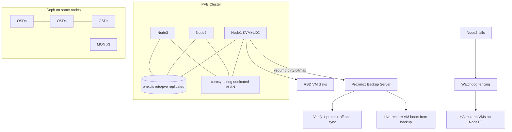

# Proxmox VE: Clustering, Ceph Integration and Backups

**Level:** Advanced
**Tree:** [Hyper-V & KVM](../README.md)
**Branch:** [KVM & Proxmox](README.md)
**Forest:** [Virtualization](../../../README.md)

## Explanation

## The open-source datacenter stack

**Proxmox VE** packages KVM/QEMU virtualization plus **LXC** system containers under one Debian-based platform with a complete web UI, REST API and CLI (qm for VMs, pct for containers, pvesh for the API). Its enterprise relevance has surged as organizations reassess hypervisor licensing: it delivers clustering, HA, live migration, software-defined storage and integrated backup with no per-socket license (support subscriptions optional).

**Clustering** uses corosync for membership and a replicated cluster filesystem (pmxcfs) mounted at /etc/pve, so configuration is identical on every node; management is multi-master - connect to any node's UI. Quorum rules apply: majority of votes required, two-node clusters need a **QDevice** (external quorum daemon) to survive a node loss. Corosync deserves its own network - it is latency-sensitive, and sharing it with storage traffic invites fencing storms. **HA** groups VMs into resources managed by the CRM; failed nodes are fenced (watchdog-based) and their HA resources restarted elsewhere.

Storage is pluggable: local LVM-thin/ZFS, NFS/iSCSI, and first-class **Ceph** - Proxmox installs and manages a hyperconverged Ceph cluster (MON/OSD/MGR on the VE nodes) from its own UI, giving vSAN/Nutanix-style HCI with RBD-backed VM disks, thin provisioning, snapshots and live migration without shared-array cost. ZFS brings replication (pvesr) for near-sync DR between nodes without Ceph.

**Backup** is the standout: vzdump does snapshot-mode backups per schedule, and **Proxmox Backup Server (PBS)** adds incremental-forever deduplicated backups with dirty-bitmap tracking (only changed blocks read), zstd compression, encryption at client side, verification jobs, and per-file restore - plus live-restore, booting a VM directly from backup storage while it streams back. Ransomware-era features (protected backups, off-site sync jobs, tape) complete a genuinely enterprise data-protection story.

## Architecture and flow



## Commands

### Command 1

Initialize a cluster on the first node and show quorum state

```text
pvecm create acme-cluster && pvecm status
```

### Command 2

Join a node to the cluster with a dedicated corosync link

```text
pvecm add 10.10.50.11 --link0 10.10.60.11
```

### Command 3

Deploy Ceph services on a VE node from the CLI

```text
pveceph install --repository no-subscription && pveceph mon create && pveceph osd create /dev/nvme1n1
```

### Command 4

Create a VM with an RBD-backed disk

```text
qm create 101 --name web01 --memory 4096 --cores 2 --net0 virtio,bridge=vmbr0 --scsi0 ceph-pool:40 --ostype l26
```

### Command 5

Live-migrate VM 101 to node pve2

```text
qm migrate 101 pve2 --online
```

### Command 6

Place a VM under HA management

```text
ha-manager add vm:101 --state started --group prod-ha
```

### Command 7

Snapshot-mode backup of a running VM to Proxmox Backup Server

```text
vzdump 101 --storage pbs-main --mode snapshot --notes-template 'pre-change {{guestname}}'
```

### Command 8

Query all cluster VMs via the REST API from the CLI

```text
pvesh get /cluster/resources --type vm --output-format json
```

## Automation scripts

### pve-nightly-checks.sh

```bash
#!/usr/bin/env bash
# Nightly Proxmox cluster health: quorum, HA, Ceph, backup freshness.
set -euo pipefail
FAIL=0
echo "== Quorum =="
if ! pvecm status | grep -q "Quorate:.*Yes"; then
  echo "CRITICAL: cluster not quorate"; FAIL=1
fi
echo "== HA resources =="
ha-manager status | grep -E "^(quorum|master|service)" || true
if ha-manager status | grep -q "error"; then
  echo "WARNING: HA resource in error state"; FAIL=1
fi
echo "== Ceph =="
if command -v ceph >/dev/null; then
  STATE=$(ceph health 2>/dev/null | awk '{print $1}')
  echo "Ceph health: $STATE"
  [ "$STATE" = "HEALTH_OK" ] || FAIL=1
fi
echo "== Backup freshness (last 26h) =="
CUTOFF=$(( $(date +%s) - 93600 ))
while read -r vmid; do
  LAST=$(pvesh get "/nodes/$(hostname)/storage/pbs-main/content"          --output-format json 2>/dev/null |          python3 -c "import sys,json;d=json.load(sys.stdin);v=[x['ctime'] for x in d if str(x.get('vmid'))=='$vmid'];print(max(v) if v else 0)")
  if [ "$LAST" -lt "$CUTOFF" ]; then
    echo "WARNING: VM $vmid has no backup in 26h"; FAIL=1
  fi
done < <(qm list | awk 'NR>1 {print $1}')
[ "$FAIL" -eq 0 ] && echo "ALL CHECKS PASSED" || echo "CHECKS FAILED=$FAIL"
exit "$FAIL"
```

## Lab

**Objective:** Build a 3-node Proxmox cluster with integrated Ceph, HA-protect a VM through a node failure, and prove PBS incremental backup plus live-restore.

### Steps

1. Install PVE on three nodes (nested OK) with separate NICs/VLANs for corosync and Ceph.
2. Form the cluster with pvecm; verify pmxcfs replication by editing a note on one node and reading it on another.
3. Deploy Ceph (3 MONs, one OSD per node) from the UI; create an RBD pool and a VM on it.
4. Live-migrate the VM across all three nodes under a ping test.
5. Enable HA for the VM, hard-stop its node, and time fencing plus restart on a survivor.
6. Install PBS, run a full then an incremental backup (note the dirty-bitmap speedup), verify, then live-restore to a new VMID.

### Validation

pvecm status shows 3 nodes, quorate; Ceph HEALTH_OK with 3 OSDs.,Migration under load loses at most one ping.,HA restarts the VM automatically after node failure within the watchdog+CRM window.,Second backup transfers a small fraction of the first (bitmap incremental).,Live-restored VM boots and serves while restore streams in the background.

## Operational automation

### Automating Proxmox

- **API-first**: everything the UI does rides /api2/json - use API tokens with scoped permissions; pvesh for shell workflows, the community.proxmox Ansible modules (proxmox_kvm, proxmox) for playbooks, and the bpg/proxmox Terraform provider for declarative VM fleets from templates+cloud-init.
- **Backup policy as config**: define vzdump jobs, PBS prune/verify/sync schedules in code; monitor freshness with the nightly check script wired to your alerting.
- **Golden templates**: build cloud-init-enabled templates (qm template) via Packer's proxmox builder in CI, so every provisioned VM starts patched and configured."

## Troubleshooting

### Scenario 1: Nodes randomly reboot under storage load

**Likely cause:** Corosync sharing a congested network - missed totem heartbeats trigger watchdog fencing

**Resolution:** Move corosync to a dedicated (ideally redundant link0+link1) network, verify latency with corosync-cfgtool -s, and keep backups/Ceph traffic off it

### Scenario 2: Cluster read-only: cannot create or edit VMs

**Likely cause:** Quorum lost - pmxcfs mounts read-only to protect config consistency

**Resolution:** Restore failed nodes or QDevice; in a genuine emergency pvecm expected 1 on the surviving node (understanding the split-brain risk), then repair membership properly

### Scenario 3: VM disks on Ceph stall during a single node reboot

**Likely cause:** Undersized Ceph (single MON, or pool size/min_size misset so one OSD loss blocks I/O)

**Resolution:** Run 3 MONs, pool size 3 min_size 2, and set noout during planned maintenance; verify with ceph osd pool get <pool> all

## Interview questions

### 1. How does Proxmox clustering differ from vSphere's vCenter model?

There is no management appliance: pmxcfs replicates configuration to every node over corosync and any node serves the full UI/API - management is multi-master and survives any node's loss inherently. The trade-off is corosync's strict quorum and latency requirements, which is why network design (dedicated redundant rings, QDevice for even node counts) is the critical skill.

### 2. Make the case for and against hyperconverged Ceph on PVE nodes.

For: no array or license cost, native RBD integration (snapshots, thin, migration), scales with nodes, one UI for compute+storage. Against: compute and storage failure domains couple (a busy VM host is also an OSD host - size CPU/RAM for both), small clusters (3 nodes) have limited rebuild headroom, and Ceph's networking demands (10GbE+, ideally separate public/cluster nets) exceed simple NFS setups. Below ~3 solid nodes, ZFS+replication is often the more honest choice.

### 3. What makes PBS incremental backups fast, and what invalidates that speed?

QEMU maintains a dirty bitmap of blocks changed since the last backup, so vzdump reads only those blocks - backup time tracks change rate, not disk size. The bitmap lives in the running QEMU process: a VM power-off/stop, node crash, or migration (historically) drops it, forcing the next backup to re-read everything (deduplication still limits transfer). Design schedules and reboots with that in mind.

### 4. How do you make a two-node Proxmox setup safe?

Add a QDevice on a third machine (any small VM/host outside the pair) so quorum survives one node's loss; give corosync two links; use ZFS replication or shared storage for fast recovery; and disable HA auto-failover if fencing cannot be trusted - a two-node cluster without a QDevice freezes read-only exactly when you need it most.

## Certification alignment

- Proxmox VE Certified Professional (PVECP) - clustering, Ceph, HA and backup objectives
- Linux Foundation LFCS - virtualization and storage management foundations
- Ceph EX260 concepts - RBD pools, MON quorum, OSD operations (as integrated in PVE)

## References

- Proxmox VE Administration Guide (pve.proxmox.com/pve-docs)
- Proxmox Backup Server Documentation - dirty bitmaps, verification, sync
- Proxmox wiki: Cluster Manager, QDevice and Ceph hyperconverged guides

## Suggested video search

Proxmox VE cluster Ceph hyperconverged setup Proxmox Backup Server tutorial

---

> Validate commands, versions, permissions, licensing, and rollback procedures in an isolated lab before production use.
