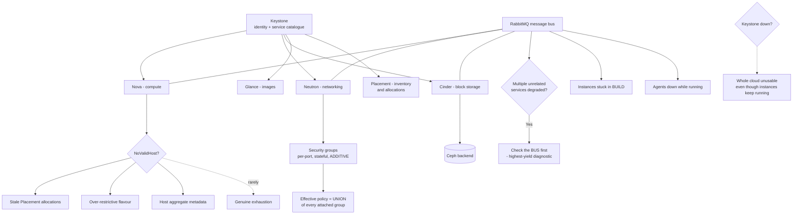

# Diagnosing OpenStack: the Message Bus, Placement and NoValidHost Failures

**Level:** Expert
**Tree:** [Private Cloud Platforms](../README.md)
**Branch:** [Operating and Selecting Private Cloud](README.md)
**Forest:** [Virtualization](../../../README.md)

## Explanation

# OpenStack Core Services

OpenStack is a set of independent services that cooperate through a message bus and a shared identity service. Understanding the seams between them is what makes it operable, because failures almost always occur at a seam rather than inside a service.

## The services that matter

- **Keystone** — identity, and the service catalogue. Every other service authenticates through it, which makes it the highest-consequence single component: Keystone down means the whole cloud is unusable even though every instance keeps running.
- **Nova** — compute. Schedules and manages instances via hypervisor drivers (usually libvirt/KVM).
- **Neutron** — networking. Provides networks, subnets, routers, security groups, usually with an ML2 plugin over Open vSwitch or OVN.
- **Cinder** — block storage, attached to instances, backed by Ceph in most production deployments.
- **Glance** — images. **Placement** — resource inventory and allocation, split out of Nova and a frequent source of scheduling confusion.

## The message bus is the real dependency

Services communicate over **RabbitMQ**. It is the component that most often causes cluster-wide symptoms with no obvious single cause: instances stuck in **BUILD**, agents reporting down while clearly running, operations that succeed but never report completion.

When multiple unrelated services degrade simultaneously, check the message bus before investigating any of them individually. This is the highest-yield diagnostic habit in OpenStack operations.

## Scheduling failures are usually Placement

A **NoValidHost** error means the scheduler found no host satisfying the request. The cause is rarely genuine exhaustion — far more often it is **stale Placement allocations** from deleted instances, an over-restrictive flavour, or host aggregate metadata excluding every candidate. Read Placement inventory and allocations before adding capacity.

## Neutron: security groups versus firewall rules

Security groups apply at the port and default to deny-inbound, allow-outbound. The common confusion is expecting them to behave like a stateful perimeter firewall — they are per-port, stateful, and additive across groups, so the effective policy on an instance is the *union* of every group attached to it, which is easy to lose track of.

## Upgrades

OpenStack upgrades are per-service and version-skew tolerant within limits, which is a strength and a trap: it is possible to leave a service behind for a release or two and only discover the incompatibility when a later upgrade will not proceed. Track the version of every service, not just the release name of the deployment.

## Architecture and flow



## Commands

### Command 1

The Keystone service catalogue — confirms which services are registered and reachable.

```text
openstack service list --long
```

### Command 2

Compare hypervisor capacity against Placement resource providers — the pair that explains most NoValidHost errors.

```text
openstack hypervisor stats show && openstack resource provider list
```

### Command 3

Deepest queues and consumer counts — a queue with messages and zero consumers is the classic OpenStack-wide fault.

```text
rabbitmqctl list_queues name messages consumers | sort -k2 -rn | head -20
```

### Command 4

Neutron agent state per host; agents alive but reported down almost always indicates the message bus.

```text
openstack network agent list --agent-type open-vswitch
```

## Automation scripts

### openstack-seam-check.sh

```bash
#!/usr/bin/env bash
# Checks the SEAMS between OpenStack services, which is where failures actually
# occur. Order is deliberate: identity, then the message bus, then Placement -
# because a bus fault produces symptoms in every service at once and investigating
# those services individually wastes the outage.
set -euo pipefail
fail=0

echo "== 1. Keystone: can anything authenticate? =="
if openstack token issue >/dev/null 2>&1; then
  echo "  identity OK"
else
  echo "  BLOCKING cannot issue a token - the cloud is unusable regardless of"
  echo "           instance state. Stop here and fix identity."
  exit 2
fi

echo
echo "== 2. Message bus: queues with messages and NO consumers =="
if command -v rabbitmqctl >/dev/null 2>&1; then
  stuck=$(rabbitmqctl list_queues name messages consumers 2>/dev/null | \
          awk 'NR>1 && $2>0 && $3==0 {print "    " $1 "  msgs=" $2 "  consumers=0"}')
  if [ -n "$stuck" ]; then
    echo "$stuck"
    echo "  FINDING queued work with no consumer - expect cluster-wide symptoms"
    fail=$((fail+1))
  else
    echo "  no stuck queues"
  fi
else
  echo "  rabbitmqctl unavailable on this host - check from a controller"
fi

echo
echo "== 3. Agents reported down (bus symptom, not an agent fault) =="
down=$(openstack network agent list -f value -c Host -c Alive 2>/dev/null | grep -ci false || true)
echo "  neutron agents not alive: ${down:-0}"
[ "${down:-0}" -gt 0 ] && fail=$((fail+1))

echo
echo "== 4. Placement: allocations vs providers (NoValidHost cause) =="
openstack resource provider list -f value -c uuid 2>/dev/null | head -5 | while read -r rp; do
  used=$(openstack resource provider show "$rp" --allocations -f value -c allocations 2>/dev/null | head -c 90)
  echo "    $rp  $used"
done

echo
echo "findings: $fail"
echo "NoValidHost is rarely real exhaustion - check stale allocations,"
echo "flavour constraints and host aggregate metadata before adding capacity."
exit $(( fail > 0 ? 1 : 0 ))
```

## Lab

**Objective:** Diagnose an OpenStack cloud at its seams and resolve a scheduling failure without adding capacity.

### Steps

1. Verify Keystone can issue a token and that the service catalogue lists every expected endpoint.
2. Inspect RabbitMQ for queues holding messages with no consumers, and correlate against any services reporting agents down.
3. Reproduce a NoValidHost condition and read Placement inventory and allocations before considering capacity.
4. Identify stale allocations from deleted instances and reconcile them.
5. Review a flavour and its host aggregate metadata to confirm candidates are not being excluded by configuration.
6. Audit one instance and list the union of security groups attached to it, confirming the effective policy is what was intended.

### Validation

Identity and catalogue are healthy, no queue holds work without a consumer, the NoValidHost was resolved by correcting allocations or metadata rather than by adding hosts, and the effective security-group policy on the audited instance is documented.

## Operational automation

Monitor queue depth with consumer count rather than queue depth alone. A deep queue with consumers is load; a queue with no consumers is a fault, and only the second one explains why several unrelated services degraded at the same moment.

## Troubleshooting

### Scenario 1: Several unrelated services degrade at once; instances stick in BUILD and agents report down while running

**Likely cause:** The message bus. RabbitMQ is the shared dependency, so a fault there presents as many simultaneous service faults.

**Resolution:** Check queues for messages with zero consumers before investigating any individual service. Diagnosing Nova and Neutron separately during a bus outage wastes the incident.

### Scenario 2: NoValidHost despite apparently free capacity

**Likely cause:** Stale Placement allocations from deleted instances, an over-restrictive flavour, or host aggregate metadata excluding every candidate.

**Resolution:** Read Placement inventory and allocations first. Genuine exhaustion is the least likely cause, and adding capacity does not fix a metadata constraint.

## Interview questions

### 1. Several OpenStack services degrade simultaneously. Where do you look first?

The message bus. Services communicate over RabbitMQ, so a bus fault presents as many unrelated services failing at once — instances stuck in BUILD, agents reporting down while clearly running, operations that succeed but never report completion. Investigating Nova and Neutron individually during a bus outage burns the incident. The specific check is queues holding messages with zero consumers.

### 2. What usually causes NoValidHost?

Rarely genuine capacity exhaustion. Far more often it is stale Placement allocations left by deleted instances, a flavour whose constraints no host satisfies, or host aggregate metadata excluding every candidate. Placement was split out of Nova and is where the truth about capacity lives, so reading inventory and allocations comes before any decision to add hosts — adding capacity cannot fix a metadata constraint.

## Certification alignment

- COA Certified OpenStack Administrator
- Red Hat RHCSA in Red Hat OpenStack
- Mirantis OpenStack certification

## References

- OpenStack Administrator Guide
- OpenStack Placement service documentation
- Neutron networking guide

## Suggested video search

https://www.youtube.com/results?search_query=openstack+nova+neutron+cinder+keystone+architecture+troubleshooting

---

> Validate commands, versions, permissions, licensing, and rollback procedures in an isolated lab before production use.
