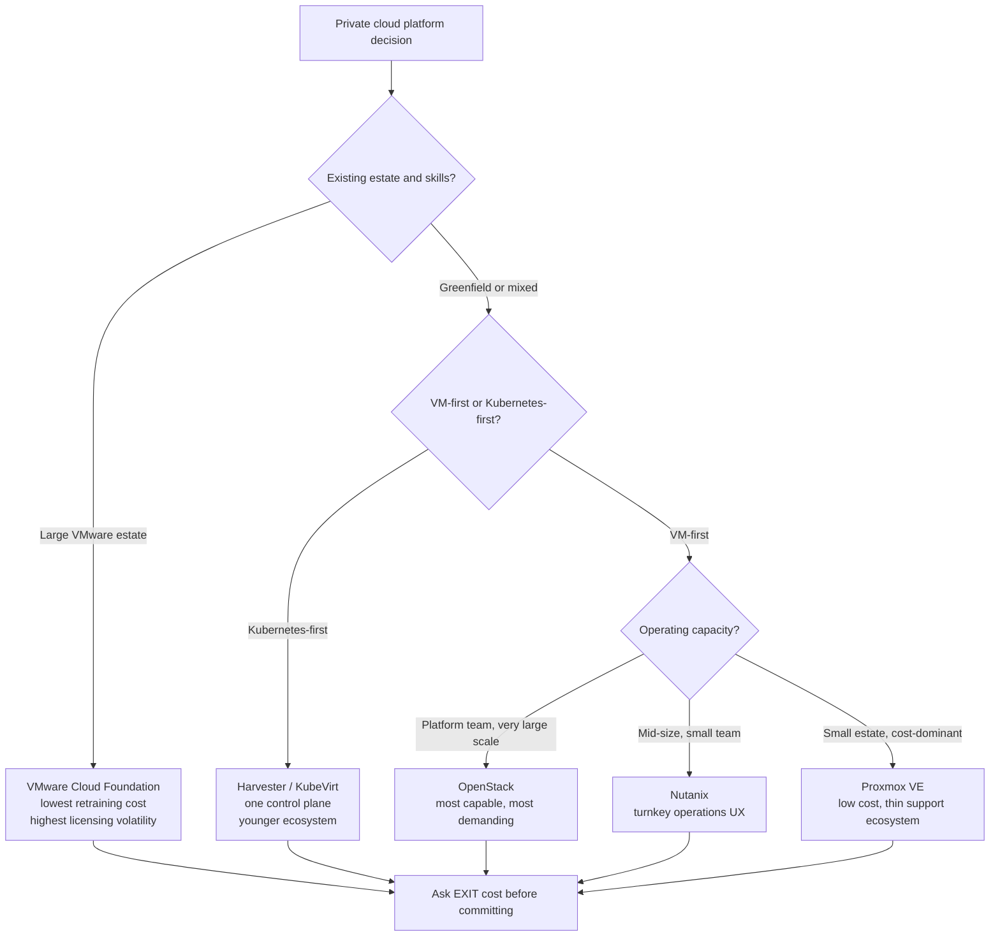

# Private Cloud Platform Selection and Exit Cost Analysis

**Level:** Advanced
**Tree:** [Private Cloud Platforms](../README.md)
**Branch:** [Operating and Selecting Private Cloud](README.md)
**Forest:** [Virtualization](../../../README.md)

## Explanation

## The decision is an operating model choice, not a feature comparison

OpenStack, VMware Cloud Foundation, Nutanix, Harvester and Proxmox VE all run virtual
machines reliably at enterprise scale. Feature matrices comparing them produce a
false sense of rigour, because the features that differ are rarely the ones that
decide the outcome. **The real question is which platform this organisation can staff,
patch and troubleshoot at three in the morning.**

### The screening order that works

1. **Existing estate and skills.** A large VMware estate with a vSphere-skilled team
   has an enormous incumbent advantage, and the honest counterweight is licensing cost
   volatility rather than technical capability.
2. **VM-first or Kubernetes-first.** If containers are the strategic direction and VMs
   are a shrinking legacy tail, a Kubernetes-native platform unifies the control plane.
   If VMs are the estate, it does not.
3. **Operating capacity.** OpenStack is the most capable and the most demanding. It
   rewards organisations with a genuine platform engineering team and punishes those
   who expected an appliance.
4. **Scale and cost sensitivity.** Turnkey appliance platforms trade licensing cost
   for operational simplicity. That is a good trade for a mid-size estate with a small
   team and a poor one at very large scale.

### Exit cost is the under-asked question

Every selection process examines entry: licensing, migration effort, training. Almost
none examines exit. Moving off a platform means converting disk formats, rebuilding
network constructs, rewriting automation, and retraining. **Ask what leaving costs
before committing**, while there is still negotiating leverage - not during a renewal
when the answer determines how much leverage the vendor has.

## Architecture and flow



## Commands

### Command 1

Identify current disk format - the first concrete input to any migration or exit cost estimate

```text
qemu-img info <disk>
```

### Command 2

Convert VMware VMDK to QCOW2 for KVM-based platforms - run against a copy and measure the time per TB to size the migration window

```text
qemu-img convert -p -O qcow2 source.vmdk target.qcow2
```

### Command 3

Convert a VMware VM including guest driver injection - the driver step is what distinguishes a working conversion from a non-booting one

```text
virt-v2v -i vmx /path/to/vm.vmx -o local -os /var/lib/libvirt/images
```

### Command 4

Extract source VM hardware configuration for migration sizing without connecting to the target

```text
govc vm.info -json <vm> | jq ".VirtualMachines[].Config.Hardware"
```

### Command 5

Confirm target platform quotas can accommodate the migrating estate before starting

```text
openstack quota show <project>
```

## Automation scripts

### estate-exit-cost-report.sh

```bash
#!/usr/bin/env bash
# Estimates platform exit effort from the current estate inventory.
# Produces the inputs a migration business case actually needs.
set -euo pipefail

INVENTORY="${1:-estate.csv}"   # name,vcpu,ram_gb,disk_gb,os,app_tier
GB_PER_HOUR="${GB_PER_HOUR:-500}"

[ -r "${INVENTORY}" ] || { echo "usage: $0 <inventory.csv>" >&2; exit 2; }

echo "Platform exit cost estimate - $(date -u +%FT%TZ)"
echo "source inventory: ${INVENTORY}"
echo

TOTAL_VM=0; TOTAL_DISK=0; WIN=0; LIN=0; TIER1=0

while IFS=, read -r name vcpu ram disk os tier; do
  case "${name}" in name|"") continue ;; esac
  TOTAL_VM=$((TOTAL_VM+1))
  TOTAL_DISK=$((TOTAL_DISK + ${disk:-0}))
  case "${os}" in *[Ww]indows*) WIN=$((WIN+1)) ;; *) LIN=$((LIN+1)) ;; esac
  case "${tier}" in *1*|*critical*) TIER1=$((TIER1+1)) ;; esac
done < "${INVENTORY}"

echo "estate:"
printf "  virtual machines : %s\n" "${TOTAL_VM}"
printf "  total disk       : %s GB\n" "${TOTAL_DISK}"
printf "  windows / linux  : %s / %s\n" "${WIN}" "${LIN}"
printf "  tier-1 workloads : %s\n" "${TIER1}"
echo

CONVERT_H=$(( TOTAL_DISK / GB_PER_HOUR ))
echo "conversion effort:"
printf "  disk conversion  : ~%s hours at %s GB/h\n" "${CONVERT_H}" "${GB_PER_HOUR}"
echo "  NOTE this is wall-clock copy time only. It excludes the parts that"
echo "       dominate a real migration:"
echo "         - guest driver replacement (Windows needs virtio drivers)"
echo "         - network construct rebuild (VLANs, security groups, LB rules)"
echo "         - automation rewrite (every playbook and pipeline targeting the old API)"
echo "         - monitoring and backup re-integration"
echo "         - per-application test and acceptance, which scales with TIER-1 count"
echo

echo "risk-weighted sequencing:"
printf "  wave 1 (low risk)  : %s non-tier-1 Linux VMs\n" "$(( LIN > TIER1 ? LIN - TIER1 : 0 ))"
printf "  wave N (high risk) : %s tier-1 workloads - individual runbooks required\n" "${TIER1}"
echo
echo "Tier-1 count, not total disk, is the honest driver of migration duration."
```

## Lab

**Objective:** Produce a defensible private cloud selection for a stated scenario, then quantify the exit cost from the chosen platform and from the incumbent, and present both as a decision record.

### Steps

1. Define a scenario: estate size, current platform, team skills, compliance constraints, and strategic direction on containers.
2. Score each of the five platforms against the four screening criteria in order - skills, VM-first vs Kubernetes-first, operating capacity, scale and cost sensitivity.
3. Deliberately do not build a feature matrix. Record why the differentiating features were not decisive.
4. Build a representative test VM on the incumbent platform and convert it to the leading candidate using virt-v2v or qemu-img.
5. Record actual conversion time per GB and, critically, whether the converted guest boots without manual driver work.
6. Run the exit cost script against a sample inventory to produce conversion hours, and enumerate the non-copy work it explicitly excludes.
7. Estimate exit cost from the recommended platform as well as from the incumbent, so the decision includes reversibility.
8. Write the outcome as an ADR: context, options considered, decision, consequences, and the accepted risks.

### Validation

A written ADR exists with a recommendation traceable to the screening criteria,Measured conversion time and boot success are recorded from a real conversion,Exit cost is quantified for both the incumbent and the recommendation

## Operational automation

### Automating selection and migration

- **RVTools or govc** to export the incumbent estate inventory as the factual basis for
  sizing. Selection arguments conducted without an inventory are opinion.
- **virt-v2v** for conversion including guest driver injection. Script it per wave and
  capture per-VM duration - real numbers replace the estimates that migration plans
  otherwise run on.
- **Terraform** against the target platform so the landing configuration is code from
  the first VM, rather than a hand-built environment that must later be reverse
  engineered.
- Maintain the decision as an **ADR in the repository**, not a slide. When the platform
  is questioned in two years, the reasoning and the accepted risks must be readable.
- Re-run the exit cost estimate annually. It is an input to every renewal negotiation
  and it changes as the estate grows.

## Troubleshooting

### Scenario 1: Converted Windows VM will not boot on the new platform, stopping with an inaccessible boot device error

**Likely cause:** The guest lacks virtio storage drivers, so it cannot see its own disk under the new hypervisor

**Resolution:** Use virt-v2v rather than a raw disk conversion - it injects the required drivers during conversion. For an already-converted VM, boot with an IDE or SATA controller, install virtio drivers inside the guest, then switch the controller back to virtio.

### Scenario 2: Migration project is far behind schedule despite disk conversion running as estimated

**Likely cause:** The plan was sized on total disk volume, but duration is driven by per-application testing and acceptance, which scales with tier-1 workload count

**Resolution:** Re-plan by workload tier rather than by capacity. Move low-risk workloads in bulk waves and give each tier-1 application its own runbook, test window and rollback path. Report progress by workload count, not by terabytes moved.

### Scenario 3: Platform selection is relitigated repeatedly with no resolution

**Likely cause:** The decision was made on a feature comparison, so any new feature claim reopens it

**Resolution:** Rewrite the decision as an ADR grounded in operating model - skills, staffing, lifecycle ownership - and record the accepted risks explicitly. Feature-based decisions are inherently unstable because the feature set moves; operating-model decisions are not.

## Interview questions

### 1. Why is a feature matrix a poor basis for choosing a private cloud platform?

Because all the credible platforms run VMs reliably, so the features that differ are rarely the ones that determine success. The decision is really about which operating model the organisation can sustain - who patches it, who is on call for it, and whether the required skills exist or must be built. A feature matrix also makes the decision permanently unstable, because any new feature release reopens it.

### 2. What is exit cost and why is it usually ignored?

The cost of migrating off a platform: disk format conversion, guest driver work, rebuilding network and security constructs, rewriting automation, and re-integrating backup and monitoring. It is ignored because selection processes focus on entry, and because asking it is uncomfortable during a purchase. The consequence is that it gets discovered at renewal, when the vendor already knows the answer and the customer does not.

### 3. How would you size a migration off VMware?

By workload tier, not by terabytes. Disk conversion time is predictable and rarely the constraint. What actually drives duration is per-application testing and acceptance for tier-1 workloads, each of which needs its own runbook, change window and rollback plan. A plan sized on capacity will report healthy progress and still miss its date.

### 4. When is OpenStack the right answer?

When the organisation has a genuine platform engineering team, wants no vendor lock-in, and operates at a scale where licensing costs justify the operational investment. It is the most capable option and the most demanding one. Choosing it while expecting appliance-like operations is the classic failure - the capability is real but it has to be operated, and that requires people who are funded to do it.

## Certification alignment

- TOGAF 10 - technology architecture and solution evaluation criteria
- VMware VCAP-DCV Design - platform design decisions and trade-off documentation
- AWS/Azure architect certifications - migration assessment and portfolio rationalisation methods

## References

- Migration decision frameworks: the 6 Rs applied to platform rather than cloud migration
- virt-v2v documentation: guest conversion and driver injection for Windows and Linux
- Architecture Decision Record format (Michael Nygard) - recording platform decisions durably

## Suggested video search

Private cloud platform selection OpenStack VMware Nutanix Harvester Proxmox comparison

---

> Validate commands, versions, permissions, licensing, and rollback procedures in an isolated lab before production use.
