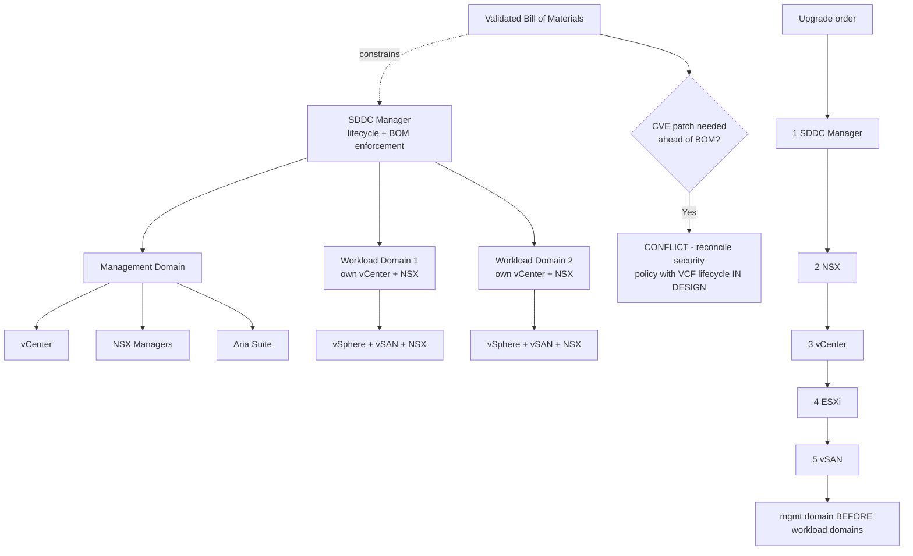

# VMware Cloud Foundation Lifecycle: SDDC Manager, the Bill of Materials and Upgrade Order

**Level:** Expert
**Tree:** [Private Cloud Platforms](../README.md)
**Branch:** [Operating and Selecting Private Cloud](README.md)
**Forest:** [Virtualization](../../../README.md)

## Explanation

# VMware Cloud Foundation: Workload Domains and Lifecycle

VCF is not a product so much as an **opinionated assembly** of vSphere, vSAN, NSX and Aria with a lifecycle manager on top. Its value and its constraints both come from that opinion: SDDC Manager will keep the stack on a validated Bill of Materials, and in exchange you give up the freedom to patch components independently.

## Management domain versus workload domains

The **management domain** is created first and hosts SDDC Manager, vCenter, NSX Managers and Aria. It is infrastructure for the infrastructure, and it must be sized for the *final* number of workload domains rather than the first one — retrofitting it is disruptive.

**Workload domains** (VI domains) carry the actual workloads, each with its own vCenter and NSX. The separation exists for blast radius and lifecycle independence: a workload domain can be upgraded, or lost, without taking the management plane with it.

The common design error is one giant workload domain "for simplicity". It removes the isolation the architecture exists to provide, and it makes every upgrade an all-or-nothing event.

## The Bill of Materials is the real constraint

SDDC Manager will only apply component versions that appear together in a validated BOM. This is what makes VCF upgrades reliable and it is also the thing that surprises teams: **you cannot patch vSphere for a CVE ahead of the BOM**. If a security policy requires patching within a fixed window, that policy and VCF lifecycle must be reconciled in design, not during an incident.

## Upgrade order is not negotiable

SDDC Manager first, then NSX, then vCenter, then ESXi, then vSAN — management domain before workload domains. Skipping ahead produces an unsupported combination that SDDC Manager will then refuse to remediate, and the recovery is manual.

## Where VCF is the wrong answer

A small estate, a team that needs component-level version control, or an environment where the licensing premium is not offset by the lifecycle saving. VCF earns its cost at scale and in regulated estates where a validated, reproducible stack version is itself a control.

## Architecture and flow



## Commands

### Command 1

List management and workload domains with status — the first check before any lifecycle operation.

```text
curl -sk -u administrator@vsphere.local -X GET https://sddc-manager/v1/domains | jq -r ".elements[] | [.name,.type,.status] | @tsv"
```

### Command 2

Show the validated Bill of Materials for a domain — the versions SDDC Manager will actually allow.

```text
curl -sk -X GET https://sddc-manager/v1/releases/domains/{id} | jq -r ".[] | .bom[] | [.name,.version] | @tsv"
```

### Command 3

Enumerate available upgrades in the order SDDC Manager will permit them.

```text
curl -sk -X GET https://sddc-manager/v1/upgradables | jq -r ".elements[] | [.bundleId,.status] | @tsv"
```

### Command 4

Confirm the installed component versions on a host against the domain BOM.

```text
esxcli software vib list | grep -iE "esx-base|nsx|vsan"
```

## Automation scripts

### vcf-bom-drift.sh

```bash
#!/usr/bin/env bash
# Reports drift between the validated Bill of Materials and what is actually installed.
# VCF only remediates supported combinations - a host that drifted out of BOM has to be
# brought back manually, so drift is worth catching early rather than at upgrade time.
set -euo pipefail
SDDC="${SDDC:?set SDDC to the SDDC Manager FQDN}"
USER="${VCF_USER:-administrator@vsphere.local}"
OUT="${1:-vcf-bom-$(date +%Y%m%d)}"
mkdir -p "$OUT"

api() { curl -sk -u "$USER:${VCF_PASS:?set VCF_PASS}" -X GET "https://$SDDC$1"; }

echo "== domains =="
api /v1/domains | jq -r '.elements[] | [.id,.name,.type,.status] | @tsv' | tee "$OUT/domains.tsv"

echo
echo "== BOM vs installed, per domain =="
while IFS=$(printf "\t") read -r id name type status; do
  echo "--- $name ($type) status=$status"
  api "/v1/releases/domains/$id" \
    | jq -r '.[0].bom[]? | "    BOM      " + .name + " " + .version' \
    | tee "$OUT/bom-$name.txt"
  if [ "$status" != "ACTIVE" ]; then
    echo "    FINDING domain not ACTIVE - lifecycle operations will be refused"
  fi
done < <(tail -n +1 "$OUT/domains.tsv")

echo
echo "== pending upgrades, in permitted order =="
api /v1/upgradables | jq -r '.elements[] | "    " + .bundleId + "  " + .status' || true

echo
echo "Upgrade order is fixed: SDDC Manager, NSX, vCenter, ESXi, vSAN;"
echo "management domain before workload domains. Skipping produces an"
echo "unsupported combination that SDDC Manager will not remediate."
```

## Lab

**Objective:** Assess a VCF estate for lifecycle readiness and reconcile the BOM against security patching policy.

### Steps

1. Enumerate the management domain and every workload domain, recording status and component versions.
2. Retrieve the validated BOM per domain and compare against installed versions, recording any drift.
3. Size the management domain against the FINAL planned number of workload domains, not the current one.
4. Identify any security policy requiring patching inside a window shorter than the BOM release cadence.
5. Document the reconciliation for that conflict — compensating control, exception, or accepted risk — before it is an incident.
6. Dry-run the upgrade sequence and confirm it follows SDDC Manager, NSX, vCenter, ESXi, vSAN with management domain first.

### Validation

Every domain is ACTIVE with no BOM drift, the management domain is sized for the final topology, and the patching-policy conflict has a written, agreed resolution.

## Operational automation

Run the BOM drift report on a schedule and alert on any component outside the validated set. Drift is silent until an upgrade is attempted, at which point SDDC Manager refuses and the remediation is manual.

## Troubleshooting

### Scenario 1: SDDC Manager refuses an upgrade with an unsupported-combination error

**Likely cause:** A component was patched out of band, or the upgrade order was not followed.

**Resolution:** Compare installed versions against the domain BOM and bring the drifted component back into the validated set. VCF will not remediate a combination it never validated.

### Scenario 2: A CVE must be patched sooner than the next validated BOM

**Likely cause:** VCF lifecycle and the security patching policy were never reconciled at design time.

**Resolution:** Decide the policy in design: either accept BOM cadence with compensating controls, or accept that out-of-band patching moves you off supported lifecycle until the next BOM.

## Interview questions

### 1. Why does VCF separate management and workload domains?

Blast radius and lifecycle independence. The management domain hosts SDDC Manager, vCenter, NSX Managers and Aria — infrastructure for the infrastructure — while workload domains carry the workloads with their own vCenter and NSX. A workload domain can be upgraded or lost without taking the management plane with it. The common error is one giant workload domain for simplicity, which discards exactly the isolation the architecture exists to provide.

### 2. What is the practical cost of the VCF Bill of Materials?

You cannot patch a component ahead of the BOM. SDDC Manager only applies version combinations that were validated together, which is what makes upgrades reliable, but it means a CVE requiring patching inside a fixed window can conflict directly with the lifecycle. That conflict has to be reconciled in design — with compensating controls or an accepted exception — because discovering it during an incident leaves no good options.

## Certification alignment

- VMware VCP-DCV
- VMware VCAP-DCV Design
- VMware Cloud Foundation Specialist

## References

- VMware Cloud Foundation Architecture and Deployment Guide
- VCF Bill of Materials release notes
- VMware Validated Design documentation

## Suggested video search

https://www.youtube.com/results?search_query=vmware+cloud+foundation+sddc+manager+workload+domain+lifecycle

---

> Validate commands, versions, permissions, licensing, and rollback procedures in an isolated lab before production use.
