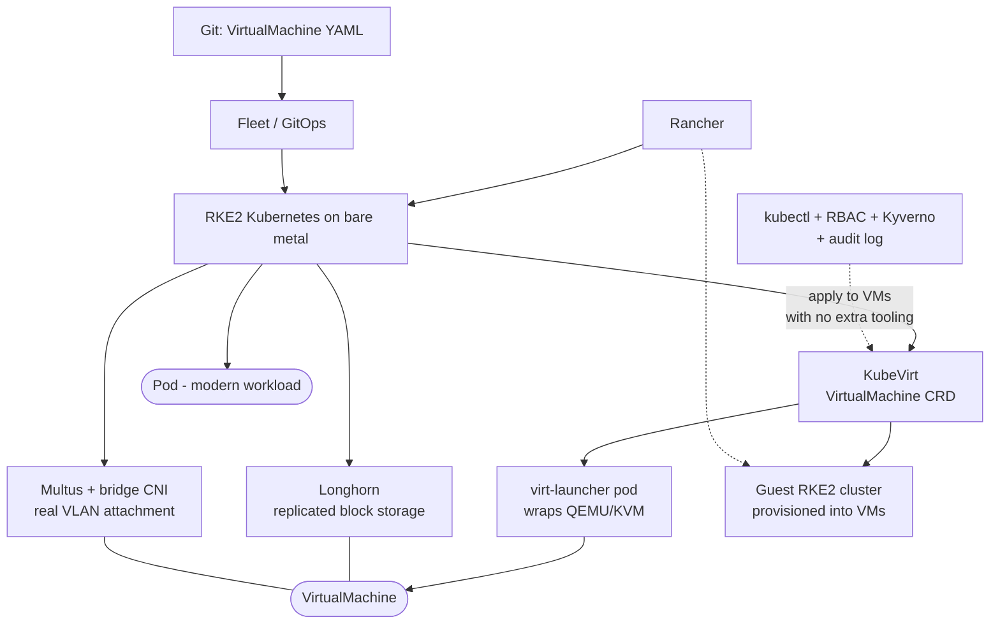

# Harvester and KubeVirt: Kubernetes-Native Virtualization with Longhorn Storage

**Level:** Intermediate
**Tree:** [Private Cloud Platforms](../README.md)
**Branch:** [Designing and Building Private Cloud](README.md)
**Forest:** [Virtualization](../../../README.md)

## Explanation

## When a virtual machine becomes a Kubernetes object

**KubeVirt** extends Kubernetes with a VirtualMachine custom resource. Each running VM
is a pod - **virt-launcher** - that wraps a QEMU/KVM process. **Harvester** packages
this as a bare-metal HCI distribution: RKE2 Kubernetes as the host platform,
**Longhorn** for replicated block storage, **Multus** so VMs can attach to real VLANs,
and integration with **Rancher** for multi-cluster management.

### The architectural consequence

Because a VM is a custom resource, everything that applies to Kubernetes objects
applies to virtual machines with no additional tooling: **kubectl** manages them,
**RBAC** authorises them, **Kyverno or OPA** admission policies constrain them, **Git**
holds their definitions, and the audit log records changes to them. An organisation
that has already built those controls for containers gets them for VMs at no
additional cost. That is the entire argument for this approach.

### Networking is where it differs most from a container platform

A pod gets a cluster IP from the CNI. A virtual machine usually needs to appear on a
real VLAN with an address from the corporate range, because the applications inside it
expect that. **Multus** attaches a second interface via a bridge to a physical VLAN.
Designing this is the main integration task and is frequently underestimated.

### Where it is not yet equivalent to vSphere

There is no equivalent of DRS-grade continuous load balancing, backup vendor support
is thinner, and Longhorn requires deliberate replica-count and node-count planning to
survive a node failure without data risk. Choose Harvester for Kubernetes-first
estates where VMs are the legacy tail - not as a drop-in vSphere replacement for a
large traditional estate.

## Architecture and flow



## Commands

### Command 1

VirtualMachine objects (desired state) and VirtualMachineInstances (running) - the distinction matters, a stopped VM has no VMI

```text
kubectl get vm,vmi -A
```

### Command 2

Start a VM through the virtctl plugin - creates the VMI from the VM definition

```text
kubectl virt start <vm> -n <ns>
```

### Command 3

Serial console access to a running VM without SSH, essential when guest networking is the problem

```text
kubectl virt console <vm> -n <ns>
```

### Command 4

Longhorn volume state including replica count and health - the storage layer VMs depend on

```text
kubectl get volumes.longhorn.io -n longhorn-system
```

### Command 5

Multus network attachments that give VMs their VLAN interfaces

```text
kubectl get network-attachment-definitions -A
```

### Command 6

Scheduling detail and events for a running VM - shows why a VM failed to schedule, exactly like a pod

```text
kubectl describe vmi <vm> -n <ns>
```

## Automation scripts

### harvester-vm-readiness.sh

```bash
#!/usr/bin/env bash
# Harvester / KubeVirt readiness - the checks that predict VM problems.
set -euo pipefail

RC=0
MIN_REPLICAS="${MIN_REPLICAS:-3}"

echo "Harvester readiness - $(date -u +%FT%TZ)"
echo

echo "nodes:"
kubectl get nodes --no-headers | sed "s/^/  /"
NODES=$(kubectl get nodes --no-headers | grep -c " Ready" || echo 0)
echo "  ready: ${NODES}"

# Longhorn replica count cannot exceed node count. A volume asking for 3
# replicas on a 2-node cluster is permanently degraded and nobody notices
# until a node reboots.
if [ "${NODES}" -lt "${MIN_REPLICAS}" ]; then
  echo "  FINDING ${NODES} nodes but replica target is ${MIN_REPLICAS}"
  echo "          volumes cannot reach full replication - degraded by design"
  RC=1
fi
echo

echo "degraded Longhorn volumes:"
kubectl get volumes.longhorn.io -n longhorn-system \
  -o custom-columns=NAME:.metadata.name,STATE:.status.state,ROBUST:.status.robustness \
  --no-headers 2>/dev/null | grep -v healthy | sed "s/^/  /" || echo "  none"
echo

echo "VMs not running:"
kubectl get vm -A -o custom-columns=NS:.metadata.namespace,NAME:.metadata.name,STATUS:.status.printableStatus \
  --no-headers 2>/dev/null | grep -v Running | sed "s/^/  /" || echo "  none"
echo

# A VM with only the pod network cannot be reached on the corporate VLAN.
echo "VMs without a Multus attachment:"
for ns in $(kubectl get vm -A -o jsonpath="{.items[*].metadata.namespace}" | tr " " "\n" | sort -u); do
  for vm in $(kubectl get vm -n "${ns}" -o jsonpath="{.items[*].metadata.name}"); do
    if ! kubectl get vm "${vm}" -n "${ns}" -o json | grep -q "multus"; then
      echo "  ${ns}/${vm} - pod network only"
    fi
  done
done

exit "${RC}"
```

## Lab

**Objective:** Build a three-node Harvester cluster, run a VM as a Kubernetes object under GitOps, attach it to a real VLAN with Multus, enforce an admission policy on VMs, and prove Longhorn replica behaviour by failing a node.

### Steps

1. Install Harvester on three bare-metal nodes and confirm the RKE2 cluster is healthy.
2. Import the cluster into Rancher and confirm both VMs and guest clusters are manageable from one console.
3. Create a VirtualMachine as a YAML manifest committed to Git, and deploy it via Fleet rather than the UI.
4. Confirm the VM appears with kubectl get vm and that a virt-launcher pod is running.
5. Define a NetworkAttachmentDefinition for a corporate VLAN and attach the VM to it. Confirm the guest receives an address on that VLAN, not a pod-network address.
6. Write a Kyverno policy that rejects any VirtualMachine without an owner label, and prove it blocks a non-compliant manifest.
7. Create a Longhorn volume with three replicas and confirm replicas are distributed across all three nodes.
8. Power off one node. Observe the volume become degraded but remain available, and confirm the VM keeps running or restarts on a surviving node.
9. Restore the node and confirm Longhorn rebuilds the third replica automatically.
10. Repeat the replica test on a deliberately undersized two-node configuration to observe permanent degradation.

### Validation

VM lifecycle is fully driven from Git,The guest holds a corporate VLAN address,The Kyverno policy rejects a non-compliant VM manifest,The volume survives node loss and rebuilds automatically on recovery

## Operational automation

### Automating Harvester

- **GitOps with Fleet or Argo CD** is the natural operating model - a VirtualMachine is
  just another manifest, so VM definitions get review, history and rollback for free.
- **Terraform Harvester provider** where VMs are provisioned as part of a wider
  infrastructure stack alongside networks and storage.
- **Rancher cluster templates** to provision guest Kubernetes clusters into Harvester
  VMs with a consistent, approved configuration.
- **Kyverno or OPA Gatekeeper** admission policies applied to VirtualMachine resources:
  require owner labels, constrain resource requests, forbid VMs without a Multus
  attachment. This is the concrete payoff of VMs being Kubernetes objects.
- **CDI (Containerized Data Importer)** to pull VM images into PVCs as part of a
  pipeline rather than uploading through a UI.

## Troubleshooting

### Scenario 1: VM starts but is unreachable from the corporate network

**Likely cause:** VM attached only to the cluster pod network, with no Multus VLAN interface

**Resolution:** Create a NetworkAttachmentDefinition for the target VLAN and add it to the VM spec. Confirm the bridge exists on every node the VM could schedule to - a missing bridge on one node produces a VM that works until it migrates.

### Scenario 2: Longhorn volumes are permanently degraded and never reach healthy

**Likely cause:** Replica count exceeds the number of available nodes, or replica anti-affinity cannot be satisfied

**Resolution:** Reduce the replica count to at most the node count, or add nodes. A three-replica volume on a two-node cluster is degraded by design and will not self-heal.

### Scenario 3: VM will not schedule and the VMI stays pending

**Likely cause:** Insufficient node resources, or a missing node feature such as hardware virtualization or a required bridge

**Resolution:** Run kubectl describe vmi and read the events exactly as you would for a pod - the scheduling failure reason is reported identically, which is one of the practical benefits of the model.

## Interview questions

### 1. What is the practical benefit of a VM being a Kubernetes custom resource?

Every control already built for containers applies to VMs without new tooling - kubectl, RBAC, admission policies via Kyverno or OPA, GitOps, and the Kubernetes audit log. An organisation that has invested in those controls extends them to virtual machines for free, rather than maintaining a parallel set of controls in a separate hypervisor management stack.

### 2. Why do VMs on Harvester usually need Multus?

Because the applications inside them expect to be on a real network. A pod gets a cluster-internal address from the CNI, which is fine for a container designed for it, but a legacy application, an appliance, or anything other systems connect to inbound needs an address on a corporate VLAN. Multus attaches an additional bridged interface to satisfy that.

### 3. When would you not choose Harvester over vSphere?

For a large traditional VM estate with a vSphere-skilled team. The ecosystem is younger - no DRS-equivalent continuous balancing, thinner backup vendor support, and Longhorn needs careful capacity planning. The retraining cost and feature gap outweigh the unified-control-plane benefit unless the organisation is genuinely Kubernetes-first and VMs are a shrinking legacy tail.

### 4. What is the difference between a VirtualMachine and a VirtualMachineInstance?

The VirtualMachine is the desired-state definition and persists whether or not the VM is running. The VirtualMachineInstance represents an actually running instance and exists only while the VM is up. It mirrors the Deployment and Pod relationship, and it matters when troubleshooting - a stopped VM legitimately has no VMI, so the absence of one is not itself a fault.

## Certification alignment

- SUSE Certified Administrator in Harvester - HCI deployment and VM operations
- CKA (Certified Kubernetes Administrator) - the underlying Kubernetes operations model
- Red Hat EX316 - OpenShift Virtualization, the enterprise KubeVirt equivalent

## References

- Harvester Documentation: architecture, networking and Longhorn integration
- KubeVirt User Guide: VirtualMachine and VirtualMachineInstance lifecycle
- Longhorn Documentation: replica scheduling, node failure behaviour and rebuild

## Suggested video search

Harvester HCI KubeVirt virtual machines Kubernetes Longhorn Multus VLAN Rancher

---

> Validate commands, versions, permissions, licensing, and rollback procedures in an isolated lab before production use.
