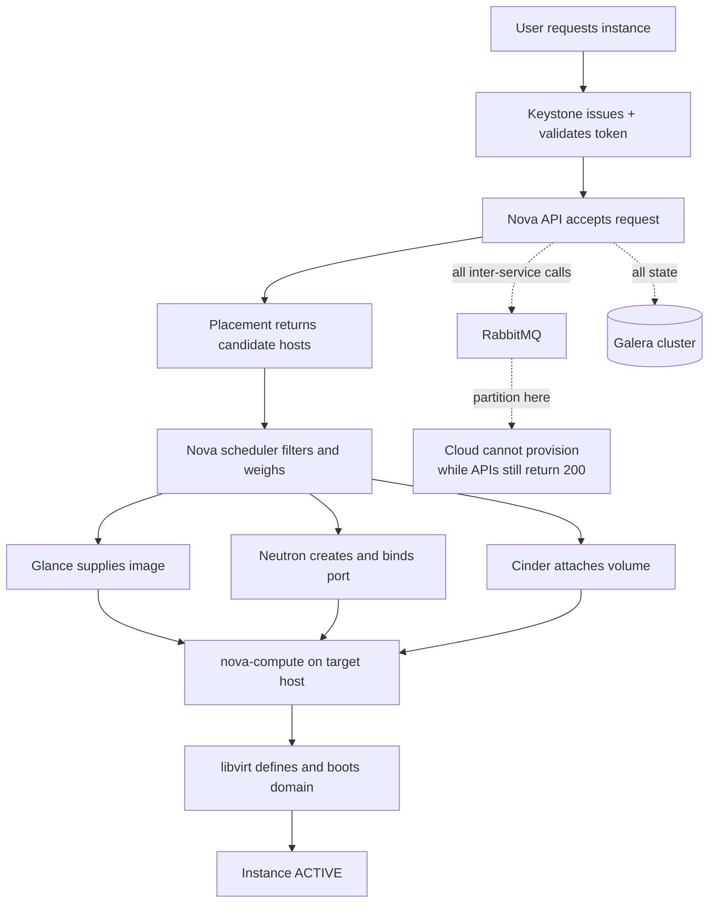

# Building an OpenStack Private Cloud: Control-Plane HA and Ceph Backends

**Level:** Advanced
**Tree:** [Private Cloud Platforms](../README.md)
**Branch:** [Designing and Building Private Cloud](README.md)
**Forest:** [Virtualization](../../../README.md)

## Explanation

## OpenStack as an operating commitment, not a product install

OpenStack is a set of cooperating services with independent APIs, joined by a shared
message bus and database. **Keystone** issues tokens every other service validates.
**Nova** owns compute lifecycle and delegates host selection to **Placement** (which
tracks resource inventory) and the **scheduler** (which filters and weighs candidates).
**Neutron** provides ports, networks and security groups. **Glance** stores images.
**Cinder** provides block volumes.

### The launch path is the mental model

A single instance launch touches nearly everything: the client authenticates to
Keystone, Nova validates the request, Placement returns candidate hosts with enough
free resource, the scheduler picks one, Glance supplies the image, Neutron creates and
binds the port, Cinder attaches a volume if requested, and nova-compute on the target
host asks libvirt to define and boot the domain. Debugging OpenStack means knowing
which hop failed, which is why the request ID appears in every service log.

### Where availability is actually won

The API services are stateless and trivially made highly available behind a load
balancer. **That is not where OpenStack breaks.** The hard dependencies are RabbitMQ
and the database. A RabbitMQ partition leaves services unable to reach their agents
while every API still answers 200 - the cloud looks healthy and nothing can be
provisioned. A Galera split-brain is worse. Design these two first and treat the API
tier as the easy part.

### Ceph as a single backend

Pointing Glance, Cinder and Nova ephemeral storage at the same Ceph cluster enables
copy-on-write cloning: an instance boots from a snapshot of the image rather than a
full copy, so boot time is seconds regardless of image size. Splitting backends per
service silently removes this and nobody notices until boot times are measured.

## Architecture and flow



## Commands

### Command 1

Full instance detail including fault field, which carries the actual scheduler or libvirt error

```text
openstack server show <id> --fit-width
```

### Command 2

Confirm nova-compute agents are up on every hypervisor - a down agent removes that host from scheduling silently

```text
openstack compute service list
```

### Command 3

Ask Placement directly which hosts could satisfy a request - isolates scheduler problems from capacity problems

```text
openstack allocation candidate list --resource VCPU=2 --resource MEMORY_MB=4096
```

### Command 4

Check for a partitioned message bus, the most common cause of a cloud that answers APIs but cannot provision

```text
rabbitmqctl cluster_status
```

### Command 5

Galera cluster size - a value below the expected node count indicates a partition or evicted node

```text
mysql -e "SHOW STATUS LIKE (wsrep_cluster_size)"
```

### Command 6

Neutron agent health - a dead L2 agent leaves ports in BUILD state indefinitely

```text
openstack network agent list
```

## Automation scripts

### openstack-control-plane-health.sh

```bash
#!/usr/bin/env bash
# OpenStack control-plane health - checks the things that actually fail.
set -euo pipefail

RC=0
echo "OpenStack control plane - $(date -u +%FT%TZ)"

# Message bus first: a partition here disables provisioning while APIs stay up.
echo "RabbitMQ:"
if rabbitmqctl cluster_status 2>/dev/null | grep -q "partitions,\[\]"; then
  echo "  no partitions"
else
  echo "  FINDING partition detected - provisioning will fail silently"
  RC=1
fi

echo "Galera:"
SIZE=$(mysql -N -e "SHOW STATUS LIKE (wsrep_cluster_size)" 2>/dev/null | tr -dc "0-9" || echo 0)
echo "  cluster size: ${SIZE}"
[ "${SIZE}" -lt 3 ] && { echo "  FINDING below 3 nodes - no quorum margin"; RC=1; }

echo "Compute agents down:"
openstack compute service list --format value -c Binary -c Host -c State 2>/dev/null |
  grep -w down | sed "s/^/  /" || echo "  none"

echo "Network agents down:"
openstack network agent list --format value -c Binary -c Host -c Alive 2>/dev/null |
  grep -w False | sed "s/^/  /" || echo "  none"

# Instances stuck in a transitional state point at a failed handoff.
echo "Instances in ERROR or stuck BUILD:"
openstack server list --all-projects --format value -c ID -c Name -c Status 2>/dev/null |
  grep -E "ERROR|BUILD" | sed "s/^/  /" || echo "  none"

exit "${RC}"
```

## Lab

**Objective:** Deploy a three-node OpenStack control plane with Ceph-backed Glance, Cinder and Nova, prove copy-on-write boot, then induce a RabbitMQ partition and observe that the cloud reports healthy while provisioning fails.

### Steps

1. Deploy three controllers running Keystone, Nova, Neutron, Glance, Cinder and Placement behind a load balancer, with RabbitMQ and Galera clustered across the same three nodes.
2. Deploy two compute nodes with nova-compute and the Neutron OVN agent.
3. Configure Ceph as the single backend for Glance images, Cinder volumes and Nova ephemeral disk. Enable RAW image format so copy-on-write cloning is possible.
4. Upload a RAW image to Glance. Launch an instance and record the time from request to ACTIVE.
5. Launch a second instance from the same image and confirm boot time is materially shorter - this proves copy-on-write cloning rather than a full image copy.
6. Query Placement directly with an allocation candidate request and confirm the candidate list matches expected hosts.
7. Block RabbitMQ traffic between two controllers with an iptables rule to induce a partition.
8. Confirm every OpenStack API still returns 200 and instance listing works, while a new instance launch hangs in BUILD - the failure mode this lab exists to demonstrate.
9. Restore connectivity, confirm RabbitMQ heals, and verify the queued launch completes or must be cleaned up.

### Validation

Second-boot time is measurably shorter than first (copy-on-write proven),During the induced partition, API calls succeed while new launches stall in BUILD,After recovery, cluster_status reports no partitions and provisioning resumes

## Operational automation

### Automating OpenStack operations

- **Terraform with the OpenStack provider** for tenant-facing resources: networks,
  instances, volumes, security groups. This is the right layer for workload teams.
- **Heat** for application stacks that must be described in-cloud and torn down as a
  unit, particularly where a tenant has no external CI system.
- **Ansible with the openstack.cloud collection** for control-plane operations -
  service configuration, agent restarts, rolling upgrades of compute nodes.
- **Kolla-Ansible or OpenStack-Helm** for containerised control-plane deployment. This
  is what makes control-plane upgrades tractable; upgrading packages in place across
  a dozen services is where hand-built OpenStack becomes unmaintainable.
- Export Placement allocation data on a schedule. Capacity planning for OpenStack is
  driven by allocation ratios and actual placement, not raw hypervisor totals.

## Troubleshooting

### Scenario 1: All OpenStack APIs return 200 and instance listing works, but new instances hang in BUILD indefinitely

**Likely cause:** RabbitMQ partition - API services accept requests but cannot reach agents over the message bus

**Resolution:** Run rabbitmqctl cluster_status and look for a non-empty partitions list. Heal the partition, then restart nova-compute and neutron agents on affected nodes. Set a partition handling strategy (pause_minority) so the behaviour is deterministic rather than silent.

### Scenario 2: Instance goes to ERROR with No valid host was found

**Likely cause:** Either genuine capacity exhaustion, or a scheduler filter excluding all hosts - commonly an aggregate, availability zone or PCI/NUMA constraint

**Resolution:** Query Placement with an allocation candidate request matching the flavor. If candidates exist, the problem is a Nova scheduler filter rather than capacity - enable scheduler debug logging and read which filter returned zero hosts.

### Scenario 3: Instances boot slowly and Ceph shows heavy read traffic on every launch

**Likely cause:** Images stored in QCOW2 rather than RAW, so copy-on-write cloning is not possible and the full image is copied per instance

**Resolution:** Convert images to RAW format on upload. Copy-on-write cloning requires RAW in Ceph; QCOW2 silently degrades to a full copy with no error.

## Interview questions

### 1. Why is the OpenStack API tier the easy part of high availability?

The API services are stateless - they can sit behind a load balancer and scale horizontally with no coordination. All shared state lives in the database and all inter-service communication in RabbitMQ, so those two are the real availability problem. A cluster with three HA API nodes and a single RabbitMQ instance is not highly available in any meaningful sense.

### 2. What does Placement do that the Nova scheduler does not?

Placement tracks resource inventory and allocations as a generic accounting service - it answers which hosts have enough of the requested resource classes. The Nova scheduler then applies policy filters and weighers to that candidate list. Separating them means capacity questions can be answered without invoking scheduling policy, which is what makes the allocation candidate query such a useful diagnostic.

### 3. A customer reports the cloud is down but every dashboard is green. Where do you look first?

The message bus. A RabbitMQ partition produces exactly this: APIs answer, reads work, dashboards render, and nothing can be provisioned because API services cannot reach their agents. It is the single most characteristic OpenStack failure and it does not surface in API health checks.

### 4. Why does image format matter for boot performance in a Ceph-backed cloud?

Ceph RBD supports copy-on-write cloning from a snapshot, but only for RAW images. With RAW, launching an instance creates a thin clone in seconds regardless of image size. With QCOW2, Glance must convert or the full image is copied to the compute node first, so boot time scales with image size and generates heavy cluster read traffic on every launch.

## Certification alignment

- COA (Certified OpenStack Administrator) - identity management, compute, networking, storage
- Red Hat CL110 / EX210 - Red Hat OpenStack Platform administration
- Mirantis OpenStack certification - control plane deployment and troubleshooting

## References

- OpenStack Documentation: Nova System Architecture and the Placement service
- OpenStack High Availability Guide: RabbitMQ and Galera cluster design
- Ceph Documentation: Block Devices and OpenStack - copy-on-write cloning requirements

## Suggested video search

OpenStack architecture deep dive Nova Neutron Keystone Placement control plane HA

---

> Validate commands, versions, permissions, licensing, and rollback procedures in an isolated lab before production use.
