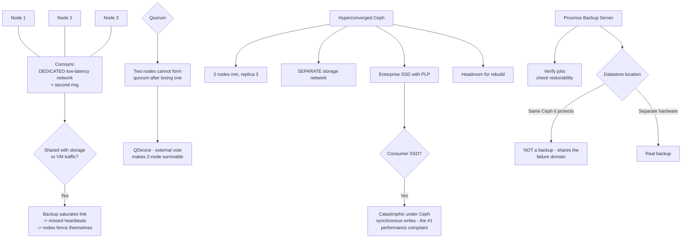

# Proxmox VE Cluster Networking, Ceph Storage and Backup Server

**Level:** Advanced
**Tree:** [Private Cloud Platforms](../README.md)
**Branch:** [Designing and Building Private Cloud](README.md)
**Forest:** [Virtualization](../../../README.md)

## Explanation

# Proxmox VE: Cluster, Ceph and Backup Server

Proxmox VE combines KVM, LXC, a clustering layer built on **Corosync**, and optional hyperconverged **Ceph**. It is genuinely capable at production scale, and its failure modes are almost all network failure modes.

## Corosync needs a dedicated, low-latency network

Cluster membership is decided by Corosync, which is **latency-sensitive rather than bandwidth-hungry**. Sharing the Corosync link with storage or VM traffic is the most common Proxmox design error: a backup job saturates the link, Corosync misses heartbeats, and nodes fence themselves out of a perfectly healthy cluster.

Give Corosync its own physical network, and configure a second ring for redundancy. This costs very little and removes an entire class of self-inflicted outage.

## Quorum and the two-node problem

A cluster needs **quorum** to make changes. Two nodes cannot form quorum after losing one, so a two-node cluster is a single failure away from being read-only. The fix is a **QDevice** — a lightweight external vote, often on a small VM or Raspberry Pi elsewhere — which makes a two-node cluster genuinely survivable.

Three nodes is the honest minimum for anything production, and it is also the Ceph minimum.

## Ceph sizing on Proxmox

Hyperconverged Ceph shares hosts with the workloads, so the trade-offs are sharper than on dedicated storage:

- **Three nodes minimum**, replica 3 for production. Replica 2 tolerates one failure but risks data loss during rebuild.
- **A separate storage network** — Ceph replication traffic is substantial and must not compete with VM or Corosync traffic.
- **Enterprise SSDs with power-loss protection.** Consumer SSDs perform catastrophically under Ceph's synchronous write pattern; this is the single most common Proxmox-Ceph performance complaint.
- **Capacity headroom** for rebuild, exactly as with vSAN.

## Proxmox Backup Server

PBS provides deduplicated, incremental-forever backups with client-side encryption and **verify jobs** that check restorability rather than assuming it.

Two habits distinguish a real backup from a nominal one: schedule **verify jobs** so corruption is discovered before a restore needs it, and place the datastore on separate hardware. A PBS datastore on the same Ceph cluster it protects is not a backup — it shares the failure domain with the thing it exists to recover.

## Architecture and flow



## Commands

### Command 1

Cluster membership, quorum state and expected votes — the first check for any cluster-wide symptom.

```text
pvecm status
```

### Command 2

Ring status per interface; a faulty ring here explains fencing that looks like random node loss.

```text
corosync-cfgtool -s
```

### Command 3

Cluster health plus per-OSD utilisation — the pair that shows both state and whether rebuild headroom exists.

```text
ceph -s && ceph osd df tree
```

### Command 4

Confirm verify jobs exist (restorability is checked, not assumed) and measure datastore throughput.

```text
proxmox-backup-manager verify-job list && proxmox-backup-client benchmark
```

## Automation scripts

### pve-cluster-health.sh

```bash
#!/usr/bin/env bash
# Proxmox cluster health with the checks that matter, in the order that matters.
# Nearly every Proxmox production failure is a network failure: Corosync sharing a
# link with storage traffic, or a two-node cluster with no QDevice.
set -euo pipefail
fail=0

echo "== quorum =="
if pvecm status >/dev/null 2>&1; then
  pvecm status | grep -E "Quorate|Expected votes|Total votes|Nodes" | sed "s/^/  /"
  if ! pvecm status | grep -qi "Quorate:.*Yes"; then
    echo "  BLOCKING cluster is NOT quorate - configuration changes will be refused"
    fail=$((fail+1))
  fi
  nodes=$(pvecm status | awk '/Nodes:/{print $2}')
  if [ "${nodes:-0}" = "2" ]; then
    if ! pvecm status | grep -qi qdevice; then
      echo "  FINDING two-node cluster with NO QDevice - one failure from read-only"
      fail=$((fail+1))
    fi
  fi
else
  echo "  not part of a cluster"
fi

echo
echo "== corosync rings =="
corosync-cfgtool -s 2>/dev/null | sed "s/^/  /" || echo "  corosync-cfgtool unavailable"
if corosync-cfgtool -s 2>/dev/null | grep -qi "FAULTY"; then
  echo "  FINDING a ring is FAULTY - expect fencing that looks like random node loss"
  fail=$((fail+1))
fi

echo
echo "== ceph =="
if command -v ceph >/dev/null 2>&1; then
  ceph -s 2>/dev/null | sed "s/^/  /" | head -12
  full=$(ceph osd df tree 2>/dev/null | awk '$0 ~ /osd\./ {gsub(/%/,"",$(NF-2)); if ($(NF-2)+0 > 70) c++} END{print c+0}')
  [ "${full:-0}" -gt 0 ] && { echo "  FINDING $full OSD(s) above 70% - rebuild headroom is disappearing"; fail=$((fail+1)); }
else
  echo "  ceph not installed on this node"
fi

echo
echo "== backup verification =="
if command -v proxmox-backup-manager >/dev/null 2>&1; then
  n=$(proxmox-backup-manager verify-job list 2>/dev/null | grep -c . || echo 0)
  echo "  verify jobs configured: $n"
  [ "$n" -le 1 ] && { echo "  FINDING no verify job - restorability is assumed, not checked"; fail=$((fail+1)); }
fi

echo
echo "findings: $fail"
exit $(( fail > 0 ? 1 : 0 ))
```

## Lab

**Objective:** Build a Proxmox cluster whose failure modes are designed out rather than discovered.

### Steps

1. Place Corosync on a dedicated physical network and configure a second ring for redundancy.
2. Verify no storage or VM traffic shares the Corosync link, then saturate the storage network and confirm cluster membership is unaffected.
3. For a two-node cluster, deploy a QDevice and confirm quorum survives the loss of one node.
4. Size Ceph with three nodes minimum and replica 3, on a separate storage network, using enterprise SSDs with power-loss protection.
5. Confirm capacity headroom is sufficient to rebuild after an OSD loss.
6. Deploy PBS with its datastore on hardware independent of the Ceph cluster it protects, and schedule verify jobs.

### Validation

Saturating the storage network does not disturb quorum, a two-node cluster survives a node loss via QDevice, Ceph has rebuild headroom on enterprise media, and PBS verify jobs run against a datastore outside the protected failure domain.

## Operational automation

Alert on Corosync ring faults and on OSD utilisation crossing the rebuild-headroom threshold. Both are silent until the moment they are not, and both convert an ordinary component failure into a cluster event.

## Troubleshooting

### Scenario 1: Nodes fence themselves during backup windows

**Likely cause:** Corosync shares a network with storage or backup traffic; saturation causes missed heartbeats and the cluster removes the node.

**Resolution:** Move Corosync to a dedicated low-latency network with a second ring. It needs latency, not bandwidth, so this is inexpensive.

### Scenario 2: Ceph performance is poor despite SSDs

**Likely cause:** Consumer SSDs without power-loss protection perform very badly under Ceph synchronous writes.

**Resolution:** Use enterprise SSDs with PLP for OSDs and journals. This is the most common Proxmox-Ceph performance complaint and it is a hardware selection problem, not a tuning one.

## Interview questions

### 1. Why does Corosync need its own network in a Proxmox cluster?

Because it is latency-sensitive rather than bandwidth-hungry, and cluster membership depends on it. If it shares a link with storage or backup traffic, a backup job can saturate the link, Corosync misses heartbeats and nodes fence themselves out of a perfectly healthy cluster. A dedicated network plus a second ring costs very little and removes an entire class of self-inflicted outage.

### 2. What is wrong with a two-node Proxmox cluster, and how do you fix it?

Two nodes cannot form quorum after losing one, so the survivor goes read-only and refuses configuration changes — the cluster is a single failure from being unmanageable. The fix is a QDevice, a lightweight external vote hosted elsewhere, which makes a two-node cluster genuinely survivable. Three nodes remains the honest minimum for production, and it is also the Ceph minimum.

## Certification alignment

- Proxmox VE Certified Professional
- LPIC-2 Linux Engineer
- Ceph Certified Administrator

## References

- Proxmox VE Administration Guide
- Proxmox VE Ceph deployment documentation
- Proxmox Backup Server documentation

## Suggested video search

https://www.youtube.com/results?search_query=proxmox+ve+cluster+corosync+ceph+backup+server

---

> Validate commands, versions, permissions, licensing, and rollback procedures in an isolated lab before production use.
