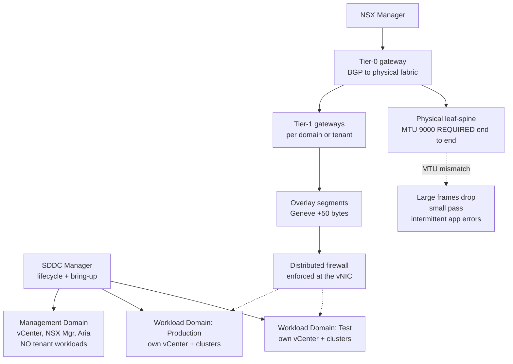

# VMware Cloud Foundation Design: Workload Domain Sizing and NSX Overlay MTU

**Level:** Advanced
**Tree:** [Private Cloud Platforms](../README.md)
**Branch:** [Designing and Building Private Cloud](README.md)
**Forest:** [Virtualization](../../../README.md)

## Explanation

## What makes VCF different from vSphere plus NSX

VMware Cloud Foundation is a lifecycle-managed bundle, and **SDDC Manager** is the
component that justifies the name. It performs bring-up, deploys workload domains, and
most importantly sequences patching across vCenter, ESXi, vSAN and NSX so the version
combinations remain supported. Running the same components without SDDC Manager is a
valid architecture - it is simply not VCF, and the upgrade burden returns to the team.

### Management domain versus workload domains

The **management domain** is built first and hosts the platform itself: vCenter, NSX
Manager, SDDC Manager and the Aria suite. It must not host tenant workloads. Each
**workload domain** gets its own vCenter and its own ESXi clusters, giving an
independent failure and lifecycle boundary.

### The design decision that dominates cost and risk

How many workload domains? One domain gives the cheapest licensing and the simplest
operations, and puts every workload behind a single vCenter upgrade. Many domains give
isolation and independent patching, at the cost of a vCenter and NSX overhead per
domain. **Split by lifecycle and compliance boundary, not by application.** A domain
per regulated workload class and a domain per patching cadence is defensible; a domain
per project is not.

### NSX and the MTU trap

NSX overlay uses Geneve encapsulation, which adds roughly 50 bytes to every frame. The
physical fabric must carry 9000-byte frames end to end. When it does not, the symptom
is not a clean failure - small packets pass and large ones drop, producing intermittent
application errors that look like anything except a network problem. This is the most
common VCF bring-up and post-deployment fault.

## Architecture and flow



## Commands

### Command 1

Confirm VMkernel interfaces and their MTU on each ESXi host

```text
esxcli network ip interface list
```

### Command 2

The definitive Geneve MTU test - 8972 payload plus headers equals 9000, and -d prevents fragmentation so a pass proves end-to-end jumbo support

```text
vmkping -I vmk10 -s 8972 -d <remote-tep-ip>
```

### Command 3

Inspect overlay transport network configuration on the distributed switch

```text
esxcli network vswitch dvs vmware vxlan network list --vds-name=<vds>
```

### Command 4

PowerCLI - list workload domains, their status and component versions as SDDC Manager sees them

```text
Get-VCFWorkloadDomain
```

### Command 5

Which lifecycle bundles apply to the current estate - the supported upgrade path

```text
Get-VCFBundle | Where-Object {$_.applicabilityStatus -eq "APPLICABLE"}
```

### Command 6

Verify transport node state; a node not in success state has no working overlay

```text
Get-NsxtService -Name com.vmware.nsx.transport_nodes
```

## Automation scripts

### Test-VcfOverlayMtu.ps1

```powershell
<#
  Verifies Geneve overlay MTU across every ESXi transport node pair.
  The single most common VCF fault: overlay configured, fabric not jumbo-clean.
#>
[CmdletBinding()]
param(
  [Parameter(Mandatory = $true)][string]$VCenter,
  [int]$PayloadBytes = 8972
)

$ErrorActionPreference = "Stop"
Connect-VIServer -Server $VCenter | Out-Null

# Collect TEP (tunnel endpoint) VMkernel addresses from every host.
$teps = @()
foreach ($vmhost in Get-VMHost) {
  $esxcli = Get-EsxCli -VMHost $vmhost -V2
  $ifaces = $esxcli.network.ip.interface.ipv4.address.list.Invoke()
  foreach ($i in $ifaces) {
    if ($i.Name -match "vmk1[0-9]") {
      $teps += [pscustomobject]@{ Host = $vmhost.Name; Vmk = $i.Name; IP = $i.IPv4Address }
    }
  }
}

Write-Host ("Found {0} transport endpoints" -f $teps.Count)
$failures = 0

foreach ($src in $teps) {
  $esxcli = Get-EsxCli -VMHost (Get-VMHost -Name $src.Host) -V2
  foreach ($dst in $teps) {
    if ($src.IP -eq $dst.IP) { continue }

    # -d sets do-not-fragment. Without it the test passes even when the
    # fabric silently fragments, which defeats the entire purpose.
    $args = $esxcli.network.diag.ping.CreateArgs()
    $args.host = $dst.IP
    $args.size = $PayloadBytes
    $args.df = $true
    $args.interface = $src.Vmk
    $args.count = 3

    try {
      $r = $esxcli.network.diag.ping.Invoke($args)
      if ($r.Summary.PacketLost -gt 0) {
        Write-Host ("  FAIL {0} -> {1} loss={2}" -f $src.Host, $dst.IP, $r.Summary.PacketLost)
        $failures++
      }
    } catch {
      Write-Host ("  FAIL {0} -> {1} ping error" -f $src.Host, $dst.IP)
      $failures++
    }
  }
}

if ($failures -gt 0) {
  Write-Host ("MTU verification FAILED on {0} path(s). Overlay traffic will drop large frames." -f $failures)
  exit 1
}
Write-Host "All transport paths carry jumbo frames without fragmentation."
exit 0
```

## Lab

**Objective:** Design and validate a VCF deployment with a management domain and two workload domains, then prove the MTU failure mode by breaking jumbo frames on one uplink and observing the intermittent, size-dependent symptom.

### Steps

1. Document a workload domain split justified by lifecycle and compliance boundary, not by application. Record the licensing and vCenter overhead implied by the count.
2. Build the management domain and confirm no tenant workloads are placed in it.
3. Deploy two workload domains through SDDC Manager and confirm each receives its own vCenter.
4. Configure NSX with a Tier-0 gateway peering BGP to the physical fabric, Tier-1 gateways per domain, and overlay segments.
5. Run vmkping with size 8972 and the do-not-fragment flag between every pair of transport endpoints. Record a clean baseline.
6. Deploy a test application across two hosts in different racks and confirm normal operation.
7. Reduce MTU to 1500 on one physical uplink to simulate a misconfigured switch port.
8. Observe the symptom carefully: ICMP and small requests still succeed, while large HTTP responses or database result sets fail intermittently. Confirm that host-level health checks all still pass.
9. Re-run the vmkping jumbo test and confirm it identifies the broken path immediately.
10. Restore MTU and verify the application recovers.

### Validation

Jumbo vmkping passes on all paths at baseline and fails only on the broken path,The application exhibits size-dependent intermittent failure while all host health checks remain green,Restoring MTU resolves it without any application change

## Operational automation

### Automating VCF

- **PowerCLI with the VCF cmdlets** is the primary interface for domain inventory,
  bundle applicability and upgrade orchestration.
- **SDDC Manager API** for workload domain creation and expansion. Treat domain
  definitions as code so an added cluster is reviewable rather than click-driven.
- **Terraform NSX-T provider** for segments, Tier-1 gateways and distributed firewall
  rules. Microsegmentation policy in particular belongs in version control - hand-edited
  firewall rules across hundreds of segments become unauditable quickly.
- **Aria Automation** for tenant-facing self-service where a service catalogue is
  required.
- Schedule the jumbo-MTU verification script. Fabric changes made by the network team
  can silently break overlay paths, and detecting that on a schedule is far cheaper
  than detecting it through an application incident.

## Troubleshooting

### Scenario 1: Applications report intermittent failures on large transfers while ping and small requests always succeed

**Likely cause:** MTU mismatch on the overlay path - Geneve adds ~50 bytes, so frames exceeding the smallest link MTU are dropped

**Resolution:** Run vmkping with size 8972 and the do-not-fragment flag between all transport endpoints. Fix the physical uplink or switch port that fails, then re-test. Do not rely on standard ping, which uses small packets and always passes.

### Scenario 2: SDDC Manager refuses an upgrade bundle as not applicable

**Likely cause:** Component versions are outside the supported combination matrix, usually because a component was patched manually outside SDDC Manager

**Resolution:** Query bundle applicability, identify the drifted component, and bring it back to a version SDDC Manager recognises. Manual patching of VCF components is the root cause and should be prohibited by process.

### Scenario 3: Workload domain deployment fails during NSX transport node configuration

**Likely cause:** Transport VLAN not trunked to the hosts, or the TEP IP pool is exhausted or overlapping

**Resolution:** Verify the transport VLAN reaches every host uplink, confirm the TEP pool has free addresses and does not overlap another pool, then retry the failed task from SDDC Manager rather than rebuilding.

## Interview questions

### 1. What does SDDC Manager actually give you that deploying vSphere, vSAN and NSX separately does not?

Lifecycle sequencing. It knows the supported version combinations across vCenter, ESXi, vSAN and NSX and orchestrates upgrades in an order that keeps the estate supported. Without it you can build the same technical architecture, but you own the interoperability matrix and the upgrade sequencing yourself, which is where most of the ongoing operational cost sits.

### 2. How would you decide how many workload domains to create?

By lifecycle and compliance boundary. Workloads that must be patched on different cadences, or that sit under different regulatory scopes, justify separate domains because they need independent vCenter upgrade schedules and isolation. Splitting per application creates vCenter and NSX overhead with no corresponding benefit. One domain for everything is legitimate for small estates but concentrates blast radius on a single vCenter upgrade.

### 3. Why is an MTU mismatch on an NSX overlay so hard to diagnose?

Because it fails partially. Geneve encapsulation adds around 50 bytes, so only frames near the MTU limit are dropped. Ping succeeds, health checks pass, small API calls work, and only large transfers fail - intermittently, depending on payload size. Every layer reports healthy, so investigation usually starts in the application. The definitive test is vmkping at 8972 bytes with do-not-fragment set.

### 4. Why must the management domain not host tenant workloads?

It hosts the control plane for the entire platform - vCenter, NSX Manager, SDDC Manager. A tenant workload that consumes resource or triggers a host issue there degrades management of every workload domain simultaneously. It also breaks the lifecycle model, because the management domain is upgraded on its own schedule ahead of workload domains.

## Certification alignment

- VMware VCP-VCF (Cloud Foundation) - architecture, workload domains and lifecycle
- VMware VCP-NV (Network Virtualization) - NSX overlay, gateways and distributed firewall
- VMware VCAP-DCV Design - workload domain and cluster design decisions

## References

- VMware Cloud Foundation Documentation: Architecture and Deployment Guide
- VMware NSX Documentation: Geneve encapsulation and MTU requirements
- VMware Validated Design: workload domain sizing and management domain separation

## Suggested video search

VMware Cloud Foundation architecture SDDC Manager workload domains NSX overlay MTU

---

> Validate commands, versions, permissions, licensing, and rollback procedures in an isolated lab before production use.
