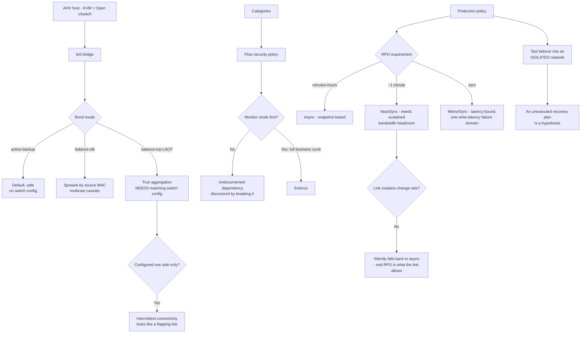

# Nutanix AHV Networking, Flow Microsegmentation and Disaster Recovery

**Level:** Advanced
**Tree:** [VMware & Nutanix](../README.md)
**Branch:** [Nutanix AHV](README.md)
**Forest:** [Virtualization](../../../README.md)

## Explanation

# AHV Networking, Flow Microsegmentation and DR

AHV is KVM with Nutanix's management plane and an Open vSwitch data path. Knowing that lineage explains most of its behaviour and most of its troubleshooting.

## Bridges, bonds and uplink modes

Each host has an OVS bridge (**br0** by default) with a bond of physical uplinks. The bond mode is the decision that matters:

- **active-backup** — default, safe, no switch configuration required, uses one uplink at a time.
- **balance-slb** — spreads by source MAC, no switch config, but can misbehave with multicast.
- **balance-tcp (LACP)** — genuine link aggregation, needs matching switch configuration.

The trap is **LACP configured on one side only**. Configure the switch without the host, or the host without the switch, and you get intermittent connectivity that looks like a flapping link — a fault that is much easier to create than to diagnose.

## Flow microsegmentation

Flow enforces policy on categories, in the same model as Prism Central policy generally. A security policy targets a category and defines permitted inbound and outbound traffic.

The operationally important feature is **monitor mode**: apply a policy and observe what it *would* block without blocking it. Every microsegmentation rollout should run in monitor mode long enough to cover a full business cycle — month-end, backup windows, batch jobs. Going straight to enforce is how a project discovers an undocumented dependency by breaking it.

## Protection policies and the RPO decision

Nutanix DR comes in two shapes:

- **Async replication** — snapshot-based, RPO measured in minutes to hours, cheapest, works over ordinary links.
- **NearSync** — RPO around a minute, using lightweight snapshots; needs sustained bandwidth headroom.
- **Metro/Sync** — RPO zero, synchronous, latency-bound, and it makes the two sites one failure domain for write latency.

The design error is choosing RPO from a requirements document without checking the **link**. NearSync on a link that cannot sustain the change rate silently falls back to async, and the actual RPO becomes whatever the link allows rather than what was promised.

## Test the failover, not the replication

Replication health tells you data is arriving. It says nothing about whether the recovery plan boots the VMs in the right order, with the right network mapping, with IPs that resolve. A recovery plan that has never been executed is a hypothesis, and Nutanix supports test failover into an isolated network specifically so it can stop being one.

## Architecture and flow



## Commands

### Command 1

Show bridge uplinks and bond mode per host — the first check for any AHV connectivity fault.

```text
manage_ovs show_uplinks
```

### Command 2

Set the bond mode; must be applied together with matching switch-side LACP configuration.

```text
manage_ovs --bridge_name br0 --bond_name br0-up --bond_mode balance-tcp update_uplinks
```

### Command 3

List protection domain snapshots to confirm replication is producing recovery points, not just running.

```text
ncli protection-domain ls-snaps name=<pd-name>
```

### Command 4

Bond member state and active slave — the diagnostic that exposes a one-sided LACP configuration.

```text
ovs-appctl bond/show br0-up
```

## Automation scripts

### ahv-dr-readiness.sh

```bash
#!/usr/bin/env bash
# Checks DR readiness on AHV: recovery points actually landing, and whether the
# recovery plan has ever been executed. Replication health proves data is arriving;
# it proves nothing about whether the VMs boot in the right order with the right
# network mapping. An unexecuted recovery plan is a hypothesis.
set -euo pipefail
MAX_AGE_MIN="${MAX_AGE_MIN:-60}"
fail=0

echo "== protection domains =="
pds=$(ncli protection-domain ls 2>/dev/null | awk -F: '/Name/{gsub(/ /,"",$2); print $2}')
[ -z "$pds" ] && { echo "  none configured - there is no DR to be ready for"; exit 1; }

for pd in $pds; do
  echo "--- $pd"
  latest=$(ncli protection-domain ls-snaps name="$pd" 2>/dev/null | \
           awk -F: '/Create Time/{print $2 $3 $4}' | head -1)
  if [ -z "$latest" ]; then
    echo "    FINDING no recovery points - replication is configured but producing nothing"
    fail=$((fail+1))
  else
    echo "    latest recovery point: $latest"
  fi
done

echo
echo "== bond consistency (one-sided LACP is the classic AHV fault) =="
if command -v manage_ovs >/dev/null 2>&1; then
  manage_ovs show_uplinks 2>/dev/null | grep -iE "bridge|bond_mode|uplinks" || true
fi

echo
echo "REMINDER: replication health is not DR readiness."
echo "Run a TEST FAILOVER into an isolated network and verify boot order,"
echo "network mapping and name resolution. Until then the plan is untested."
exit $(( fail > 0 ? 1 : 0 ))
```

## Lab

**Objective:** Configure AHV networking safely, roll out Flow microsegmentation without breaking dependencies, and prove DR works.

### Steps

1. Record the bond mode per host and confirm switch-side configuration matches — especially for LACP, where one-sided configuration causes intermittent faults.
2. Define categories for one application tier and author a Flow security policy against them.
3. Apply the policy in MONITOR mode and observe for a full business cycle including month-end and backup windows.
4. Review what would have been blocked, resolve each undocumented dependency, then switch to enforce.
5. Choose an RPO and verify the link can sustain the measured change rate for that tier — not the requirement on paper.
6. Execute a test failover into an isolated network and verify boot order, network mapping and name resolution.

### Validation

Bond configuration matches on both sides, the Flow policy ran a full cycle in monitor mode with every finding resolved before enforcing, the chosen RPO is sustainable on the measured link, and a test failover has actually booted the workload.

## Operational automation

Alert when a protection domain produces no new recovery point inside its RPO window, and schedule test failovers rather than leaving them to be requested. Replication that silently degrades from NearSync to async will keep reporting healthy while the real RPO quietly changes.

## Troubleshooting

### Scenario 1: Intermittent connectivity that looks like a flapping uplink

**Likely cause:** LACP configured on the host but not the switch, or the reverse.

**Resolution:** Compare bond mode against switch configuration with ovs-appctl bond/show. One-sided LACP is far easier to create than to diagnose, so check it before deeper investigation.

### Scenario 2: Actual RPO is worse than the configured protection policy

**Likely cause:** NearSync could not sustain the change rate on the available link and fell back to async.

**Resolution:** Measure the change rate for the protected tier and size bandwidth against it. RPO chosen from a requirements document without checking the link becomes whatever the link allows.

## Interview questions

### 1. Why should a Flow microsegmentation rollout start in monitor mode?

Because it shows what a policy would block without blocking it, and it needs to run long enough to cover a full business cycle — month-end, backup windows, batch jobs. Enterprise applications have dependencies nobody documented, and going straight to enforce means discovering them by breaking them. Monitor mode converts that discovery from an incident into a review.

### 2. A team specifies a one-minute RPO and configures NearSync. What do you check?

Whether the link can sustain the measured change rate for that workload. NearSync needs sustained bandwidth headroom, and when it cannot keep up it falls back to async — so the real RPO becomes whatever the link allows while the policy still says one minute. RPO chosen from a requirements document rather than from measurement is how a DR test discovers hours of data loss that nobody expected.

## Certification alignment

- Nutanix NCP-MCI
- Nutanix Certified Advanced Professional
- Nutanix NCP-DR

## References

- Nutanix AHV Networking best practices
- Nutanix Flow Security documentation
- Nutanix Data Protection and DR guide

## Suggested video search

https://www.youtube.com/results?search_query=nutanix+ahv+networking+flow+microsegmentation+protection+policy

---

> Validate commands, versions, permissions, licensing, and rollback procedures in an isolated lab before production use.
