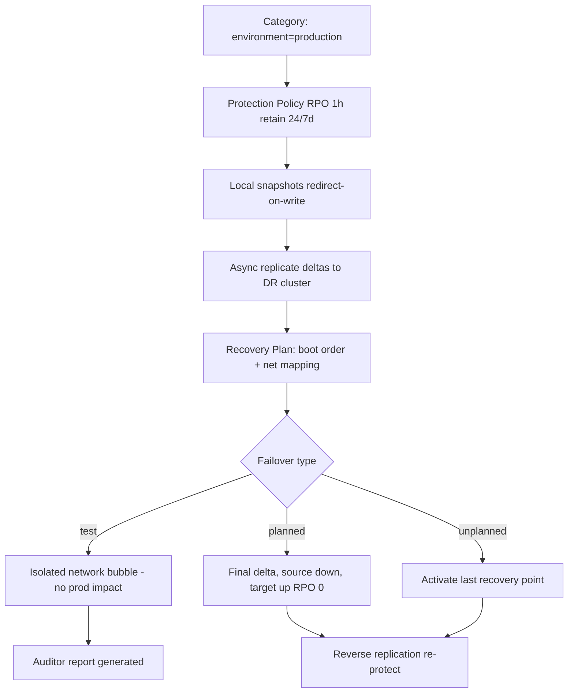

# Nutanix: Snapshots, Replication and DR with Protection Policies

**Level:** Enterprise
**Tree:** [VMware & Nutanix](../README.md)
**Branch:** [Nutanix AHV](README.md)
**Forest:** [Virtualization](../../../README.md)

## Explanation

## Data protection built into the fabric

Nutanix treats data protection as a fabric feature, not a bolt-on. **Snapshots** are redirect-on-write metadata operations in the DSF - creation is near-instant and space consumption is delta-only, so frequent recovery points are cheap (unlike VMware-layer delta-disk snapshots, there is no I/O penalty chain to collapse). Snapshots group into **consistency groups** so multi-VM applications (app + DB) snapshot at the same instant; VSS integration quiesces Windows guests for application-consistent points.

Replication ships snapshot deltas to another cluster. **Asynchronous** replication supports RPOs down to the near-sync range (1-15 minutes with LWS), while **Metro Availability** / synchronous replication provides RPO zero between metro-distance clusters for the highest tier. The modern management model is policy-based in Prism Central: **Protection Policies** declare RPO, retention and replication targets, and attach to VMs via **categories** (tags) - a newly provisioned VM tagged environment:production is protected automatically, eliminating the classic gap where new workloads are silently unprotected. **Recovery Plans** complete the story: they define boot order, stage delays, per-stage scripts, and network mapping (production subnet to DR subnet, including IP remapping), and they support **validation and test failover** into an isolated network - DR testing without touching production, on demand, with a generated report for auditors.

Failover types: planned (replicate final delta, shut down source, bring up at target - zero data loss), unplanned (activate at target from the last recovery point - accept RPO loss), and test. Runbook discipline still matters: DNS, dependencies outside the cluster (AD, load balancers), and re-protection after failover (reverse replication) are where paper DR plans fail; the platform automates the VM mechanics so teams can rehearse the rest quarterly.

## Architecture and flow



## Commands

### Command 1

List legacy protection domains and their schedules (PE-managed DR)

```text
ncli protection-domain ls
```

### Command 2

Create a protection domain with a consistency group for a SQL pair

```text
ncli protection-domain create name=pd-sql && ncli protection-domain protect name=pd-sql vm-names=sql01,sql02 cg-name=cg-sql
```

### Command 3

Take an immediate snapshot retained for 24 hours

```text
ncli protection-domain add-one-time-snapshot name=pd-sql retention-time=86400
```

### Command 4

Show configured replication target clusters and their health

```text
ncli remote-site ls
```

### Command 5

Check in-flight replication progress and lag against RPO

```text
ncli protection-domain ls-repl-status
```

### Command 6

Ad-hoc crash-consistent VM snapshot before a risky change

```text
acli vm.snapshot_create web01 snapshot_name=pre-change-$(date +%F)
```

## Automation scripts

### dr_compliance_report.py

```python
#!/usr/bin/env python3
"""Report VMs missing DR protection via Prism Central v3 API."""
import requests, sys

PC = "https://prism-central.acme.com:9440"
AUTH = ("svc-dr-audit", "REPLACE_FROM_VAULT")

def list_entities(kind: str, flt: str = ""):
    body = {"kind": kind, "length": 500}
    if flt:
        body["filter"] = flt
    r = requests.post(PC + "/api/nutanix/v3/" + kind + "s/list",
                      json=body, auth=AUTH, timeout=30, verify=True)
    r.raise_for_status()
    return r.json().get("entities", [])

def main():
    vms = list_entities("vm")
    unprotected = []
    for vm in vms:
        cats = vm.get("metadata", {}).get("categories", {})
        name = vm.get("spec", {}).get("name", "unknown")
        if cats.get("environment") == "production" and "Protection" not in cats:
            unprotected.append(name)
    print("Production VMs total:",
          sum(1 for v in vms
              if v.get("metadata", {}).get("categories", {}).get("environment") == "production"))
    if unprotected:
        print("UNPROTECTED production VMs:")
        for n in sorted(unprotected):
            print("  -", n)
        sys.exit(2)
    print("All production VMs carry a Protection category. Compliant.")

if __name__ == "__main__":
    main()
```

## Lab

**Objective:** Build category-driven DR between two clusters: protection policy with 1-hour RPO, a recovery plan with network mapping, and a clean test failover with evidence.

### Steps

1. Pair two clusters (or CE instances) in Prism Central as availability zones.
2. Create category environment:production and tag two app VMs plus their DB VM.
3. Create a protection policy: RPO 1 hour, retain 24 local/7 remote, target the DR cluster; attach via the category.
4. Verify first full replication completes and deltas follow within RPO.
5. Author a recovery plan: DB boots stage 1, apps stage 2 with 120s delay, production subnet mapped to DR test subnet.
6. Run validate, then test failover; confirm VMs boot in order on the isolated network, then clean up the test.
7. Provision a brand-new VM with the category and prove it is protected automatically.

### Validation

Replication status shows lag under the 1-hour RPO for all protected VMs.,Test failover report shows staged boot order honored and all VMs powered on.,Test VMs received DR-subnet addresses; production was untouched throughout.,The newly created categorized VM appears in the policy's protected entity list without manual action.

## Operational automation

### Automating data protection

- **Category-driven by design**: provisioning pipelines (Terraform/Ansible/Calm) assign environment and Protection categories at create time - protection is a property of being provisioned, not a later ticket.
- **Compliance loop**: schedule the unprotected-VM audit script daily; page on any production VM lacking protection or any replication lag beyond RPO.
- **DR drills as code**: trigger recovery-plan test failovers quarterly via API, collect the generated reports as audit evidence, and auto-create tickets for any VM that failed to boot in its stage."

## Troubleshooting

### Scenario 1: Replication lag keeps exceeding the policy RPO

**Likely cause:** WAN bandwidth insufficient for the change rate, or initial seeding still running

**Resolution:** Measure daily change rate versus link capacity, enable/verify compression on the remote site link, seed large initial datasets in a window, or relax RPO for bulk-churn VMs

### Scenario 2: Application-consistent snapshot fails on a Windows VM

**Likely cause:** NGT (Nutanix Guest Tools) missing/outdated or VSS writers in a failed state inside the guest

**Resolution:** Install/refresh NGT, check vssadmin list writers for failures, fix the failing writer service, retest with a manual app-consistent snapshot

### Scenario 3: Test failover VMs boot but cannot reach anything

**Likely cause:** Recovery plan network mapping absent or mapped to a subnet with no test services (DNS/GW)

**Resolution:** Map production to a purpose-built isolated test subnet with DNS/gateway stubs, or use the offline network option deliberately and document expectation

## Interview questions

### 1. Why are Nutanix-native snapshots cheaper than hypervisor delta-disk snapshots?

They are metadata pointer operations (redirect-on-write) inside the distributed storage fabric - no delta-disk chain sits in the I/O path, so there is no read penalty growing with snapshot age and no risky consolidation/collapse event. That makes frequent, long-retained recovery points operationally safe.

### 2. Walk through designing DR for a 3-tier app with 15-minute RPO and 1-hour RTO.

Category-tag all tier VMs; protection policy at RPO 15 minutes (near-sync if change rate demands) replicating to the DR AZ; consistency group for the DB tier. Recovery plan: DB stage 1, app stage 2, web stage 3 with health-check delays, subnet mappings and IP remap rules. Prove RTO with a timed test failover quarterly; the residual risk list is external dependencies - DNS cutover, AD reachability, load balancer config at DR.

### 3. Planned versus unplanned failover - what actually differs?

Planned: source is alive, so the system replicates a final delta, powers down source VMs, and activates at target - zero data loss, and clean reverse-protection afterwards. Unplanned: source is gone; you activate from the last replicated recovery point, accepting up to RPO of loss, and must handle potential split-brain when the source site returns (the platform blocks the old copies, but application-level reconciliation is yours).

### 4. How do categories change DR operations compared to per-VM protection?

They invert the default: policy attaches to a label, and anything born with the label is protected instantly. The failure mode shifts from 'we forgot to protect the new VM' (silent, discovered during a disaster) to 'the VM is missing a tag' (loud, caught by a daily compliance query). At hundreds of VMs that inversion is the difference between auditable DR and hope.

## Certification alignment

- Nutanix NCP-MCI - Configure protection policies, recovery plans and DR workflows
- Nutanix NCM/NCS-Core objectives - Business continuity and disaster recovery design
- Nutanix NCA - Describe snapshot and replication concepts

## References

- Nutanix Portal: Data Protection and Recovery with Prism Element / Leap guides
- The Nutanix Bible - snapshots, replication and DR chapters
- Nutanix best-practice guide: Disaster Recovery planning

## Suggested video search

Nutanix protection policies recovery plans Leap DR test failover demo

---

> Validate commands, versions, permissions, licensing, and rollback procedures in an isolated lab before production use.
