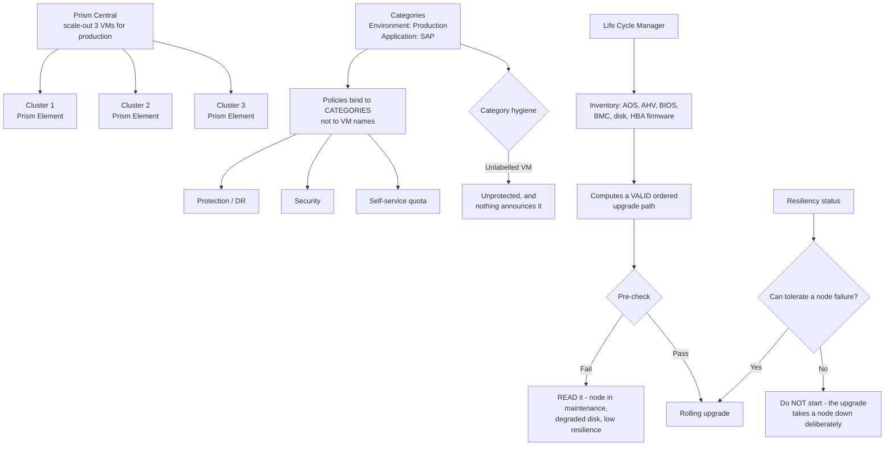

# Nutanix Prism Central: Multi-Cluster Operations and Lifecycle Management

**Level:** Advanced
**Tree:** [VMware & Nutanix](../README.md)
**Branch:** [Nutanix AHV](README.md)
**Forest:** [Virtualization](../../../README.md)

## Explanation

# Nutanix Prism Central: Multi-Cluster Operations

Prism Element manages one cluster; **Prism Central** manages many, and adds the capabilities that only make sense across clusters — categories, policies, self-service, and lifecycle orchestration.

## Prism Central is production infrastructure

The most common mistake is treating Prism Central as a management convenience and deploying a single small instance. Once categories drive policy, self-service drives provisioning, and LCM drives upgrades, Prism Central is in the critical path.

It should be **scale-out (three VMs)** for any estate that depends on it, sized for the *planned* number of managed VMs rather than the current count, because resizing is disruptive.

## Categories are the organising primitive

A **category** is a key-value label on an entity — **Environment: Production**, **Application: SAP**. Policies then apply to categories rather than to named VMs, which means a new VM inherits protection, security and DR policy from the moment it is labelled.

This is the same lesson as NSX tags: policy attached to identity survives change; policy attached to a name does not. The corollary is that **category hygiene becomes a real operational control** — an unlabelled VM is an unprotected VM, and nothing announces it.

## Life Cycle Manager

**LCM** inventories firmware and software across the stack — AOS, AHV, BIOS, BMC, disk firmware, HBA — and computes a valid upgrade path. This matters because Nutanix upgrades are ordered and interdependent; a manual firmware update out of sequence can leave a node unable to rejoin.

LCM runs a pre-check before any operation. **Pre-check failures should be read, not bypassed** — they routinely catch a node already in maintenance, insufficient cluster resilience, or a degraded disk that would turn a rolling upgrade into an outage.

## Resiliency before any maintenance

The single most useful operational habit is checking **cluster resiliency status** before starting anything. A cluster reporting it cannot tolerate a node failure must not begin a rolling upgrade — the upgrade takes a node down deliberately, and the cluster has already told you it cannot absorb that.

## Architecture and flow



## Commands

### Command 1

Cluster resiliency by node domain — the check that must pass before any maintenance begins.

```text
ncli cluster get-domain-fault-tolerance-status type=node
```

### Command 2

Surface any service not running across all CVMs, which blocks upgrades and indicates a degraded cluster.

```text
cluster status | grep -v UP
```

### Command 3

List VMs with NO categories — these inherit no policy and are the silent gap in protection coverage.

```text
curl -sk -u admin -X POST https://prism-central:9440/api/nutanix/v3/vms/list -d '{"kind":"vm","length":500}' | jq -r ".entities[] | select(.metadata.categories == {}) | .spec.name"
```

### Command 4

Host state across the cluster, confirming no node is already in maintenance before an upgrade.

```text
ncli host list | grep -E "Name|Node State"
```

## Automation scripts

### nutanix-preflight.sh

```bash
#!/usr/bin/env bash
# Pre-maintenance gate for a Nutanix cluster. Refuses when the cluster has already
# said it cannot tolerate a node failure - a rolling upgrade takes a node down
# deliberately, so starting one in that state converts maintenance into an outage.
set -euo pipefail
fail=0

echo "== cluster services =="
if cluster status 2>/dev/null | grep -qv "UP"; then
  cluster status | grep -v "UP" | head -20
  echo "  FINDING one or more services not UP"
  fail=$((fail+1))
else
  echo "  all services UP"
fi

echo
echo "== node fault tolerance =="
ft=$(ncli cluster get-domain-fault-tolerance-status type=node 2>/dev/null | \
     grep -i "Current Fault Tolerance" | head -1 | awk -F: '{gsub(/ /,"",$2); print $2}')
echo "  current fault tolerance: ${ft:-unknown}"
if [ "${ft:-0}" = "0" ]; then
  echo "  BLOCKING cluster cannot tolerate a node failure - do NOT start a rolling upgrade"
  fail=$((fail+1))
fi

echo
echo "== hosts already in maintenance =="
if ncli host list 2>/dev/null | grep -i "Node State" | grep -qiv "NORMAL"; then
  ncli host list | grep -iE "Name|Node State" | head -20
  echo "  FINDING a host is not in NORMAL state"
  fail=$((fail+1))
else
  echo "  all hosts NORMAL"
fi

echo
echo "findings: $fail"
[ "$fail" -gt 0 ] && { echo "DO NOT PROCEED. Read the LCM pre-check rather than bypassing it."; exit 1; }
echo "Pre-flight clean - safe to begin LCM operations."
```

## Lab

**Objective:** Establish category-driven policy across clusters and run a safe LCM upgrade.

### Steps

1. Deploy or verify Prism Central as scale-out, sized for the planned managed-VM count rather than the current one.
2. Define categories for environment and application, and bind protection and security policies to categories rather than VM names.
3. Audit for VMs carrying no categories — these inherit no policy and are the silent protection gap.
4. Run an LCM inventory and record the computed upgrade path across AOS, AHV and firmware.
5. Check cluster resiliency and host states, and refuse to proceed if the cluster cannot tolerate a node failure.
6. Execute the rolling upgrade, reading every pre-check failure rather than bypassing it.

### Validation

Prism Central is scale-out and correctly sized, no VM lacks categories, resiliency confirms node-failure tolerance before the upgrade, and no pre-check was bypassed.

## Operational automation

Schedule the uncategorised-VM audit and route findings to the owning team. An unlabelled VM inherits no protection or DR policy, and nothing in the platform announces it — the gap is only visible if something looks for it.

## Troubleshooting

### Scenario 1: A rolling upgrade caused a workload outage

**Likely cause:** The cluster could not tolerate a node failure before the upgrade began, and the upgrade removed a node deliberately.

**Resolution:** Gate every maintenance operation on fault-tolerance status. The cluster reports this in advance; the outage is the cost of not reading it.

### Scenario 2: New VMs are missing from backup and DR protection

**Likely cause:** Protection policy binds to categories and the VMs were created without any, so they inherited nothing.

**Resolution:** Audit for uncategorised VMs on a schedule and enforce category assignment at provisioning time. Category hygiene is an operational control, not metadata tidiness.

## Interview questions

### 1. What do categories do in Prism Central, and why does it matter operationally?

A category is a key-value label, and policies bind to categories rather than to named VMs — so a new VM inherits protection, security and DR policy the moment it is labelled. That makes category hygiene an operational control rather than metadata tidiness: an unlabelled VM is an unprotected VM, and nothing in the platform announces it. It is the same principle as tag-based policy in NSX — policy attached to identity survives change, policy attached to a name does not.

### 2. What should you check before starting an LCM upgrade?

Cluster fault-tolerance status first. A rolling upgrade deliberately takes a node down, so a cluster already reporting it cannot tolerate a node failure must not begin one. Then confirm no host is already in maintenance and all services are UP. And LCM pre-check failures should be read rather than bypassed — they routinely catch exactly these conditions, plus degraded disks that would turn a rolling upgrade into an outage.

## Certification alignment

- Nutanix NCP-MCI
- Nutanix NCM-MCI
- Nutanix Certified Services Expert

## References

- Nutanix Prism Central Administration Guide
- Nutanix Life Cycle Manager documentation
- Nutanix Cluster Resiliency best practices

## Suggested video search

https://www.youtube.com/results?search_query=nutanix+prism+central+categories+lcm+lifecycle+manager

---

> Validate commands, versions, permissions, licensing, and rollback procedures in an isolated lab before production use.
