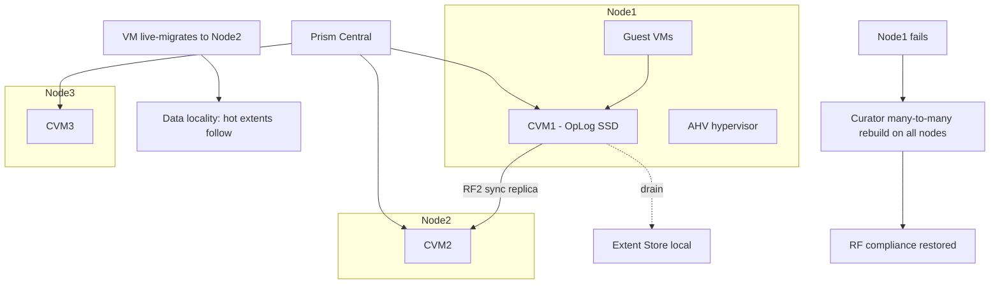

# Nutanix: HCI Architecture, Prism and AHV VM Management

**Level:** Advanced
**Tree:** [VMware & Nutanix](../README.md)
**Branch:** [Nutanix AHV](README.md)
**Forest:** [Virtualization](../../../README.md)

## Explanation

## Hyperconverged: storage controller as a VM

Nutanix collapses the three-tier SAN architecture into a cluster of x86 nodes, each running a hypervisor (**AHV**, Nutanix's hardened KVM derivative, or ESXi/Hyper-V) plus one **Controller VM (CVM)** that owns the node's local NVMe/SSD/HDD and serves storage to that node's guests. The CVMs federate into the **Distributed Storage Fabric (DSF)**: writes land on the local CVM's OpLog (SSD persistent write buffer), replicate synchronously to one or two other CVMs (Replication Factor 2 or 3) before acknowledgment, and drain to the extent store. Reads are served locally whenever possible (**data locality**) - after a VM live-migrates, its hot data follows it in the background, keeping the read path on-node. Cluster-wide services - deduplication, compression, erasure coding (EC-X), snapshots, disaster recovery - are software features applied per storage container.

A node failure is a non-event by design: its data has RF copies elsewhere, its VMs restart via AHV HA on surviving nodes, and **Curator** (the MapReduce background service) rebuilds the missing replicas across the whole cluster in parallel - many-to-many rebuild, far faster than RAID's one-spindle bottleneck. The CVM itself failing triggers **autopathing**: the hypervisor redirects storage I/O to a remote CVM until it recovers.

**Prism Element** manages one cluster; **Prism Central** federates many, adding RBAC, categories (tag-based policy), capacity runway forecasting, and the automation surface (v3/v4 REST APIs, Nutanix Calm/NCM for self-service). Day-to-day AHV operations feel deliberately simple: image service for templates, live migration, affinity rules, one-click rolling AOS/AHV upgrades (LCM) - the design bet is that virtualization operations should be boring, and the CLI surface (acli, ncli) plus APIs make it automatable.

## Architecture and flow



## Commands

### Command 1

Cluster identity, AOS version and current redundancy/fault tolerance state

```text
ncli cluster info && ncli cluster get-redundancy-state
```

### Command 2

Create an AHV VM with a 60G disk in the prod container

```text
acli vm.create web01 num_vcpus=4 memory=8G && acli vm.disk_create web01 create_size=60G container=prod-ctr
```

### Command 3

Constrain a VM to specific AHV hosts (licensing or latency pinning)

```text
acli vm.affinity_set web01 host_list=NODE-A,NODE-B
```

### Command 4

Evacuate an AHV host for maintenance with live migrations

```text
acli host.enter_maintenance_mode NODE-A wait=true
```

### Command 5

Review storage containers and their RF/efficiency settings

```text
ncli container ls | grep -E 'Name|Replication|Compression'
```

### Command 6

List CVM IPs and check core service status across all CVMs

```text
svmips && allssh 'genesis status | head -3'
```

### Command 7

Run the full Nutanix Cluster Check health suite before/after changes

```text
ncc health_checks run_all
```

## Automation scripts

### ahv_vm_provision.py

```python
#!/usr/bin/env python3
"""Provision an AHV VM via Prism Central v3 API with validation."""
import sys
import requests

PC = "https://prism-central.acme.com:9440"
AUTH = ("svc-automation", "REPLACE_FROM_VAULT")
HEADERS = {"Content-Type": "application/json"}

def find_image(name: str) -> str:
    r = requests.post(PC + "/api/nutanix/v3/images/list",
                      json={"kind": "image", "filter": "name==" + name},
                      auth=AUTH, headers=HEADERS, verify=True, timeout=30)
    r.raise_for_status()
    entities = r.json().get("entities", [])
    if not entities:
        sys.exit("ERROR: image not found: " + name)
    return entities[0]["metadata"]["uuid"]

def create_vm(name: str, image_uuid: str, subnet_uuid: str) -> str:
    spec = {
        "metadata": {"kind": "vm"},
        "spec": {
            "name": name,
            "resources": {
                "num_sockets": 2, "num_vcpus_per_socket": 2,
                "memory_size_mib": 8192,
                "disk_list": [{
                    "data_source_reference": {"kind": "image", "uuid": image_uuid},
                    "device_properties": {"device_type": "DISK"}
                }],
                "nic_list": [{"subnet_reference": {"kind": "subnet", "uuid": subnet_uuid}}]
            }
        }
    }
    r = requests.post(PC + "/api/nutanix/v3/vms", json=spec,
                      auth=AUTH, headers=HEADERS, verify=True, timeout=30)
    r.raise_for_status()
    task = r.json()["status"]["execution_context"]["task_uuid"]
    print("VM create submitted, task:", task)
    return task

if __name__ == "__main__":
    if len(sys.argv) != 3:
        sys.exit("usage: ahv_vm_provision.py VM_NAME SUBNET_UUID")
    img = find_image("rhel9-golden")
    create_vm(sys.argv[1], img, sys.argv[2])
```

## Lab

**Objective:** Operate a Nutanix CE cluster: provision from the image service, pin with affinity, survive a simulated node outage, and verify rebuild and data locality behavior.

### Steps

1. Deploy Nutanix Community Edition (3 nodes nested); confirm redundancy state with ncli.
2. Upload a RHEL 9 qcow2 to the image service and clone two VMs from it via acli.
3. Set host affinity for one VM; live-migrate the other and observe it excluded from the pinned host.
4. Run an fio workload in a VM, note read locality stats (2009 page or Prism metrics).
5. Gracefully power off one node; watch HA restart its VM and Curator rebuild RF compliance.
6. Run ncc health_checks run_all and clear every warning you can before finishing.

### Validation

ncli cluster get-redundancy-state returns the desired fault tolerance both before and after the node test.,Affinity-pinned VM never migrates off its allowed hosts.,After node failure, data resiliency status returns to OK without admin action.,NCC reports no critical findings.

## Operational automation

### Automating Nutanix operations

- **APIs first**: Prism Central v3/v4 REST covers VM lifecycle, categories and policies; the nutanix.ncp Ansible collection (ntnx_vms, ntnx_images, ntnx_subnets) makes it declarative from AAP.
- **Terraform**: the nutanix provider manages VMs, images and subnets as IaC - popular for lab-on-demand and dev/test vending.
- **LCM + NCC on schedule**: pre-stage firmware/AOS upgrades with Life Cycle Manager in maintenance windows, and schedule ncc health_checks with results shipped to your monitoring stack - upgrade only on a clean bill of health.

## Troubleshooting

### Scenario 1: Cluster reports data resiliency critical after adding a node

**Likely cause:** Rebuild/rebalance in progress, or fault domain (block awareness) constraints unsatisfiable with current layout

**Resolution:** Let Curator finish (watch progress in Prism), verify RF versus node/block count, run ncc to identify the specific unsatisfied domain

### Scenario 2: Guest I/O stalls on one node while other nodes are fine

**Likely cause:** Local CVM degraded (memory pressure, service crash) forcing autopathing latency

**Resolution:** Check genesis status and CVM RAM sizing on that node, review cvm logs (stargate), restart the affected service in a window; never power off a CVM without maintenance procedure

### Scenario 3: VM live migration between AHV hosts fails

**Likely cause:** Insufficient target resources, affinity rules constraining placement, or AHV version skew mid-upgrade

**Resolution:** Check acli vm.get for affinity, free capacity on targets, and complete pending LCM upgrades so hosts are version-consistent

## Interview questions

### 1. Explain the write path in Nutanix DSF and where the acknowledgment happens.

A guest write hits the local CVM, lands in the OpLog on SSD, and is synchronously replicated to one (RF2) or two (RF3) other CVMs' OpLogs; only then is the guest acknowledged. Data later drains to the extent store where compression/EC-X apply. Acknowledgment after replication is what makes node loss non-destructive.

### 2. What is data locality and why does it matter at scale?

Reads are served from the VM's own node whenever a local replica exists; after a migration, hot extents are migrated back near the VM in the background. This keeps read traffic off the east-west network, so aggregate read bandwidth scales linearly with nodes instead of saturating a shared array's controllers - the core HCI scaling argument.

### 3. Contrast a Nutanix node-failure rebuild with a RAID rebuild.

RAID rebuilds funnel through one spare spindle/group - hours to days, with a wide second-failure exposure window. DSF knows exactly which extents lost a replica and rebuilds them from all nodes to all nodes in parallel under Curator; time drops with cluster size and only actual data (not empty capacity) is rebuilt, shrinking the risk window dramatically.

### 4. When would you choose RF3 or higher-level protections over RF2?

RF3 (with its 3-copy overhead and 5-node minimum) when the blast radius justifies it: large clusters where simultaneous double failures are statistically real, long rebuild windows from very large drives, or business-critical containers. Complement with block/rack awareness so replicas spread across failure domains, and with async/metro DR for site-level protection - RF protects within a cluster only.

## Certification alignment

- Nutanix NCA - Describe AOS architecture, CVM and DSF concepts
- Nutanix NCP-MCI - Deploy and manage AHV VMs, affinity and maintenance workflows
- Nutanix NCP-MCI - Monitor cluster health with Prism and NCC

## References

- The Nutanix Bible (nutanixbible.com) - architecture deep dive
- Nutanix Portal Documentation: AOS, AHV Administration and Prism Guides
- Nutanix developer portal: v3/v4 API and nutanix.ncp Ansible collection

## Suggested video search

Nutanix AHV architecture CVM distributed storage fabric Prism deep dive

---

> Validate commands, versions, permissions, licensing, and rollback procedures in an isolated lab before production use.
