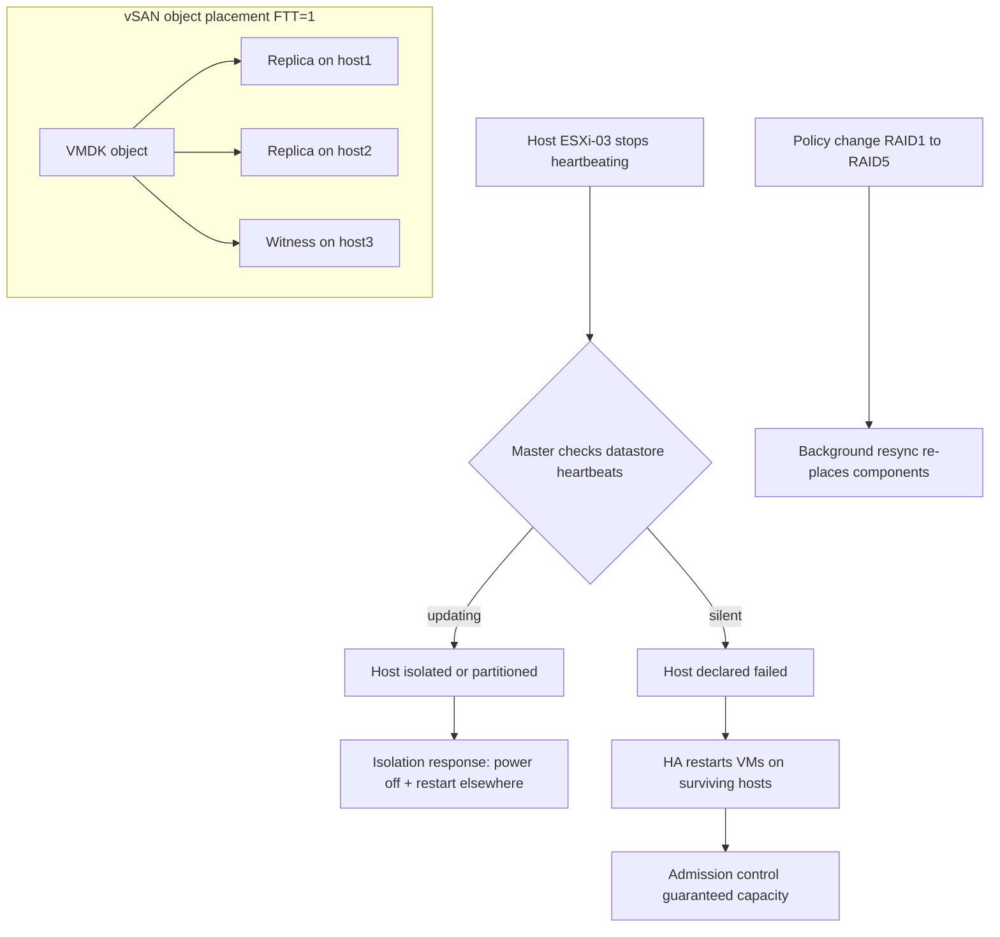

# vSphere: High Availability and vSAN Storage Policies

**Level:** Expert
**Tree:** [VMware & Nutanix](../README.md)
**Branch:** [VMware vSphere](README.md)
**Forest:** [Virtualization](../../../README.md)

## Explanation

## Surviving host failure and defining storage in software

**vSphere HA** protects VMs against host failure with restart, not fault tolerance: when a host dies, its VMs are re-registered and powered on elsewhere - minutes of downtime, automatically. Internals matter for design: hosts elect a **master** (highest-numbered eligible host wins) that monitors slaves via network heartbeats; when heartbeats stop, the master distinguishes a *failed* host from an *isolated* or *partitioned* one using **datastore heartbeats** - a host that still updates its heartbeat datastores is alive but unreachable. The per-host **isolation response** (leave powered on, or power off then restart elsewhere) must match storage type: with IP storage or vSAN, an isolated host has likely lost storage too, so power-off is correct; with FC storage, leave-powered-on avoids needless restarts. **Admission control** reserves failover capacity - N+1 or a percentage - so a cluster cannot fill to the point where failover is impossible; disabling it to squeeze in more VMs is how outages become disasters. VM/application monitoring adds guest-level restarts on heartbeat loss, and Proactive HA evacuates hosts reporting degraded hardware before they fail.

**vSAN** replaces the array: each host contributes local disks, forming a distributed object store on which each VM disk is an object placed according to a **storage policy**. The core policy knob is **Failures To Tolerate**: FTT=1 mirrored (2 copies + witness), FTT=2 (3 copies), or RAID-5/6 erasure coding (all-flash) trading capacity efficiency for rebuild cost and write amplification. Policies apply per-VM, even per-VMDK, and can change on the fly - storage tiers become metadata, not LUN migrations. A **witness** component breaks split-brain ties; **stretched clusters** span two sites with a third-site witness appliance for site-level failure tolerance. HA plus vSAN interact tightly: HA heartbeats ride the vSAN network, and design must keep slack space (recommended operational reserve) for rebuilds after a failure - a full vSAN cluster cannot heal itself.

## Architecture and flow



## Commands

### Command 1

PowerCLI: audit HA and admission control state

```text
Get-Cluster Prod-01 | Select HAEnabled,HAAdmissionControlEnabled,HAFailoverLevel
```

### Command 2

PowerCLI: enable HA with admission control

```text
Get-Cluster Prod-01 | Set-Cluster -HAEnabled $true -HAAdmissionControlEnabled $true
```

### Command 3

Show vSAN cluster membership and health from a host

```text
esxcli vsan cluster get
```

### Command 4

Run the vSAN health checks from the CLI

```text
esxcli vsan health cluster list
```

### Command 5

Summarize vSAN object health (accessible, degraded, rebuilding)

```text
esxcli vsan debug object health summary get
```

### Command 6

PowerCLI: list vSAN storage policies and their rules

```text
Get-SpbmStoragePolicy | Select Name,AnyOfRuleSets
```

### Command 7

Validate vSAN network MTU end-to-end with don't-fragment jumbo ping

```text
vmkping -I vmk2 -S vsan 10.10.30.13 -s 8972 -d
```

## Automation scripts

### Test-HAReadiness.ps1

```powershell
# HA/vSAN readiness audit: admission control, heartbeat datastores, slack space.
param([Parameter(Mandatory)][string]$ClusterName)
Import-Module VMware.PowerCLI -ErrorAction Stop
$clu = Get-Cluster -Name $ClusterName -ErrorAction Stop
$report = [ordered]@{}
$report.HAEnabled          = $clu.HAEnabled
$report.AdmissionControl   = $clu.HAAdmissionControlEnabled
$report.HostCount          = ($clu | Get-VMHost | Where-Object ConnectionState -eq 'Connected').Count
$dsHb = (Get-AdvancedSetting -Entity $clu -Name 'das.heartbeatDsPerHost' -ErrorAction SilentlyContinue).Value
$report.HeartbeatDsPerHost = if ($dsHb) { $dsHb } else { '2 (default)' }
$vsanDs = Get-Datastore | Where-Object Type -eq 'vsan'
if ($vsanDs) {
    $freePct = [math]::Round(($vsanDs.FreeSpaceGB / $vsanDs.CapacityGB) * 100, 1)
    $report.vsanFreePct = $freePct
    $report.SlackOK     = $freePct -ge 25
}
$report.GetEnumerator() | ForEach-Object { "{0,-22}: {1}" -f $_.Key, $_.Value }
if ($report.Contains('SlackOK') -and -not $report.SlackOK) {
    Write-Warning "vSAN free space below 25% operational reserve - rebuild after failure may not complete."
}
```

## Lab

**Objective:** Prove HA restart behavior including isolation handling, then drive vSAN policy changes and a simulated disk failure while measuring object resync.

### Steps

1. Enable HA with percentage-based admission control on a 4-host (nested) vSAN cluster.
2. Power off one host abruptly; time the restart of its VMs and read the HA events sequence.
3. Isolate a host (block management VLAN only) and observe datastore-heartbeat-based isolation handling instead of failure handling.
4. Create storage policies FTT1-Mirror and FTT1-RAID5; deploy a VM on each and inspect component layout in the vSAN UI.
5. Change the running VM's policy from RAID-1 to RAID-5 and watch the resync dashboard.
6. Fail one capacity disk and confirm rebuild restores compliance; note slack space consumed.

### Validation

VMs from the failed host restart automatically within the expected window.,Isolated-host VMs follow the configured isolation response, not a spurious restart.,vSAN UI shows RAID-1 objects as 2 replicas + witness, RAID-5 as 3+1 components.,After disk failure, all objects return to compliant with zero data loss.,Admission control blocks powering on VMs beyond reserved failover capacity.

## Operational automation

### Automating availability and storage policy

- **Policy as code**: define SPBM policies and cluster HA settings in PowerCLI or community.vmware Ansible modules, stored in git; a scheduled compliance job re-asserts them and reports drift.
- **Health gating**: run vSAN health-check API queries before and after every patch window; block the pipeline if resync bytes are non-zero before host evacuation.
- **Failure drills**: script a quarterly game day - power off a designated host via out-of-band (iLO/Redfish), assert restart SLAs from vCenter events, file the evidence automatically.

## Troubleshooting

### Scenario 1: HA cannot power on a VM after host failure: insufficient resources

**Likely cause:** Admission control policy mismatch with actual reservations, or capacity genuinely consumed

**Resolution:** Review failover capacity math (slot size distortion from one large-reservation VM is classic); fix oversized reservations or move to percentage-based policy

### Scenario 2: vSAN objects show reduced availability with no rebuild progress

**Likely cause:** Rebuild has no target - insufficient slack space or not enough fault domains after the failure

**Resolution:** Free/expand capacity or add a host; verify the cluster still satisfies the policy's host minimum (FTT=1 mirror needs 3, RAID-5 needs 4)

### Scenario 3: Frequent vSAN network partitions in health checks

**Likely cause:** vSAN VMkernel misconfiguration - MTU mismatch, multicast/unicast issues after topology change, or flapping uplinks

**Resolution:** vmkping with jumbo don't-fragment between all hosts, verify identical VLAN/MTU, check physical switch ports; re-run health after correction

## Interview questions

### 1. How does the HA master tell a failed host from an isolated one?

Loss of network heartbeats plus silence on datastore heartbeats means failed - restart its VMs. Network silence while the host still updates heartbeat datastores means isolated/partitioned - the host is alive, so the isolation response governs (power off and restart elsewhere, or leave powered on). This two-channel design prevents split-brain double-running of VMs.

### 2. Which isolation response do you set for a vSAN cluster and why?

Power off and restart: an ESXi host isolated from the vSAN network has generally lost access to its storage objects anyway, so its VMs are already dead or unable to write; powering them off releases locks and lets HA restart them on hosts that still have quorum for the objects. Leave-powered-on suits only storage that survives management-network isolation, like FC.

### 3. Compare FTT=1 RAID-1 versus RAID-5 on vSAN for a database.

RAID-1 mirrors: 200% capacity, one full extra write, fastest rebuilds, best write latency - right for latency-sensitive OLTP. RAID-5 (3+1): 133% capacity but every write triggers read-modify-write amplification across hosts and rebuilds are heavier; acceptable for read-heavy or capacity-driven tiers on all-flash. Policy-per-VMDK lets you mirror logs and erasure-code data files on the same VM.

### 4. Why does vSAN need slack space, and how much do you design for?

Failures and policy changes trigger component rebuilds and resyncs that need free capacity to land - a cluster without slack cannot self-heal and can hit congestion thresholds that throttle guest I/O. Design guidance is roughly 25-30% operational reserve (the UI now computes it explicitly); capacity planning must treat it as reserved, not usable.

## Certification alignment

- VMware VCP-DCV (2V0-21.23) - Configure vSphere HA and admission control
- VMware VCP-DCV - vSAN concepts and storage policy management
- VCAP-DCV Design / VCDX - Availability design: RTO-driven HA and FTT decisions

## References

- VMware vSphere Availability Guide - HA internals and admission control
- VMware vSAN Design Guide and vSAN Operations documentation
- VMware KB: vSAN capacity and slack space guidance

## Suggested video search

vSphere HA deep dive datastore heartbeat vSAN storage policy FTT explained

---

> Validate commands, versions, permissions, licensing, and rollback procedures in an isolated lab before production use.
