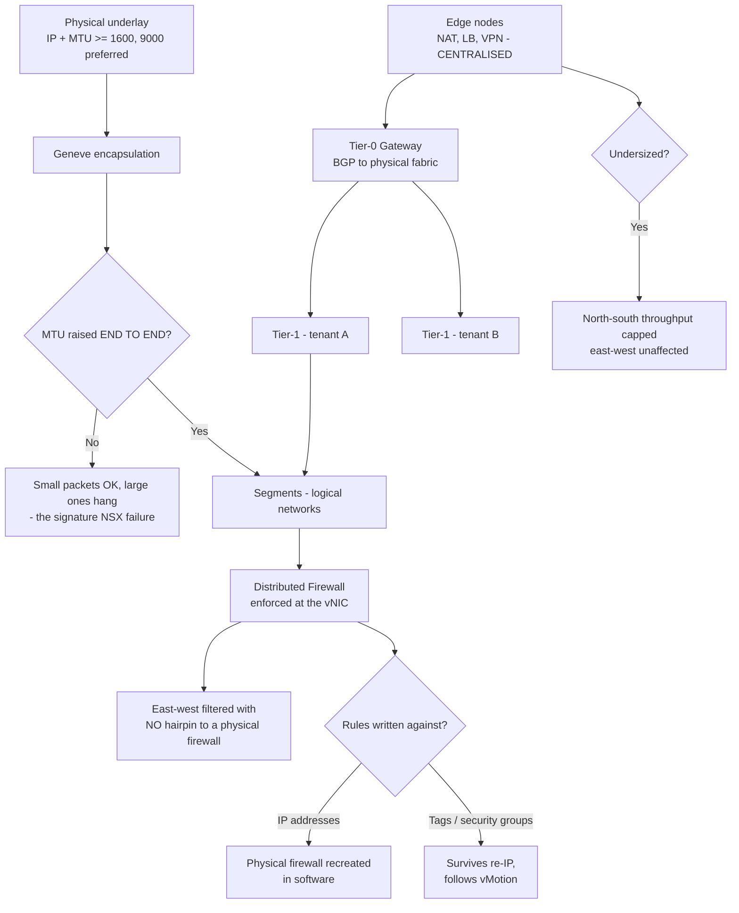

# VMware NSX Overlay Networking, Distributed Firewall and Edge Services

**Level:** Expert
**Tree:** [VMware & Nutanix](../README.md)
**Branch:** [VMware vSphere](README.md)
**Forest:** [Virtualization](../../../README.md)

## Explanation

# NSX Overlay, Distributed Firewall and Edge Services

NSX decouples the network from the physical fabric. The physical underlay carries IP and MTU; everything else — segments, routing, firewalling, load balancing — becomes software running on the hypervisors.

## Overlay and the MTU requirement

Segments are **Geneve-encapsulated** over the underlay. Encapsulation adds overhead, so the underlay must carry a larger MTU than the guest — 1600 bytes minimum, 9000 preferred.

This is the single most common NSX deployment failure, and its signature is distinctive: small packets work, large ones do not. Ping succeeds, SSH connects, then a file transfer or a database query hangs. The MTU must be raised **end to end**, including every switch between hosts; one device left at 1500 produces exactly this intermittent behaviour.

## The distributed firewall is the real prize

The **DFW** enforces at the vNIC, in the hypervisor, before traffic reaches the wire. Two consequences matter:

- **East-west traffic is filtered without hairpinning** to a physical firewall. Two VMs on the same host, same segment, are still policed.
- **Microsegmentation becomes practical.** Policy can be written against tags, VM names or security groups rather than IP addresses, so it survives re-IP and follows the workload on vMotion.

The discipline that makes it work is writing rules against **tags rather than addresses**. Address-based rules in NSX recreate the physical firewall in software and inherit all its maintenance burden.

## Tier-0 and Tier-1 gateways

**Tier-0** is the boundary to the physical network, running BGP with the upstream fabric — one per environment, typically. **Tier-1** gateways sit beneath it, one per tenant or application, and connect segments.

The separation lets a tenant own its own routing and services without touching the physical peering. Services with the Edge — NAT, load balancing, VPN, gateway firewall — attach at a Tier-1, or at Tier-0 where they must apply to everything.

## Edge nodes are a capacity decision

Edge nodes run the centralised services, and everything stateful (NAT, load balancing, VPN) executes there rather than distributed. Undersizing Edge nodes shows up as throughput limits on north-south traffic while east-west remains fine — a signature worth recognising, because it points at the Edge rather than at the fabric.

## Architecture and flow



## Commands

### Command 1

Confirm the TEP (tunnel endpoint) interface exists and is configured for overlay traffic.

```text
esxcli network ip interface list | grep -A3 vmk10
```

### Command 2

The definitive overlay MTU test: a do-not-fragment ping at Geneve payload size. Failure here is the MTU fault before any deeper diagnosis.

```text
vmkping ++netstack=vxlan -d -s 1572 -I vmk10 <remote-tep-ip>
```

### Command 3

Enumerate DFW sections and rule counts — the input to reviewing whether policy is tag-based or address-based.

```text
curl -sk -u admin -X GET https://nsx-manager/api/v1/firewall/sections | jq -r ".results[] | [.display_name,.rule_count] | @tsv"
```

### Command 4

BGP peering state between Tier-0 and the physical fabric, run from the Edge node CLI.

```text
get logical-router <t0-uuid> bgp neighbor summary
```

## Automation scripts

### nsx-mtu-verify.sh

```bash
#!/usr/bin/env bash
# Verifies overlay MTU end to end between TEPs, which is the most common NSX
# deployment failure. Signature: small packets fine, large packets hang. One
# switch left at 1500 anywhere in the path reproduces it.
set -euo pipefail
VMK="${VMK:-vmk10}"
SIZE="${SIZE:-1572}"      # 1600 MTU minus IP/ICMP headers
PEERS="${*:?usage: nsx-mtu-verify.sh <remote-tep-ip> [more...]}"

fail=0
echo "overlay MTU verification  interface=$VMK  payload=${SIZE}B (do-not-fragment)"
echo
for ip in $PEERS; do
  printf "  %-18s " "$ip"
  if vmkping ++netstack=vxlan -d -s "$SIZE" -c 3 -I "$VMK" "$ip" >/dev/null 2>&1; then
    echo "OK"
  else
    echo "FAIL"
    fail=$((fail+1))
    # Prove it is MTU and not reachability
    if vmkping ++netstack=vxlan -c 3 -I "$VMK" "$ip" >/dev/null 2>&1; then
      echo "        reachable at default size - this IS an MTU fault in the path"
    else
      echo "        not reachable at all - reachability fault, not MTU"
    fi
  fi
done

echo
if [ "$fail" -gt 0 ]; then
  echo "$fail peer(s) failed. Raise MTU to >=1600 on EVERY switch in the path,"
  echo "not only on the hosts. One device at 1500 produces intermittent"
  echo "large-packet failures that look like application faults."
  exit 1
fi
echo "All TEP paths carry full overlay MTU."
```

## Lab

**Objective:** Validate an NSX overlay end to end and convert address-based firewall policy to tag-based microsegmentation.

### Steps

1. Verify TEP interfaces exist on every host and record the configured MTU at each hop in the physical path.
2. Run a do-not-fragment ping at Geneve payload size between every TEP pair and treat any failure as an MTU fault until proven otherwise.
3. Audit DFW sections and classify each rule as address-based or tag-based.
4. Define security tags for one application tier and rewrite its rules against tags.
5. Test that policy follows the workload by vMotioning a VM and confirming enforcement is unchanged.
6. Confirm Tier-0 BGP peering with the physical fabric and check Edge node utilisation against north-south throughput requirements.

### Validation

Every TEP pair passes the full-size do-not-fragment test, the pilot application enforces on tags rather than addresses, policy survives a vMotion, and Edge capacity meets measured north-south demand.

## Operational automation

Run the TEP MTU verification after every fabric change. An MTU regression introduced by a switch replacement is invisible to reachability monitoring and surfaces days later as unexplained application timeouts.

## Troubleshooting

### Scenario 1: Ping and SSH work but file transfers and database queries hang

**Likely cause:** Overlay MTU is below the Geneve requirement somewhere in the physical path — small packets fit, large ones are dropped.

**Resolution:** Run a do-not-fragment vmkping at full payload size between TEPs, then raise MTU to at least 1600 on every switch in the path, not only on the hosts.

### Scenario 2: North-south throughput is capped while east-west performs well

**Likely cause:** Edge nodes are undersized. Centralised services (NAT, load balancing, VPN) run on the Edge; distributed routing and DFW do not.

**Resolution:** Size Edge nodes against measured north-south demand. The asymmetry between east-west and north-south performance is the diagnostic that points at the Edge.

## Interview questions

### 1. What is the most common NSX deployment failure and how do you recognise it?

Insufficient overlay MTU. Geneve encapsulation adds overhead, so the underlay needs at least 1600 bytes. The signature is that small packets work and large ones do not — ping and SSH succeed, then a file transfer or database query hangs, which looks like an application fault. The test is a do-not-fragment vmkping at full payload size between TEPs, and the fix has to be applied end to end: one switch left at 1500 reproduces the whole symptom.

### 2. Why write distributed firewall rules against tags rather than IP addresses?

Because tag-based policy survives re-IP and follows the workload on vMotion, which is the entire advantage of enforcing at the vNIC. Address-based rules recreate the physical firewall in software and inherit its maintenance burden — every renumbering becomes a policy change. The DFW also filters east-west traffic between two VMs on the same host without hairpinning to a physical appliance, which is what makes microsegmentation practical rather than theoretical.

## Certification alignment

- VMware VCP-NV
- VMware VCAP-NV Deploy
- VMware NSX Specialist

## References

- VMware NSX Reference Design Guide
- NSX Distributed Firewall documentation
- Geneve encapsulation RFC 8926

## Suggested video search

https://www.youtube.com/results?search_query=vmware+nsx+geneve+overlay+distributed+firewall+tier0+tier1+edge

---

> Validate commands, versions, permissions, licensing, and rollback procedures in an isolated lab before production use.
