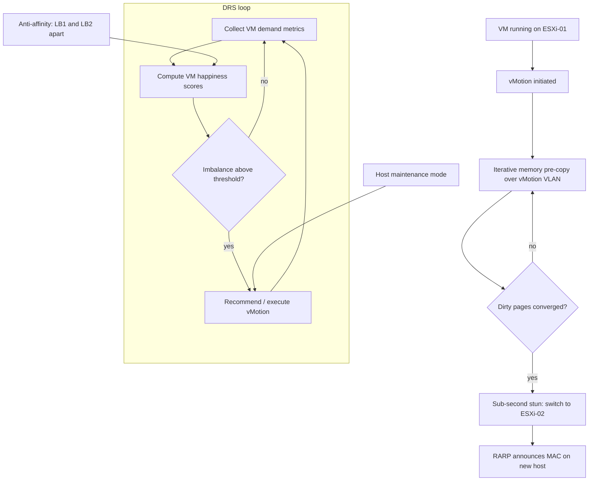

# vSphere: vMotion and DRS Resource Management

**Level:** Advanced
**Tree:** [VMware & Nutanix](../README.md)
**Branch:** [VMware vSphere](README.md)
**Forest:** [Virtualization](../../../README.md)

## Explanation

## Live workload mobility and automated balancing

**vMotion** live-migrates a running VM between ESXi hosts with no downtime: the VM's memory is copied iteratively over the vMotion network while it keeps running, dirtied pages are re-copied in converging passes, and a final sub-second stun switches execution to the target host, which assumes the VM's MAC and open network state. Storage stays put (shared datastore) unless Storage vMotion moves the disks too; combined compute+storage migration handles hosts with no shared storage. Prerequisites that bite in practice: a VMkernel port enabled for vMotion on every host (dedicated VLAN, ideally multi-NIC for large-memory VMs), CPU compatibility across hosts - solved at cluster level by **EVC (Enhanced vMotion Compatibility)**, which masks newer CPU features down to a chosen generation baseline - and no host-local dependencies (CD-ROM mapped to a local ISO is the classic blocker).

**DRS (Distributed Resource Scheduler)** builds on vMotion: it monitors CPU and memory demand across the cluster and recommends or automatically executes migrations to keep VM happiness high (modern DRS scores each VM's resource satisfaction rather than balancing host averages). Automation levels run from manual to fully automated with a migration-threshold slider; production norm is fully automated at the default threshold.

The governance layer is rules and pools. **Affinity rules** keep chatty VMs together; **anti-affinity** separates cluster members (two load balancers never on one host); **VM-Host rules** pin licensed workloads (Oracle) to a licensed host group - "must" rules are honored even by HA, "should" rules yield in emergencies. **Resource pools** carve cluster capacity with shares, reservations and limits - shares only matter under contention, and the perennial design warning is unintended sibling rivalry: a pool with few VMs and equal shares can starve a busier sibling pool. DRS also handles maintenance mode: evacuating a host for patching becomes one click plus automatic rebalancing after.

## Architecture and flow



## Commands

### Command 1

Verify the VMkernel interface used for vMotion on an ESXi host

```text
esxcli network ip interface list | grep -A5 vmk1
```

### Command 2

Test vMotion VLAN connectivity host-to-host using the vMotion TCP/IP stack

```text
vmkping -I vmk1 -S vmotion 10.10.20.12
```

### Command 3

Trigger a vMotion via the govc CLI (vSphere API)

```text
govc vm.migrate -host esxi-02.acme.com -vm app-vm01
```

### Command 4

PowerCLI: audit affinity/anti-affinity rules in a cluster

```text
Get-DrsRule -Cluster Prod-01 | Select Name,Enabled,KeepTogether,VMIds
```

### Command 5

PowerCLI: set DRS to fully automated

```text
Get-Cluster Prod-01 | Set-Cluster -DrsAutomationLevel FullyAutomated
```

### Command 6

PowerCLI: enter maintenance mode and let DRS evacuate all VMs

```text
Set-VMHost -VMHost esxi-01.acme.com -State Maintenance -Evacuate
```

## Automation scripts

### Assert-AntiAffinity.ps1

```powershell
# Ensure every clustered app pair has a DRS anti-affinity rule.
# Requires VMware.PowerCLI. Run against vCenter with read/modify rights.
param(
    [Parameter(Mandatory)] [string] $Cluster,
    [Parameter(Mandatory)] [string[]] $VmPair,
    [string] $RuleName = "sep-" + ($VmPair -join "-")
)
Import-Module VMware.PowerCLI -ErrorAction Stop
$clu = Get-Cluster -Name $Cluster -ErrorAction Stop
$vms = foreach ($v in $VmPair) { Get-VM -Name $v -Location $clu -ErrorAction Stop }
if ($vms.Count -lt 2) { throw "Need at least two VMs for anti-affinity." }
$existing = Get-DrsRule -Cluster $clu -Name $RuleName -ErrorAction SilentlyContinue
if ($existing) {
    Write-Host "Rule $RuleName already exists - verifying membership"
    if (Compare-Object $existing.VMIds ($vms.Id)) {
        Set-DrsRule -Rule $existing -VM $vms -Confirm:$false | Out-Null
        Write-Host "Rule membership corrected."
    }
} else {
    New-DrsRule -Cluster $clu -Name $RuleName -KeepTogether $false -VM $vms | Out-Null
    Write-Host "Created anti-affinity rule $RuleName"
}
Get-DrsRule -Cluster $clu -Name $RuleName | Format-List Name,Enabled,KeepTogether
```

## Lab

**Objective:** Configure a 3-host DRS cluster with EVC, prove zero-downtime vMotion under load, and demonstrate anti-affinity enforcement plus one-click host evacuation.

### Steps

1. Create a cluster with DRS fully automated and EVC set to a common CPU baseline; add three nested ESXi hosts.
2. Configure a dedicated vMotion VMkernel port per host on its own VLAN; verify with vmkping.
3. Start a continuous ping and a memory-churn workload inside a test VM, then vMotion it; record dropped pings (expect 0-1).
4. Deploy two 'load balancer' VMs and create an anti-affinity rule; try to vMotion both onto one host and observe DRS correct it.
5. Put one host into maintenance mode and watch DRS evacuate every VM automatically.
6. Review the DRS cluster score and migration history in vCenter.

### Validation

vMotion completes with at most one lost ping and no application error.,Both anti-affinity VMs are never co-resident; the rule shows enforced in DRS faults if forced.,Maintenance mode completes without manual migrations.,Cluster DRS score remains healthy (green) after rebalancing.

## Operational automation

### Automating vSphere resource management

- **PowerCLI**: the operational lingua franca - schedule rule audits (anti-affinity presence for every clustered pair), automated maintenance-mode patch cycles per host, and DRS setting compliance reports.
- **govc / vSphere API**: lightweight CLI for pipelines - trigger migrations, query DRS recommendations, gate deployments on cluster headroom.
- **Ansible**: community.vmware modules (vmware_vm_vm_drs_rule, vmware_maintenancemode) bring cluster policy under the same AAP governance as the OS layer; Aria Operations (vROps) closes the loop with predictive rightsizing feeding automation.

## Troubleshooting

### Scenario 1: vMotion fails at 14% with operation timed out

**Likely cause:** vMotion VMkernel connectivity broken between source and target (VLAN, MTU mismatch, or firewall)

**Resolution:** vmkping -I vmk1 with normal and jumbo (-s 8972 -d) sizes both directions; align MTU end-to-end and open TCP 8000 between hosts

### Scenario 2: vMotion blocked with CPU feature incompatibility error

**Likely cause:** Target host CPU lacks features the VM sampled at power-on (mixed CPU generations, no EVC)

**Resolution:** Enable EVC at the highest baseline all hosts support; already-running VMs adopt the mask only after a full power cycle

### Scenario 3: DRS shows recommendations but never migrates anything

**Likely cause:** Automation level manual/partially automated, or per-VM overrides pin workloads

**Resolution:** Set cluster to fully automated, review VM Overrides list, and check for disabled DRS or must-rules constraining placement

## Interview questions

### 1. Explain how vMotion achieves zero downtime for a busy VM.

Iterative pre-copy: copy all memory while the VM runs, then repeatedly copy only pages dirtied since the last pass. When the dirty set is small enough to transfer within the stun budget, the VM is paused for well under a second, the final delta plus device state moves, and execution resumes on the target, which sends a RARP so switches relearn the MAC. If the workload dirties memory faster than the network drains it, vMotion throttles (SDPS) to force convergence.

### 2. What does EVC actually do, and what is the cost?

EVC applies a CPU feature mask (via CPUID interception) so every host in the cluster exposes the same, older feature baseline - guaranteeing vMotion compatibility across mixed hardware generations. The cost is that VMs cannot use instructions newer than the baseline (e.g. newer AVX variants), a usually negligible but occasionally measurable performance trade for workloads that exploit them.

### 3. Design DRS rules for a 2-node app cluster plus an Oracle DB in an 8-host cluster.

Anti-affinity (separate) rule for the two app nodes so a host failure takes at most one. VM-to-host 'must run' rule pinning Oracle VMs to a licensed host group to bound licensing exposure - accepting that HA will not restart them elsewhere; pair it with capacity in the licensed group. Review rules against HA admission control so reserved failover capacity honors the constraints.

### 4. When do resource pool shares actually matter, and what is the classic misconfiguration?

Only under contention - unclaimed resources flow freely otherwise. The classic error is the pie-split trap: two sibling pools with equal shares, one holding 5 VMs and the other 50, giving the first pool's VMs ten times the per-VM entitlement during contention. Fix by scaling shares to population/importance or using scalable shares in vSphere 7+.

## Certification alignment

- VMware VCP-DCV (2V0-21.23) - Configure and manage vMotion and EVC
- VCP-DCV - Create and manage DRS clusters, affinity and anti-affinity rules
- VCAP-DCV Design / VCDX - Resource management and availability design decisions

## References

- VMware vSphere Documentation: vCenter Server and Host Management - vMotion
- VMware vSphere Resource Management Guide - DRS and resource pools
- VMware KB: EVC processor support matrix

## Suggested video search

vSphere 8 vMotion deep dive DRS anti-affinity EVC explained

---

> Validate commands, versions, permissions, licensing, and rollback procedures in an isolated lab before production use.
