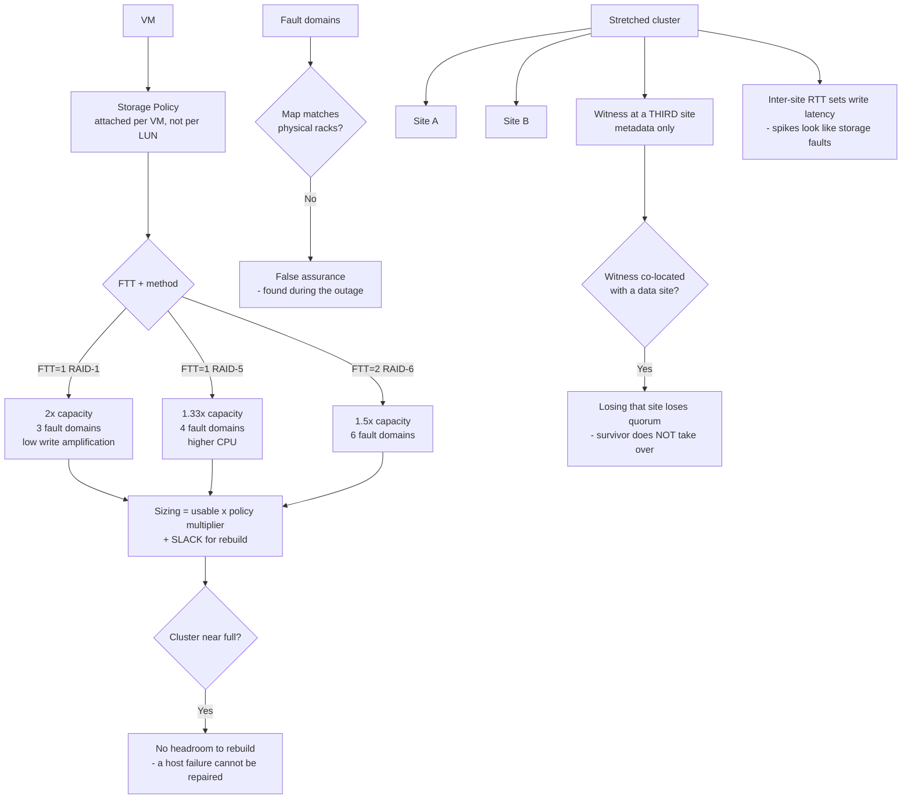

# VMware vSAN Storage Policies, Fault Domains and Stretched Clusters

**Level:** Advanced
**Tree:** [VMware & Nutanix](../README.md)
**Branch:** [VMware vSphere](README.md)
**Forest:** [Virtualization](../../../README.md)

## Explanation

# vSAN Storage Policies, Fault Domains and Stretched Clusters

vSAN moves storage decisions from the array to the **VM**. Instead of placing a VM on a LUN with fixed characteristics, you attach a **storage policy** and vSAN places the data to satisfy it. That inversion is the whole design model, and misunderstanding it is where capacity planning goes wrong.

## Failures to tolerate, and what it costs

The core policy setting is **FTT** (failures to tolerate) with a fault tolerance method:

- **FTT=1, RAID-1 mirroring** — two copies plus a witness. Costs 2× raw capacity, cheapest on write amplification, needs 3 fault domains.
- **FTT=1, RAID-5 erasure coding** — 1.33× capacity, needs 4 fault domains, higher CPU and write amplification.
- **FTT=2, RAID-6** — 1.5× capacity, needs 6 fault domains.

The number people miss: **FTT is capacity, not just resilience**. A 100 TB requirement at FTT=1 mirroring needs 200 TB raw plus slack space. Sizing against usable capacity without applying the policy multiplier is the most common vSAN sizing error.

## Slack space is not optional

vSAN needs free capacity to rebuild after a failure and to rebalance. Running a cluster near full does not merely risk running out — it removes the headroom rebuild requires, so a single host failure cannot be repaired. Treat the slack recommendation as a hard floor, not a guideline.

## Fault domains

By default each host is a fault domain. Configuring **rack-level fault domains** makes vSAN place copies across racks, so losing a rack (power, top-of-rack switch) does not lose both copies. This only works if the fault domain map matches physical reality — a map that says "rack A" for hosts actually in rack B provides false assurance, and it is discovered during the outage.

## Stretched clusters

A stretched cluster spans two sites with a **witness at a third**. The witness holds metadata only, but its placement decides behaviour: if the witness sits at one of the two data sites, losing that site loses quorum and the surviving site does not take over.

Latency is the binding constraint — synchronous writes cross the inter-site link, so round-trip time directly sets write latency. A stretched cluster over a link that occasionally spikes will produce application timeouts that look like storage faults.

## Architecture and flow



## Commands

### Command 1

Show disk groups and their roles per host — the physical basis of every policy decision.

```text
esxcli vsan storage list
```

### Command 2

Cluster membership and health, including whether the host sees a healthy quorum.

```text
esxcli vsan cluster get
```

### Command 3

Report the configured fault domain — the check that catches a map not matching physical racks.

```text
esxcli vsan faultdomain get
```

### Command 4

Object health across the cluster, showing components that are not compliant with their policy.

```text
esxcli vsan debug object health summary get
```

## Automation scripts

### vsan-capacity-check.py

```python
#!/usr/bin/env python3
"""Size a vSAN cluster correctly: usable requirement x policy multiplier + slack.

The most common vSAN sizing error is planning against usable capacity without
applying the FTT multiplier. FTT is capacity, not only resilience: 100 TB at
FTT=1 mirroring needs 200 TB raw BEFORE slack.
"""
import sys

POLICY = {
    "ftt1-mirror": (2.00, 3, "RAID-1, lowest write amplification"),
    "ftt1-raid5":  (1.33, 4, "RAID-5 erasure coding, higher CPU"),
    "ftt2-raid6":  (1.50, 6, "RAID-6 erasure coding"),
    "ftt2-mirror": (3.00, 5, "RAID-1 three copies"),
}

def main(usable_tb, policy, hosts, slack_pct=30.0):
    if policy not in POLICY:
        print("unknown policy. options: " + ", ".join(POLICY)); sys.exit(2)
    mult, min_fd, note = POLICY[policy]

    raw = usable_tb * mult
    with_slack = raw / (1 - slack_pct / 100.0)

    print("policy            " + policy + "  (" + note + ")")
    print("usable required   {:.1f} TB".format(usable_tb))
    print("policy multiplier x{:.2f}".format(mult))
    print("raw required      {:.1f} TB".format(raw))
    print("with {:.0f}% slack   {:.1f} TB   <- size to THIS".format(slack_pct, with_slack))
    print("fault domains     {} required, {} present".format(min_fd, hosts))

    if hosts < min_fd:
        print("\nFINDING only {} fault domains - {} needs {}.".format(hosts, policy, min_fd))
        print("The policy cannot be satisfied and objects will be non-compliant.")
        sys.exit(1)
    print("\nSlack is not a guideline: without it a host failure cannot be REBUILT.")

if __name__ == "__main__":
    u = float(sys.argv[1]) if len(sys.argv) > 1 else 100.0
    p = sys.argv[2] if len(sys.argv) > 2 else "ftt1-mirror"
    h = int(sys.argv[3]) if len(sys.argv) > 3 else 4
    main(u, p, h)
```

## Lab

**Objective:** Size a vSAN cluster against a real capacity requirement and validate fault domain and stretched-cluster design.

### Steps

1. State the usable capacity requirement, then apply the policy multiplier for the chosen FTT and fault tolerance method.
2. Add slack space and size the cluster against that figure, not against usable.
3. Confirm the host count meets the minimum fault domains the policy requires.
4. Compare the configured fault domain map against physical rack placement, host by host.
5. For a stretched cluster, confirm the witness is at a third site and not co-located with either data site.
6. Measure inter-site round-trip latency over a working week and check the peak against the write-latency budget.

### Validation

Raw capacity covers usable x multiplier plus slack, fault domains meet the policy minimum and match physical racks, and the witness is genuinely at a third site with measured inter-site latency inside budget.

## Operational automation

Alert on vSAN free capacity crossing the slack threshold rather than on "disk full". Once slack is consumed, a host failure cannot be rebuilt — the cluster is already in an unrecoverable posture while every dashboard still shows space available.

## Troubleshooting

### Scenario 1: Objects report non-compliant with their storage policy

**Likely cause:** Insufficient fault domains for the policy, or capacity exhausted so vSAN cannot place the required components.

**Resolution:** Check fault domain count against the policy minimum and free capacity against slack. Both are placement constraints, not performance ones.

### Scenario 2: A site failure in a stretched cluster did not fail over

**Likely cause:** The witness was co-located with a data site, so losing that site lost quorum.

**Resolution:** Relocate the witness to a genuine third site. A witness at one of the two data sites provides no split-brain protection for the failure of that site.

## Interview questions

### 1. How does FTT affect capacity planning in vSAN?

FTT is a capacity multiplier, not just a resilience setting. FTT=1 with mirroring needs 2x raw for the usable requirement; FTT=1 with RAID-5 needs 1.33x but four fault domains; FTT=2 with RAID-6 needs 1.5x and six. Sizing against usable capacity without applying the multiplier is the most common vSAN sizing error, and slack space on top is a hard floor rather than a guideline — without it a failed host cannot be rebuilt.

### 2. Where does the witness go in a stretched cluster, and why does it matter?

At a third site, independent of both data sites. It holds metadata only, so it is tempting to place it conveniently — but if it sits at one of the two data sites, losing that site loses quorum and the surviving site will not take over. The design then fails precisely in the scenario it was built for. The other binding constraint is inter-site latency, since synchronous writes cross the link and round-trip time sets write latency directly.

## Certification alignment

- VMware VCP-DCV
- VMware vSAN Specialist
- VMware VCAP-DCV Design

## References

- VMware vSAN Design and Sizing Guide
- vSAN Stretched Cluster Guide
- VMware vSAN Operations Guide

## Suggested video search

https://www.youtube.com/results?search_query=vmware+vsan+storage+policy+ftt+fault+domain+stretched+cluster

---

> Validate commands, versions, permissions, licensing, and rollback procedures in an isolated lab before production use.
